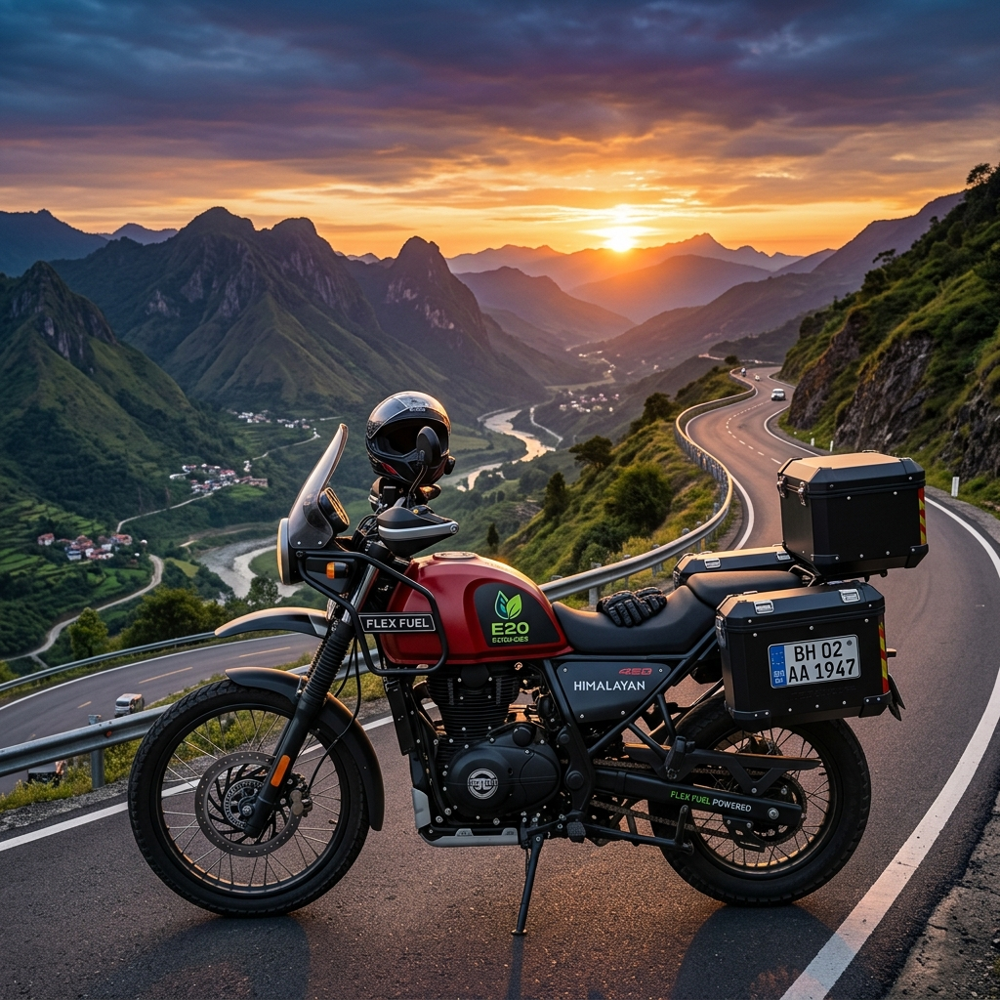

# Best Flex Fuel Bikes & Scooters in India (2026 Comprehensive List)

The Indian two-wheeler market has undergone a dramatic transformation over the last few years, and as we navigate through 2026, the shift towards cleaner, more sustainable mobility solutions is more prominent than ever. While electric vehicles (EVs) have claimed a significant share of the spotlight, the rise of flex-fuel technology offers a powerful and pragmatic alternative. Flex-fuel vehicles (FFVs) bridge the gap between traditional internal combustion engines and completely emission-free mobility, providing a practical transition for millions of Indian commuters. 

This comprehensive guide delves into the best flex fuel bikes and scooters available in India in 2026. We will explore the leading models, break down their specifications, analyze the cost-benefits, and help you determine the perfect flex-fuel two-wheeler for your daily needs. Whether you are a daily commuter navigating the chaotic traffic of Mumbai or a weekend rider cruising through the hills of the Western Ghats, flex-fuel technology offers something for everyone.

## Understanding Flex-Fuel Technology in Two-Wheelers

Before diving into the top models, it's crucial to understand what flex-fuel technology is and why it's gaining such massive traction in India. A flex-fuel two-wheeler is equipped with an internal combustion engine designed to run on more than one type of fuel, typically a blend of gasoline (petrol) and ethanol. In India, the government's push for the E20 mandate (20% ethanol blend) has successfully evolved into E85 (85% ethanol, 15% petrol) capabilities for newer models.

The engines in these bikes and scooters feature modified fuel systems, upgraded fuel lines, and advanced Engine Control Units (ECUs) equipped with sensors that automatically detect the ethanol-to-petrol ratio. This allows the engine to adjust spark timing and fuel injection in real-time, ensuring optimal performance regardless of whether you fill up with pure petrol, E20, or E85.

### The Ethanol Push in India

India's aggressive ethanol blending program is driven by two primary factors: environmental concerns and economic strategy. By blending ethanol—a renewable biofuel produced largely from sugarcane and agricultural waste—with petrol, the country significantly reduces its reliance on expensive imported crude oil. Simultaneously, ethanol burns cleaner than pure petrol, leading to a substantial reduction in tailpipe emissions, particularly carbon monoxide and unburnt hydrocarbons.

For the everyday Indian rider, this translates to slightly cheaper fuel costs (as ethanol is generally priced lower than petrol) and the satisfaction of contributing to a greener environment without the range anxiety currently associated with many electric two-wheelers.

## The Advantages of Choosing a Flex-Fuel Two-Wheeler

Opting for a flex-fuel bike or scooter in 2026 comes with a myriad of benefits that appeal to both the wallet and the conscience.

### 1. Cost-Effective Commuting
With the price of ethanol being more stable and generally lower than petrol, running a flex-fuel two-wheeler on higher ethanol blends (like E85) can result in noticeable savings at the pump. Although ethanol has a slightly lower energy density than petrol—meaning you might see a small drop in overall fuel efficiency—the lower cost per liter often offsets this, leading to lower running costs per kilometer.

### 2. Environmental Impact
Ethanol is a renewable resource. When combusted, it produces significantly fewer greenhouse gas emissions compared to standard fossil fuels. By riding an E85-capable bike or scooter, you are actively participating in reducing the carbon footprint and improving urban air quality.

### 3. Engine Performance
Ethanol has a higher octane rating than standard petrol. This allows engines to run at higher compression ratios without knocking, potentially offering better power output and smoother performance. Many riders note that flex-fuel bikes feel slightly more responsive and exhibit less engine vibration.

### 4. No Range Anxiety
Unlike electric scooters and bikes, which require charging infrastructure and time, flex-fuel vehicles can be refueled in minutes at any conventional petrol pump or designated ethanol dispensing station. This makes them ideal for long-distance travel and rural areas where EV infrastructure might still be lacking.

### 5. Future-Proofing
As the Indian government continues to promote biofuels and tighten emission norms, owning a flex-fuel vehicle ensures that your ride remains compliant and relevant for years to come.

---

## Top 5 Flex Fuel Bikes in India (2026)

The motorcycle segment has seen aggressive adoption of flex-fuel technology. Here are the top 5 flex fuel bikes that dominate the Indian market in 2026.

### 1. TVS Apache RTR 160 4V FFV

TVS Motor Company has always been a pioneer in racing and innovation, and the Apache RTR 160 4V FFV (Flex Fuel Vehicle) stands as a testament to their engineering prowess. This bike perfectly marries the sporty, aggressive DNA of the Apache lineage with eco-friendly flex-fuel capabilities.

**Key Specifications:**
*   **Engine Capacity:** 159.7 cc, single-cylinder, oil-cooled
*   **Power Output:** 17.55 PS (varies slightly depending on the ethanol blend)
*   **Torque:** 14.73 Nm
*   **Fuel System:** Advanced Bosch Fuel Injection with Ethanol Sensor
*   **Estimated Price:** ₹1,35,000 (Ex-showroom)
*   **Ethanol Compatibility:** Up to E85

**Why We Love It:**
The Apache RTR 160 4V FFV retains the sharp handling, aggressive styling, and robust build quality that the series is famous for. The transition to flex-fuel has not dampened its spirit; in fact, the high-octane ethanol blend gives the engine a peppy character. The digital instrument cluster now includes an indicator showing the current ethanol blend percentage in the tank, a nifty feature for tech-savvy riders. It is the perfect choice for college students and young professionals who want performance without compromising on environmental responsibility.

### 2. Bajaj Pulsar NS160 Flex

Bajaj Auto's response to the flex-fuel revolution is the robust and popular Pulsar NS160 Flex. Known for its muscular streetfighter styling and raw power, the NS160 has been beautifully adapted to run on high ethanol blends.

**Key Specifications:**
*   **Engine Capacity:** 160.3 cc, single-cylinder, oil-cooled, twin-spark
*   **Power Output:** 17.2 PS
*   **Torque:** 14.6 Nm
*   **Fuel System:** DTS-i with Flex Fuel Calibration
*   **Estimated Price:** ₹1,32,000 (Ex-showroom)
*   **Ethanol Compatibility:** Up to E85

**Why We Love It:**
The Pulsar NS160 Flex offers a commanding riding posture and excellent high-speed stability. Bajaj has tweaked the perimeter frame to accommodate the slightly larger, anti-corrosive fuel tank required for high-ethanol blends. The bike delivers a punchy mid-range, making it excellent for city overtakes. Bajaj's widespread service network and low maintenance costs make the NS160 Flex an incredibly sensible purchase for the pragmatic Indian buyer who still wants a thrilling ride.

### 3. Hero Glamour XTEC Flex Fuel

Hero MotoCorp caters to the massive commuter segment in India, and the Glamour XTEC Flex Fuel brings the benefits of E85 to the masses. It focuses heavily on reliability, comfort, and economy.

**Key Specifications:**
*   **Engine Capacity:** 124.7 cc, single-cylinder, air-cooled
*   **Power Output:** 10.7 PS
*   **Torque:** 10.6 Nm
*   **Fuel System:** XSens Programmed Fuel Injection
*   **Estimated Price:** ₹95,000 (Ex-showroom)
*   **Ethanol Compatibility:** Up to E85

**Why We Love It:**
The Glamour has always been the quintessential Indian commuter bike. The XTEC Flex Fuel variant adds modern touches like a fully digital console with Bluetooth connectivity, turn-by-turn navigation, and an LED headlamp. The engine is incredibly refined and tuned for maximum fuel efficiency, making it the ideal workhorse for daily office commutes. It is affordable to buy, cheap to run, and easy to maintain.

### 4. Honda CB350 Flex

For those who prefer classic, retro styling combined with modern technology, the Honda CB350 Flex is the undisputed king. Honda has modified its highly successful 350cc platform to embrace ethanol without losing its characteristic thump and relaxed cruising nature.

**Key Specifications:**
*   **Engine Capacity:** 348.36 cc, single-cylinder, air-cooled
*   **Power Output:** 21.07 PS
*   **Torque:** 30 Nm
*   **Fuel System:** PGM-FI with Flex Tech
*   **Estimated Price:** ₹2,20,000 (Ex-showroom)
*   **Ethanol Compatibility:** Up to E85

**Why We Love It:**
The Honda CB350 Flex is a masterpiece of engineering. The long-stroke engine produces a massive 30 Nm of torque low down in the rev range, making highway cruising an absolute joy. The engine components, including the valves and piston rings, have been specially treated to withstand the corrosive nature of high-concentration ethanol. It features Honda Selectable Torque Control (HSTC) and a slip-and-assist clutch. For weekend tourers who want a sustainable ride, the CB350 Flex is unparalleled.

### 5. Yamaha FZ-FI V4 Flex

Yamaha's 'Lord of the Streets' has also received the flex-fuel treatment. The FZ-FI V4 Flex maintains its muscular, bold stance while housing a deeply refined and eco-friendly heart.

**Key Specifications:**
*   **Engine Capacity:** 149 cc, single-cylinder, air-cooled
*   **Power Output:** 12.4 PS
*   **Torque:** 13.3 Nm
*   **Fuel System:** Blue Core Fuel Injection
*   **Estimated Price:** ₹1,25,000 (Ex-showroom)
*   **Ethanol Compatibility:** Up to E85

**Why We Love It:**
The Yamaha FZ-FI V4 Flex prioritizes comfort and linear power delivery. The wide tires provide excellent grip, and the beefy suspension setup handles Indian potholes with ease. Yamaha's Blue Core technology ensures that despite running on varying blends of ethanol, the engine remains highly efficient and reliable. It’s the perfect blend of macho styling and sensible, sustainable commuting.

---

## Top 5 Flex Fuel Scooters in India (2026)

Scooters form the backbone of urban mobility in India, offering unmatched convenience and utility. The integration of flex-fuel technology into scooters has revolutionized daily commuting.

### 1. Honda Activa 7G Flex

No list of Indian two-wheelers is complete without the Honda Activa. The Activa 7G Flex is the latest iteration of India's favorite scooter, now fully capable of running on E85 fuel.

**Key Specifications:**
*   **Engine Capacity:** 109.51 cc, single-cylinder, fan-cooled
*   **Power Output:** 7.79 PS
*   **Torque:** 8.90 Nm
*   **Fuel System:** PGM-FI with Enhanced Smart Power (eSP)
*   **Estimated Price:** ₹88,000 (Ex-showroom)
*   **Ethanol Compatibility:** Up to E85

**Why We Love It:**
The Honda Activa 7G Flex is the definition of reliability. Honda has seamlessly integrated the flex-fuel system so that the end-user notices no difference in the scooter's legendary smoothness and quiet start mechanism (ACG starter). The metal body provides durability, and the telescopic suspension ensures a comfortable ride. It remains the default choice for families looking for a no-nonsense, eco-friendly daily runner.

### 2. TVS Jupiter 125 FFV

The TVS Jupiter 125 has been a strong contender in the 125cc segment, and its FFV variant takes the competition to a new level by offering flex-fuel capabilities alongside class-leading features.

**Key Specifications:**
*   **Engine Capacity:** 124.8 cc, single-cylinder, air-cooled
*   **Power Output:** 8.15 PS
*   **Torque:** 10.5 Nm
*   **Fuel System:** EcoThrust Fuel Injection (ET-Fi)
*   **Estimated Price:** ₹96,000 (Ex-showroom)
*   **Ethanol Compatibility:** Up to E85

**Why We Love It:**
The Jupiter 125 FFV is all about practical innovation. It features a front fuel filler, meaning you don't have to get off the seat at the petrol pump. Most impressively, the fuel tank is situated under the floorboard, freeing up a massive 33 liters of under-seat storage—enough to swallow two full-face helmets. Combined with its ability to run on cheaper ethanol blends, it is arguably the most practical scooter on the market.

### 3. Suzuki Access 125 E-Flex

The Suzuki Access 125 has always been loved for its peppy performance and retro-modern styling. The new E-Flex model continues this legacy while being kind to the environment.

**Key Specifications:**
*   **Engine Capacity:** 124 cc, single-cylinder, air-cooled
*   **Power Output:** 8.7 PS
*   **Torque:** 10 Nm
*   **Fuel System:** Fuel Injection with Suzuki Eco Performance (SEP)
*   **Estimated Price:** ₹94,000 (Ex-showroom)
*   **Ethanol Compatibility:** Up to E85

**Why We Love It:**
The Access 125 E-Flex feels remarkably quick off the line. Suzuki’s engineers have calibrated the engine to utilize the higher octane rating of E85 effectively, resulting in brisk acceleration that makes cutting through city traffic a breeze. It features external fuel filling, LED headlights, and a digital console. It is the perfect scooter for those who want a blend of performance and classic styling in an eco-friendly package.

### 4. Yamaha Fascino 125 Fi Hybrid Flex

Yamaha brings a unique proposition to the table with the Fascino 125 Fi Hybrid Flex. It combines flex-fuel engine technology with a mild-hybrid system for unparalleled efficiency.

**Key Specifications:**
*   **Engine Capacity:** 125 cc, single-cylinder, air-cooled
*   **Power Output:** 8.2 PS
*   **Torque:** 10.3 Nm
*   **Fuel System:** Fuel Injection + Smart Motor Generator (Hybrid)
*   **Estimated Price:** ₹98,000 (Ex-showroom)
*   **Ethanol Compatibility:** Up to E85

**Why We Love It:**
The Fascino is a technological marvel. The Smart Motor Generator acts as an electric motor to provide power assist when accelerating from a stop, taking the load off the engine and significantly improving fuel economy in stop-and-go traffic. When you pair this hybrid assist with the cost savings of running on E85, the Fascino becomes incredibly cheap to operate. Its sweeping, curvy European styling also ensures you look good while saving money.

### 5. Hero Destini 125 XTEC Flex

Hero MotoCorp's Destini 125 XTEC Flex rounds out our top 5. It is designed as a premium family scooter that offers solid build quality and modern connectivity features.

**Key Specifications:**
*   **Engine Capacity:** 124.6 cc, single-cylinder, air-cooled
*   **Power Output:** 9.1 PS
*   **Torque:** 10.4 Nm
*   **Fuel System:** Programmed Fuel Injection (i3S Technology)
*   **Estimated Price:** ₹92,000 (Ex-showroom)
*   **Ethanol Compatibility:** Up to E85

**Why We Love It:**
The Destini 125 XTEC Flex features Hero's proprietary i3S (Idle Stop-Start System), which automatically shuts off the engine at traffic lights and restarts it with a simple pull of the brake and twist of the throttle. This feature, combined with E85 fuel capability, maximizes efficiency in heavy urban traffic. The scooter also boasts premium chrome accents, a comfortable long seat, and Bluetooth connectivity for call and SMS alerts.

---

## Comprehensive Buying Guide: How to Choose a Flex-Fuel Two-Wheeler

With so many excellent options available, choosing the right flex-fuel bike or scooter can be daunting. Here are the crucial factors you should consider before making your purchase in 2026.

### 1. Assess Your Daily Usage
*   **City Commuting:** If your primary use is navigating heavy city traffic, a scooter like the Honda Activa 7G Flex or TVS Jupiter 125 FFV offers the best convenience due to their automatic transmissions and ample storage space.
*   **Highway and Long Distances:** If your commute involves highways or you enjoy weekend rides, a motorcycle with a larger engine, like the Honda CB350 Flex or Bajaj Pulsar NS160 Flex, will provide better stability, comfort, and cruising capability.

### 2. Availability of E85 Fuel
While the government has aggressively expanded the ethanol dispensing network, it is essential to check the availability of E85 fuel stations along your regular routes. Flex-fuel vehicles can run perfectly on regular petrol (E10 or E20), but to realize the economic and environmental benefits, you need consistent access to higher ethanol blends.

### 3. Understanding Fuel Efficiency vs. Running Cost
It is a scientific fact that ethanol has a lower energy density than petrol. This means you might see a slight drop in the raw mileage (km/liter) when running on E85 compared to pure petrol. However, because E85 is priced significantly lower than petrol, your overall running cost per kilometer will likely be lower. Do not fixate solely on the mileage figure; calculate the cost per kilometer based on local fuel prices.

### 4. Maintenance Network
Flex-fuel engines have specific components (like specialized fuel lines, anti-corrosive tank coatings, and advanced sensors) that require proper maintenance. Ensure that the brand you choose has an authorized service center near you with technicians trained to handle FFVs. Brands like Hero, Honda, and Bajaj have unparalleled networks across India.

### 5. Technology and Features
Modern two-wheelers are packed with tech. Look for features that matter to you. Do you need Bluetooth connectivity for navigation? Is a front-mounted fuel filler crucial for your convenience? Do you prefer a fully digital instrument cluster? The Hero Glamour XTEC and TVS Jupiter 125 score high in this department.

### 6. Budget and Resale Value
Factor in the on-road price, which includes insurance and registration. Additionally, consider the historical resale value of the brand. Honda and Hero traditionally hold their value very well in the Indian market, which is an important consideration if you plan to upgrade in a few years.

---

## Maintenance and Care for Flex-Fuel Two-Wheelers

While flex-fuel bikes and scooters are designed to be robust, they do require a slightly different approach to maintenance to ensure longevity and optimal performance.

### Regular Use is Key
Ethanol has a tendency to absorb moisture from the air (it is hygroscopic). If a flex-fuel vehicle is left sitting for extended periods with E85 in the tank, this moisture can cause phase separation and potentially lead to corrosion or starting issues. It is highly recommended to ride your FFV regularly. If you plan to store the vehicle for over a month, it is advisable to fill the tank with standard petrol (E10) and run the engine for a few minutes to flush the ethanol from the fuel lines.

### Monitor Fuel Filters
Because ethanol can act as a solvent, it may clean out old deposits in the fuel system, which can then clog the fuel filter. When you first switch to a high ethanol blend, it is a good practice to have your fuel filter checked or replaced earlier than the standard service interval.

### Use Recommended Engine Oils
Always use the engine oil grade specified by the manufacturer. Ethanol combustion produces slightly different byproducts than petrol, and modern engine oils formulated for FFVs are designed to handle these specific conditions, neutralizing acids and preventing wear.

### Keep the Tank Full
To minimize the amount of air (and therefore moisture) inside the fuel tank, try to keep the tank relatively full, especially during the monsoon season.

---

## Frequently Asked Questions (FAQs)

**Q1: Can I mix normal petrol and E85 in my flex-fuel bike?**
**A:** Yes, absolutely! That is the core feature of a flex-fuel vehicle. The smart engine sensors automatically detect the ratio of petrol to ethanol in the tank and adjust the engine tuning instantly. You can mix them in any proportion without worrying about engine damage.

**Q2: Will running on E85 damage my engine over time?**
**A:** No. Flex-fuel bikes and scooters are built with specially treated materials, anti-corrosive fuel tanks, upgraded rubber hoses, and specific valves designed specifically to withstand the properties of high-concentration ethanol.

**Q3: Does E85 give less mileage than standard petrol?**
**A:** Yes, ethanol contains roughly 30% less energy per volume than standard petrol. You may notice a slight reduction in fuel economy (km/l). However, because E85 is priced cheaper, the actual running cost per kilometer is often lower or on par with petrol.

**Q4: Can I convert my older petrol scooter to a flex-fuel vehicle?**
**A:** While aftermarket conversion kits exist, they are highly discouraged. A true flex-fuel vehicle requires a reinforced fuel tank, specialized fuel lines, and a highly sophisticated ECU. Bolt-on kits rarely provide the necessary hardware upgrades, leading to severe engine damage and fuel leaks over time. It is always safer to purchase a factory-built FFV.

**Q5: Are flex-fuel vehicles slower than petrol vehicles?**
**A:** Generally, no. In fact, because ethanol has a higher octane rating, the engine can advance the ignition timing, sometimes resulting in a slight increase in horsepower and a smoother, more responsive throttle feel.

---

## Conclusion: Embracing the Flex-Fuel Future in 2026

The year 2026 marks a definitive turning point in the Indian two-wheeler landscape. Flex-fuel technology is no longer an experimental concept but a mainstream reality offering a highly practical, sustainable, and economical way to commute. 

For the daily commuter looking for ultimate convenience, scooters like the **Honda Activa 7G Flex** and the **TVS Jupiter 125 FFV** provide unmatched utility and reliability. If you crave the thrill of a motorcycle, the **TVS Apache RTR 160 4V FFV** and the majestic **Honda CB350 Flex** prove that eco-friendly riding does not mean sacrificing performance or style.

As the infrastructure for E85 continues to expand rapidly across urban and rural India, investing in a flex-fuel bike or scooter is a smart, forward-thinking decision. It allows you to reduce your carbon footprint, support domestic biofuel industries, and save money at the pump, all while enjoying the freedom and flexibility of a traditional internal combustion engine. The future of Indian mobility is flexible, and it looks incredibly promising.
