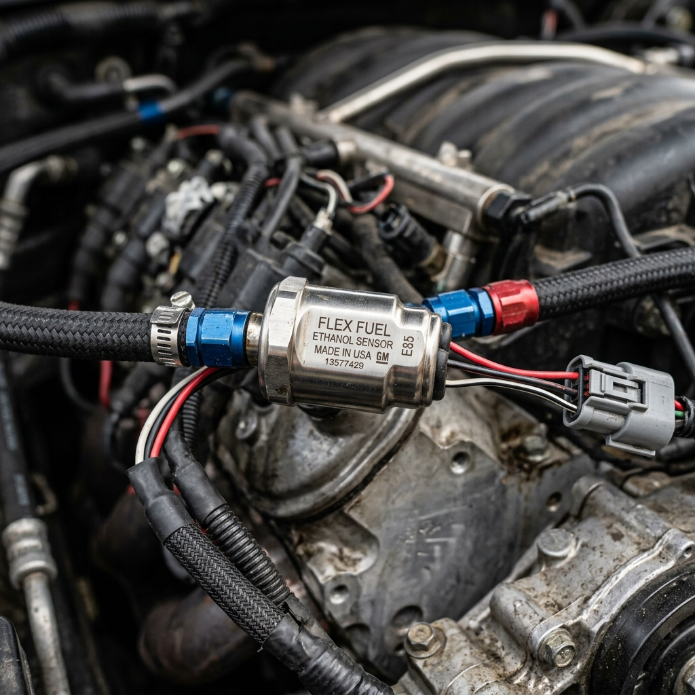

# Bosch vs Magneti Marelli: Best Flex Fuel Sensors Compared

The transition to E85 (ethanol fuel) and flex-fuel systems represents one of the most cost-effective and efficient ways to extract more power from a combustion engine. Ethanol’s high octane rating and latent heat of vaporization allow for aggressive ignition timing and boost pressures, making it a favorite among tuning enthusiasts. However, running a mix of ethanol and gasoline safely and optimally requires the engine control unit (ECU) to know the exact ethanol content in the fuel lines. This is where the flex fuel sensor comes into play.

Two of the biggest names in automotive components—Bosch and Magneti Marelli—offer highly regarded flex fuel sensors. But how do they compare? In this comprehensive guide, we pit Bosch against Magneti Marelli to determine the best flex fuel sensor for your build. We will explore their design, accuracy, flow characteristics, integration compatibility, durability, and overall value. 

---

## 1. Introduction to Flex Fuel Systems

Before diving into the sensors themselves, it is essential to understand the ecosystem in which they operate. A flex fuel system allows a vehicle to run on any blend of gasoline and ethanol, typically ranging from 0% ethanol (pure gasoline, though standard pump gas often has up to 10% ethanol) to 85% ethanol (E85). 

### How Do Flex Fuel Sensors Work?
A flex fuel sensor is typically installed in the return or feed fuel line. As fuel flows through the sensor, it measures the dielectric constant of the liquid. Ethanol and gasoline have different dielectric constants, allowing the sensor's internal microprocessor to calculate the exact percentage of ethanol in the mixture. 

In addition to ethanol content, most modern flex fuel sensors also measure fuel temperature. Both the ethanol percentage and fuel temperature are translated into an electrical signal—usually a pulsed frequency signal—that is sent to the ECU. The ECU then interpolates between various fuel, ignition, and boost maps to ensure optimal engine performance and safety for that specific fuel blend.

### Why Quality Matters
A faulty, inaccurate, or restrictive flex fuel sensor can spell disaster for a high-performance engine. If a sensor under-reports the ethanol content, the ECU may not add enough fuel or may run too much ignition timing, leading to catastrophic engine knock (detonation). Conversely, over-reporting can lead to an overly rich mixture, bogging down performance and washing the cylinder walls with fuel. Furthermore, high-horsepower applications demand substantial fuel flow, making the physical restriction of the sensor a critical consideration.

---

## 2. Overview of Bosch Flex Fuel Sensors

Bosch is a titan in the automotive industry, renowned for manufacturing everything from fuel injectors to complex engine management systems. Their sensors are standard equipment on millions of vehicles worldwide, and their flex fuel sensors are widely adopted by both OEMs and the aftermarket tuning community.

### Design and Construction
Bosch flex fuel sensors are typically housed in robust plastic and metal enclosures designed to withstand harsh under-hood environments. The most popular aftermarket variants (often based on GM/Continental designs but manufactured or branded through Bosch partnerships or equivalents in the aftermarket sphere, though Bosch directly manufactures the core sensing elements in many OEM applications) feature 3/8-inch quick-connect fuel line fittings. 

The sensor uses a capacitive measurement technique. Two metal plates inside the sensor tube form a capacitor. As the fuel mixture changes, the capacitance changes, which the internal electronics convert into a readable output frequency.

### The Standard Signal
Bosch-style sensors generally output a 5-volt digital square wave signal. 
- **Frequency (Hz)** corresponds to the ethanol percentage. Typically, 50 Hz equals 0% ethanol, and 150 Hz equals 100% ethanol. 
- **Pulse Width (ms)** corresponds to the fuel temperature. 

This standardized output makes Bosch sensors incredibly easy to integrate with aftermarket ECUs like Haltech, MoTeC, Link, AEM, and ECUMaster.

---

## 3. Overview of Magneti Marelli Flex Fuel Sensors

Magneti Marelli, an Italian powerhouse in automotive components and motorsport electronics, is famous for supplying high-end parts for Formula 1, MotoGP, and exotic supercars. Their flex fuel sensors cater to a premium market, focusing on ultra-high precision, rapid response times, and exceptional build quality.

### Design and Construction
Magneti Marelli sensors often feature high-grade aluminum or composite housings designed to save weight while maintaining structural integrity under extreme vibrations and pressures. They are explicitly designed with motorsport applications in mind. 

Like Bosch, they measure the dielectric properties of the fuel, but Magneti Marelli often incorporates proprietary filtering algorithms within the sensor's microprocessor to deliver a cleaner, more stable signal even when the fuel flow is turbulent or aerated.

### Signal and Telemetry
While Magneti Marelli sensors can provide standard frequency outputs comparable to Bosch, many of their high-end models offer CAN bus connectivity. A CAN-based flex fuel sensor sends digital data packets directly to the ECU or data logger. This eliminates any potential signal degradation that can occur with analog or pulse-width signals over long wire runs and allows for the transmission of additional diagnostic data.

---

## 4. Head-to-Head Comparison

To determine which sensor is best for your specific application, we need to compare them across several critical categories: Accuracy and Response Time, Flow Restriction, Durability and Reliability, Integration and Compatibility, and Price.

### A. Accuracy and Response Time
When tuning an engine to its absolute limit on E85, precision is paramount. 

**Bosch:**
Bosch sensors are highly accurate, typically reading within +/- 2% to 3% of the actual ethanol content. For 99% of street and track applications, this level of accuracy is more than sufficient. The response time is also quite fast, updating the ECU several times per second. However, under extreme flow conditions where fuel aeration (bubbles in the fuel) might occur, the standard capacitive sensor can sometimes experience minor signal noise.

**Magneti Marelli:**
Magneti Marelli takes the edge in pure precision. Their sensors are designed to provide sub-1% accuracy in ideal conditions. More importantly, their internal processing algorithms are better at filtering out noise from turbulent fuel flow. The response time is near-instantaneous, which is crucial in motorsport applications where fuel blends might change rapidly (e.g., during endurance racing pit stops) or where rapid temperature fluctuations occur.

*Winner: Magneti Marelli*

### B. Flow Restriction
A flex fuel sensor sits directly in the fuel path. If the internal diameter of the sensor is smaller than your fuel lines, it becomes a bottleneck, limiting the maximum amount of fuel that can reach the engine.

**Bosch:**
The standard Bosch-style sensor (often utilizing 3/8" tubes) flows incredibly well. It is generally accepted that a standard 3/8" flex fuel sensor can support upwards of 600-800 horsepower on E85 without becoming a severe restriction. For ultra-high-horsepower builds (1000+ HP), tuners often run the sensor in a bypass loop. This means only a portion of the fuel flows through the sensor, while the rest bypasses it, ensuring zero restriction to the main fuel rail.

**Magneti Marelli:**
Magneti Marelli offers sensors with various fitting options, including larger -6AN or -8AN equivalent internal bores directly from the factory for their motorsport lines. This allows builders to plumb the sensor directly into the main feed line of high-horsepower cars without needing a complicated bypass loop. 

*Winner: Magneti Marelli (for high HP), Tie (for street cars)*

### C. Durability and Reliability
Under the hood, components are subjected to extreme heat, vibration, and chemical exposure. 

**Bosch:**
Bosch sensors are OEM-grade. They are designed to last for the lifetime of a production vehicle (100,000+ miles). They are incredibly robust, weather-sealed, and resistant to degradation from prolonged exposure to high-concentration ethanol. Failure rates are exceedingly low.

**Magneti Marelli:**
Built to motorsport specifications, Magneti Marelli sensors can withstand higher vibration frequencies and more extreme temperature cycles than standard OEM sensors. They are practically indestructible in a street car application and offer ultimate peace of mind in a dedicated race car.

*Winner: Tie (Both are exceptionally reliable)*

### D. Integration and Compatibility
How easily the sensor talks to your ECU is a major factor in the installation process.

**Bosch:**
Bosch-style sensors are the undisputed king of compatibility. Because their 50-150Hz frequency output is the industry standard, literally every aftermarket standalone ECU on the market has pre-configured settings for them. Furthermore, many modern factory ECUs (via tools like Cobb Accessport, EcuTek, or HP Tuners) have been reverse-engineered to accept the standard Bosch frequency signal. Wiring usually requires just three wires: 12V Power, Ground, and Signal.

**Magneti Marelli:**
While Magneti Marelli sensors can output standard signals, their true potential is unlocked via CAN bus integration. If you are running a high-end ECU (MoTeC, Syvecs, Cosworth) that supports custom CAN receive templates, the Magneti Marelli sensor is a dream. However, if you are running a more basic ECU or utilizing stock ECU reflashing software, configuring a Magneti Marelli sensor (especially a CAN-based one) can be significantly more complex and require advanced technical knowledge.

*Winner: Bosch (for ease of use and universal compatibility)*

### E. Price and Value
Cost is always a factor, regardless of the budget.

**Bosch:**
The standard Bosch-style flex fuel sensor is incredibly affordable. You can often purchase genuine sensors for under $100. Even full kits that include the sensor, pigtail harness, and AN-fittings usually retail for $150 to $250. This represents unbelievable value for the performance and safety they provide.

**Magneti Marelli:**
Premium performance commands a premium price. Magneti Marelli sensors are significantly more expensive, often costing three to five times as much as a Bosch sensor. For a professional racing team, this cost is negligible. For a privateer or street enthusiast, it is a substantial investment.

*Winner: Bosch*

---

## 5. Understanding the Data: How ECUs Use the Sensor

To appreciate the hardware, it's vital to understand the software side of the flex fuel equation. When a flex fuel sensor (Bosch or Magneti Marelli) sends data to the ECU, a complex blending process occurs.

### The Base Maps
A flex fuel tune actually consists of at least two primary tunes:
1. **The Gasoline Map:** Calibrated for standard pump gas (e.g., 10% ethanol).
2. **The E85 Map:** Calibrated for high ethanol content (e.g., 85% ethanol).

These maps dictate injector pulse width (fueling), ignition timing advance, and target boost pressure.

### The Blending Algorithm
When you fill up your tank, the resulting mixture might be E40, E60, or E75. The ECU reads the ethanol percentage from the flex fuel sensor and uses a blending table to interpolate between the Gasoline Map and the E85 Map.

For example, if the sensor reads E45 (roughly halfway between E10 and E85), the ECU will look at the ignition timing value for E10 and the value for E85, and deliver a timing advance that is perfectly proportioned between the two. 

### Why Sensor Speed Matters Here
If you are doing a wide-open-throttle pull, and a pocket of fuel with a different ethanol concentration reaches the engine, the ECU must adjust instantly. If the sensor is slow, the engine might run lean for a fraction of a second, causing knock. Both Bosch and Magneti Marelli excel here, providing data fast enough for modern ECUs to react within a single engine revolution.

---

## 6. Installation Best Practices

Regardless of whether you choose Bosch or Magneti Marelli, proper installation is critical for accurate readings and safety.

### Location, Location, Location
1. **Return Line Installation:** The most common and recommended location for a flex fuel sensor is in the fuel return line, after the fuel pressure regulator. In this location, the sensor is subjected to lower pressure, reducing stress on the component. It also ensures that the fuel being measured is truly representative of what just passed through the rail.
2. **Feed Line Installation:** For returnless fuel systems, the sensor must be installed in the feed line. Because feed lines are under high pressure (often 40-70+ psi), ensure all fittings are absolutely secure and use high-quality PTFE-lined hoses to prevent ethanol degradation. 
3. **Bypass Loops:** As mentioned earlier, if you are pushing massive horsepower and your fuel lines are -8AN or larger, installing a standard 3/8" Bosch sensor inline will cause a restriction. Use a Y-block to split the fuel line, route a smaller line through the sensor, and merge them back together. 

### Wiring Considerations
- **Use Shielded Cable:** To prevent electrical noise from ignition coils or alternators from interfering with the frequency signal, use shielded wire for the signal line, especially on Bosch sensors.
- **Solid Grounds:** Ensure the sensor is grounded to a clean, bare-metal chassis point or directly to the ECU’s sensor ground block. Poor grounds will cause erratic ethanol readings.
- **Vibration Isolation:** While both sensors are tough, mounting them solidly to the engine block or chassis can transmit harsh vibrations. Use a rubber-isolated mounting bracket to extend the sensor's lifespan.

---

## 7. Which Sensor is Right For You?

The decision between Bosch and Magneti Marelli ultimately comes down to the intended use of the vehicle, the capabilities of your engine management system, and your budget.

### When to Choose Bosch
The Bosch flex fuel sensor is the clear winner for **95% of enthusiasts**. You should choose the Bosch sensor if:
- You are building a street car, track day car, or amateur drag car.
- You want the easiest, plug-and-play compatibility with nearly any aftermarket or reflashed OEM ECU.
- You are looking for the best bang-for-your-buck modification available.
- Your horsepower goals are anywhere from stock up to roughly 800-1000 HP (using a bypass for the upper end of that range).

Bosch offers uncompromising reliability and accuracy that is more than sufficient to safely extract massive power from E85.

### When to Choose Magneti Marelli
The Magneti Marelli flex fuel sensor is the choice for the **elite top 5%**. You should choose Magneti Marelli if:
- You are building a professional, no-expenses-spared race car (Time Attack, Formula Drift, Endurance Racing).
- You are utilizing a high-end motorsport ECU (MoTeC, Syvecs) and want to utilize CAN bus communication to reduce wiring complexity and enhance data logging.
- You demand the absolute highest level of precision and noise filtering in turbulent flow conditions.
- You require a sensor with large internal bores to sit inline on a massive fuel system without causing restriction.

---

## 8. The Future of Flex Fuel Technology

As the automotive industry evolves, so too does flex fuel technology. While the internal combustion engine faces challenges from electrification, the use of biofuels like ethanol remains a critical stepping stone for reducing emissions while maintaining high power output in motorsport and enthusiast vehicles.

### Advanced Sensor Diagnostics
Future flex fuel sensors, building upon the CAN architecture championed by companies like Magneti Marelli, will likely offer deeper diagnostic capabilities. Imagine a sensor that not only reads ethanol content but can also detect fuel contamination (like water in the fuel) or predict internal fuel pump failure by analyzing micro-pulsations in the fuel flow.

### Integration with Direct Injection
As Direct Injection (DI) becomes universal, flex fuel systems must become more sophisticated. DI systems run at incredibly high pressures (thousands of PSI). While flex fuel sensors will remain on the low-pressure feed side, the ECU's response to the sensor data must be exponentially faster and more precise to control the microscopic pulse widths of high-pressure DI injectors safely. Both Bosch and Magneti Marelli are at the forefront of developing ECUs and sensors capable of managing these complex dynamics.

---

## 9. Frequently Asked Questions (FAQs)

**Q: Can I run E85 without a flex fuel sensor?**
A: Yes, but it is dangerous and inconvenient. You would have to manually flash a specific E85 map onto your ECU every time you fill up, and you must ensure the tank is exactly 85% ethanol. If you get a bad batch of winter-blend E85 (which might only be E70) while running a dedicated E85 tune, your engine will run lean and likely knock, potentially causing engine failure. A flex fuel sensor is a mandatory safety device for E85 tuning.

**Q: Do flex fuel sensors go bad?**
A: While rare, they can fail. The most common cause of failure is physical contamination (debris in the fuel system) or electrical shorts due to improper wiring or exposure to extreme heat. If a sensor fails, most ECUs are programmed with a "failsafe" strategy that defaults to a safe, low-timing gasoline map to prevent engine damage.

**Q: Does installing a flex fuel sensor increase horsepower?**
A: The sensor itself does not add horsepower. However, it allows your ECU to safely unlock the potential of E85. It is the combination of the sensor, E85 fuel, larger fuel injectors, and a proper ECU tune that adds the horsepower.

**Q: What is the difference between a Continental sensor and a Bosch sensor?**
A: In the aftermarket, these names are often used interchangeably. GM/Continental originally designed the standard capacitive sensor housing style that is incredibly popular today. Bosch manufactures similar OEM sensors and supplies internal components. Functionally, standard aftermarket sensors branded as either Continental or Bosch operate on the identical 50-150Hz frequency scale and perform equally well.

---

## 10. Conclusion

The debate between Bosch and Magneti Marelli flex fuel sensors is not a matter of "good vs. bad," but rather "excellent vs. specialized." 

For the vast majority of car builders, tuners, and enthusiasts, the **Bosch-style flex fuel sensor** is the undisputed champion. It offers phenomenal accuracy, bulletproof reliability, universal compatibility with almost every ECU on the planet, and it does so at a price point that is accessible to anyone. It is the backbone of modern flex fuel tuning.

However, if you are operating in the upper echelons of motorsport where every fraction of a percent matters, where CAN bus architecture is standard, and where budgets are vast, **Magneti Marelli** stands ready. They provide the uncompromising precision and data integration required by professional racing teams.

Ultimately, installing a flex fuel system is one of the smartest upgrades you can make to a performance vehicle. By choosing a high-quality sensor from either of these legendary manufacturers, you are ensuring that your engine management system has the accurate data it needs to keep your engine safe while delivering maximum power, tank after tank.
