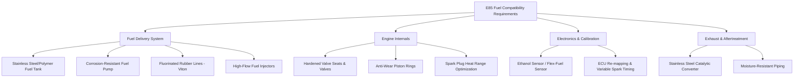
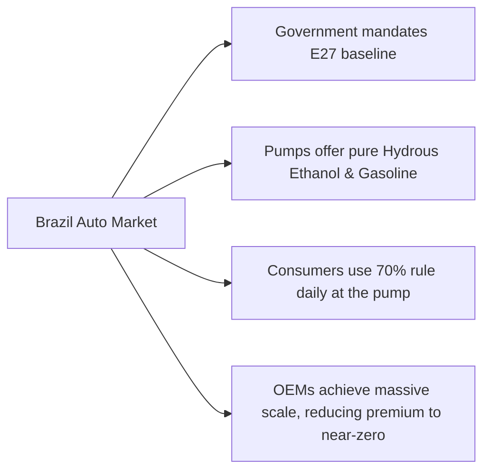

# How Much More Expensive Are E85 Compatible Cars?

The Indian automotive sector is undergoing one of its most transformative phases. Driven by a pressing need to reduce crude oil imports, curb greenhouse gas emissions, and support the domestic agricultural sector, the Government of India has aggressively pushed for bio-ethanol blending. While E10 (10% ethanol blended with 90% petrol) is already history and E20 (20% ethanol) is rapidly becoming the standard across retail outlets, the ultimate horizon for internal combustion engines is the adoption of Flex-Fuel Vehicles (FFVs) capable of running on E85—a blend containing up to 85% ethanol and 15% petrol.

For consumers, however, the transition to E85-compatible vehicles raises critical questions. Chief among them is the price tag: **How much more expensive are E85 compatible cars?** 

To answer this, we must examine the engineering modifications required to make a standard petrol engine ethanol-compliant, the material costs associated with these upgrades, real-world case studies of upcoming flex-fuel models in India like the Maruti Suzuki WagonR Flex-Fuel and the Toyota Innova HyCross Flex-Fuel, and the overriding influence of government taxation policies.

---

## 1. Technical Architecture: What Makes a Car E85-Compatible?

To understand the price premium of an E85-compatible vehicle, one must first understand why a standard petrol car cannot simply be filled with ethanol. 

### The Chemistry of Corrosion and Fuel Properties
Ethanol (ethyl alcohol) is chemically very different from gasoline. It has two main properties that make it hostile to conventional fuel systems:
1. **Corrosiveness:** Ethanol is highly hygroscopic, meaning it absorbs water from the air. When water blends with ethanol, it can form acidic solutions that corrode metals like steel, aluminum, and zinc. It also causes natural rubber and certain plastics to dry out, swell, crack, and eventually disintegrate.
2. **Lower Energy Density:** Ethanol has roughly 30% less energy per unit volume than gasoline. Consequently, to produce the same amount of power, an engine running on E85 must inject approximately 30% to 35% more fuel into the cylinders than it would when running on pure petrol.

These characteristics necessitate significant hardware and software modifications across several vehicle sub-systems.



### Component-by-Component Upgrade Breakdown

#### The Fuel Tank and Delivery Lines
Standard passenger vehicles typically use high-density polyethylene (HDPE) or steel fuel tanks. For E85 compatibility, the fuel tank must either be made of high-grade stainless steel or lined with specialized, non-reactive polymers that resist ethanol degradation. 

The fuel lines and flexible hoses present an even greater challenge. Conventional nitrile rubber hoses degrade rapidly under ethanol exposure. OEMs must substitute them with high-cost fluorinated rubber elastomers (such as Viton or fluoroelastomers) which maintain chemical stability in the presence of alcohol and water.

#### The Fuel Pump and Injectors
Because E85 requires a much higher volume of fuel flow to match petrol's energy output, the fuel pump must be upsized. The internal components of the pump—such as the armature, commutator, and electrical connections—must be plated or sealed to prevent galvanic corrosion caused by ethanol’s conductivity. 

Similarly, the fuel injectors must feature larger nozzle orifices to accommodate the 30%+ increase in fuel volume. The internal seals and needle valves of the injectors must also use advanced, wear-resistant coatings (like Diamond-Like Carbon or DLC) to combat the lack of lubricity in ethanol.

#### Engine Internals (Valves and Pistons)
Ethanol burns with a different flame speed and temperature profile compared to gasoline. More importantly, gasoline contains natural lubricating agents that ethanol lacks. To prevent premature engine wear:
*   **Valves and Valve Seats:** Standard intake and exhaust valves must be replaced with components made from hardened steel alloys or cobalt-base alloys (such as Stellite) to prevent valve seat recession.
*   **Piston Rings and Cylinder Liners:** Piston rings require specialized anti-friction coatings, and cylinder liners must be optimized to withstand the washing away of the oil film by unburnt ethanol during cold starts.

#### Sensors and the Engine Control Unit (ECU)
A true Flex-Fuel Vehicle must be able to run on any blend of fuel from E20 to E85 seamlessly. To do this, the vehicle requires an **Ethanol Sensor** (also known as a Flex-Fuel Sensor) installed in the fuel line. This sensor measures the dielectric constant and fuel temperature to calculate the exact percentage of ethanol in real-time. 

This data is sent to the ECU, which dynamically adjusts:
*   Fuel injection duration (to inject more or less fuel based on ethanol content).
*   Ignition timing (ethanol has a higher octane rating of ~108, allowing the engine to run higher ignition advance without knocking).
*   Cold-start parameters (ethanol has low volatility at low temperatures, making cold starting difficult without precise fuel pooling control).

#### Exhaust and Aftertreatment
Ethanol combustion produces higher levels of water vapor and aldehydes. The exhaust system, including the exhaust manifold, muffler, and catalytic converter housing, must use high-grade stainless steel (SUS304 or similar) to prevent rusting from the inside out. The catalyst formulation must also be tweaked to effectively neutralize acetaldehyde and formaldehyde emissions.

---

## 2. The Bill of Materials (BOM) Premium: Breaking Down Manufacturer Costs

When looking at the physical cost of these upgrades, the manufacturer's Bill of Materials (BOM) increases. However, the exact figure depends heavily on manufacturing scale, component sourcing, and vehicle complexity.

### Estimated BOM Cost Upcharges for E85 Modification
Below is a realistic estimate of the manufacturer's cost increase to upgrade a standard 1.2-liter to 1.5-liter naturally aspirated petrol engine to E85 compliance, based on industry analyses of global supply chains and Indian manufacturing projections:

| Component Group | Standard Component Cost (INR) | E85 Component Cost (INR) | Net Premium to OEM (INR) | Key Modifications / Materials Used |
| :--- | :--- | :--- | :--- | :--- |
| **Fuel Tank & Lines** | ₹4,500 | ₹8,000 | **+₹3,500** | Fluorinated rubber lines, modified tank lining |
| **Fuel Pump Assembly**| ₹3,000 | ₹6,500 | **+₹3,500** | Corrosion-resistant motors, higher flow rate |
| **Fuel Injectors (x4)**| ₹2,400 | ₹5,000 | **+₹2,600** | High-flow nozzles, DLC coating |
| **Engine Valves & Seats**| ₹2,000 | ₹5,500 | **+₹3,500** | Stellite/hardened alloy steel alloys |
| **Piston Rings & Liners**| ₹3,500 | ₹5,500 | **+₹2,000** | Anti-wear coatings, modified clearances |
| **Ethanol Sensor** | N/A | ₹6,000 | **+₹6,000** | Optical/Dielectric sensor addition |
| **ECU & Software** | ₹8,000 | ₹10,500 | **+₹2,500** | Dual-map calibration, processing overhead |
| **Exhaust & Catalyst** | ₹12,000 | ₹16,500 | **+₹4,500** | SUS304 stainless steel, aldehyde catalysts |
| **Total Estimated OEM Cost**| **₹35,400** | **₹63,500** | **+₹28,100** | *Factory-level material cost premium* |

### From BOM to Retail Price Premium
While the raw material and component cost increases by approximately **₹25,000 to ₹30,000** at the factory level, the consumer does not buy cars at factory cost. Before reaching the showroom floor, this BOM premium is subjected to:
1.  **R&D and Testing Amortization:** Developing flex-fuel engines for Indian environmental conditions (humidity, high dust, varied fuel quality) requires extensive validation testing, which OEMs must amortize over initial production runs.
2.  **Supply Chain Margins:** Tier-1 suppliers charge a premium for specialized parts (like the ethanol sensor) until volumes reach millions of units.
3.  **Dealer Margins and Logistics:** Standard retail markups apply.
4.  **GST and Cess:** Under the current Indian tax structure, ICE cars attract 28% GST plus a compensation cess ranging from 1% to 22% depending on engine capacity and vehicle length. This compounding tax significantly inflates the retail cost of any component upgrade.

Consequently, without government tax interventions, a factory-level BOM premium of ₹28,000 translates to a retail showroom price premium of **₹45,000 to ₹65,000** for a basic budget hatchback.

---

## 3. Case Studies: Upcoming Flex-Fuel Models in India

To get a clearer picture of how these costs materialize in the real world, we can examine two prominent upcoming vehicles that represent the opposite ends of the Indian automotive spectrum: a mass-market budget hatchback and a premium strong hybrid MPV.

### Case Study A: Maruti Suzuki WagonR Flex-Fuel (Budget Segment)

Maruti Suzuki showcased its WagonR Flex-Fuel prototype at various national automotive shows, including the Auto Expo and the Bharat Mobility Expo. The vehicle is designed to run on any ethanol-petrol blend from E20 to E85.

```
+-----------------------------------------------------------------------+
|                 MARUTI SUZUKI WAGONR FLEX-FUEL PROFILE                 |
+-----------------------------------------------------------------------+
|  Engine: 1.2-litre, 4-cylinder K12N DualJet                           |
|  Current Petrol Ex-Showroom Price: ~₹6.5 Lakh (ZXi Variant)           |
|  Estimated E85 Retail Premium: ₹35,000 - ₹50,000 (No tax concessions) |
|  Percentage Price Increase: 5.4% to 7.7%                              |
+-----------------------------------------------------------------------+
```

#### Technical Modifications Specific to WagonR
Maruti Suzuki’s engineering team had to redesign the fuel system of the K-Series engine. Because the WagonR is a budget vehicle, keeping the premium low was paramount. 
*   They introduced a local-made ethanol sensor to reduce import costs.
*   The fuel pump and injectors were sourced from local Tier-1 suppliers with revised technical specifications.
*   Valves and valve seats were upgraded to prevent wear under dry ethanol combustion.
*   The ECU code was completely rewritten to handle cold starts down to colder Northern Indian winters without requiring an auxiliary petrol tank (a system sometimes used in older Brazilian models).

#### Economic Reality for Budget Buyers
For a buyer purchasing a WagonR, an extra ₹40,000 is a significant amount—representing roughly 6% of the car's total ex-showroom value. Budget buyers are highly sensitive to initial acquisition costs. If Maruti Suzuki passes the entire premium to the consumer, adoption will depend entirely on E85 fuel being priced low enough at the pump to promise a quick payback period.

---

### Case Study B: Toyota Innova HyCross Flex-Fuel (Premium & Hybrid Segment)

At the other end of the spectrum is the Toyota Innova HyCross Flex-Fuel Prototype, unveiled in India as the world's first BS6 Stage II-compliant electrified flex-fuel vehicle (FFV-SHEV). 

This vehicle combines a **Strong Hybrid Electric System** with a **Flex-Fuel Engine**. It runs on E85 while utilizing an electric motor and self-charging battery pack to maximize efficiency.

```
+-----------------------------------------------------------------------+
|               TOYOTA INNOVA HYCROSS FLEX-FUEL PROFILE                 |
+-----------------------------------------------------------------------+
|  Engine: 2.0-litre, 4-cylinder Atkinson Cycle + Electric Motor        |
|  Current Hybrid Ex-Showroom Price: ~₹26.0 Lakh - ₹30.5 Lakh           |
|  Estimated E85 Retail Premium: ₹80,000 - ₹1,20,000                    |
|  Percentage Price Increase: 3.0% to 4.0%                              |
+-----------------------------------------------------------------------+
```

#### The Engineering Complexity of FFV-SHEV
Combining a strong hybrid powertrain with a flex-fuel engine introduces a massive engineering challenge: **thermal management and cold starts**. 
In a strong hybrid vehicle, the internal combustion engine (ICE) turns on and off constantly depending on speed and battery charge. Because ethanol requires a warm engine to vaporize and burn cleanly, constant engine shut-offs can lead to incomplete combustion, oil dilution (where unburnt ethanol passes the piston rings into the engine oil), and high tailpipe emissions during transient phases.

To solve this, Toyota had to implement:
*   An advanced engine pre-heating system.
*   Specialized water jackets and rapid-heating catalytic converters.
*   A highly sophisticated ECU that coordinates the battery charge state with engine temperature to minimize cold restarts.
*   Upgraded premium alloys in the engine block and head to handle the unique stresses of hybrid-flex operation.

#### Economic Reality for Premium Buyers
The price premium for the Toyota HyCross Flex-Fuel is expected to be substantially higher in absolute terms—likely ranging between **₹80,000 and ₹1,20,000** over the standard hybrid model. 

However, as a percentage of the vehicle's total ex-showroom price (which sits around ₹30 Lakh), this represents an increase of only 3% to 4%. Premium buyers in this segment are generally less sensitive to upfront cost premiums, especially if the vehicle offers the dual benefits of ultra-high hybrid mileage (typically 20+ km/l in the city) and cheaper bio-ethanol fuel.

---

## 4. Government Policies and Tax Implications: The Pricing Game Changer

While manufacturing costs dictate the floor price of E85-compatible cars, government policy determines what the consumer actually pays. In India, automotive taxation is exceptionally high, meaning policy levers can instantly neutralize the manufacturing cost premium.

### GST Rationalization: The ultimate lever
Currently, the Goods and Services Tax (GST) structure in India heavily penalizes internal combustion engines:

```
+-----------------------------------------------------------------------+
|                  CURRENT GST RATES ON PASSENGER VEHICLES              |
+-----------------------------------------------------------------------+
|  Electric Vehicles (EVs): 5% GST                                      |
|  Strong Hybrids: 28% GST + 15% Cess = 43% Total Tax                   |
|  Standard ICE Petrol/Diesel: 28% GST + 1% to 22% Cess = 29% to 50%    |
+-----------------------------------------------------------------------+
```

The Indian government, spearheaded by the Ministry of Road Transport and Highways (MoRTH), has repeatedly floated proposals to reduce the GST on Flex-Fuel Vehicles. The proposed structure suggests lowering the GST on FFVs from the standard 28% to **12% or even 5%**, mirroring the treatment of electric vehicles.

#### The Impact of a GST Cut on Consumer Price
Let us calculate how a hypothetical reduction of GST to 12% would affect the retail price of a mid-size hatchback with a baseline ex-showroom price of ₹7,00,000:

```
Scenario A: Standard Petrol Hatchback (No GST Concessions)
  - Factory Cost: ₹5,00,000
  - GST (28%): ₹1,40,000
  - Cess (1%): ₹5,000
  - Retail Ex-Showroom Price: ₹6,45,000

Scenario B: E85 Flex-Fuel Hatchback (With ₹30,000 OEM Premium, but NO GST Concessions)
  - Factory Cost: ₹5,30,000 (₹5,00,000 base + ₹30,000 E85 upgrades)
  - GST (28%): ₹1,48,400
  - Cess (1%): ₹5,300
  - Retail Ex-Showroom Price: ₹6,83,700
  - Consumer Premium: +₹38,700

Scenario C: E85 Flex-Fuel Hatchback (With ₹30,000 OEM Premium + Proposed 12% GST)
  - Factory Cost: ₹5,30,000 (₹5,00,000 base + ₹30,000 E85 upgrades)
  - GST (12%): ₹63,600
  - Cess (0% - waived for clean fuels): ₹0
  - Retail Ex-Showroom Price: ₹5,93,600
  - Consumer Premium: -₹51,400 (CHEAPER than the standard petrol car!)
```

This simple math demonstrates that if the Indian government executes its proposed tax rationalization for flex-fuel vehicles, **E85 compatible cars will actually be cheaper to buy than standard petrol cars**, completely erasing the hardware cost premium.

### Road Tax and Registration Exemptions
In addition to central GST cuts, state governments have the authority to waive road taxes and registration fees. Several states, such as Uttar Pradesh, have already implemented road tax waivers for strong hybrids and electric vehicles. Extending these waivers to flex-fuel cars (especially hybrid flex-fuels like the Toyota HyCross) could save buyers an additional ₹50,000 to ₹2,500,000 depending on the state and vehicle class, making E85 models highly attractive from day one.

---

## 5. Economic Feasibility: Fuel Price vs. Fuel Efficiency

Buying an E85 car is only the first part of the financial equation. The ongoing cost of ownership depends on a critical trade-off: **lower fuel cost versus reduced fuel efficiency**.

### The Energy Density Deficit (Mileage Drop)
As established, ethanol has lower energy density than gasoline. When running a flex-fuel car on E85, the engine must burn more fuel to cover the same distance. The resulting drop in fuel economy (mileage) is typically **25% to 30%**.

For example, if a Maruti Suzuki WagonR achieves **18 km/l** on standard petrol (E10/E20), it will only achieve approximately **12.6 to 13.5 km/l** when running on E85.

### The "70% Rule" of Ethanol Pricing
To make economic sense, E85 must be priced significantly lower than petrol at the pump. Globally, this is governed by the **70% Rule**: *Ethanol is only financially viable for the consumer if its price per liter is less than 70% of the price of a liter of petrol.*

If petrol costs ₹100 per liter in India, E85 must cost **₹70 per liter or less** just for the consumer to break even on running costs. If E85 is priced higher than ₹70, the consumer is actually paying more per kilometer to run their car on bio-ethanol, despite the lower pump price.

```
Let:
  Pp = Price of Petrol per litre (₹100)
  Pe = Price of E85 per litre
  Mp = Mileage on Petrol (18 km/l)
  Me = Mileage on E85 (13 km/l) -> 27.7% reduction

Running Cost on Petrol (Cp) = Pp / Mp = 100 / 18 = ₹5.55 per km
Running Cost on E85 (Ce) = Pe / Me = Pe / 13

For Pe = ₹75:
  Ce = 75 / 13 = ₹5.77 per km (More expensive than petrol!)

For Pe = ₹70 (Breakeven Point):
  Ce = 70 / 13 = ₹5.38 per km (Marginal saving of ₹0.17/km)

For Pe = ₹60 (Target Subsidy Price):
  Ce = 60 / 13 = ₹4.61 per km (Saving of ₹0.94/km)
```

### Financial Scenarios & Payback Period Calculations
Let us calculate the payback period for a buyer who pays a **₹40,000 upfront premium** for an E85-compatible car under three different fuel pricing scenarios. We will assume an annual driving distance of **15,000 kilometers** and a base petrol price of **₹100/liter**.

#### Scenario 1: Unsubsidized E85 (Priced at ₹75/liter)
*   **Petrol Running Cost:** ₹5.55 / km
*   **E85 Running Cost:** ₹5.77 / km
*   **Annual Savings:** -₹3,300 (Consumer loses money by running on E85)
*   **Payback Period:** **Never**

#### Scenario 2: Moderate Subsidy E85 (Priced at ₹65/liter)
*   **Petrol Running Cost:** ₹5.55 / km
*   **E85 Running Cost (65 / 13):** ₹5.00 / km
*   **Savings per Kilometer:** ₹0.55 / km
*   **Annual Savings (15,000 km):** ₹8,250
*   **Payback Period (₹40,000 / ₹8,250):** **4.8 Years**

#### Scenario 3: High Subsidy / Agricultural Promotion E85 (Priced at ₹55/liter)
*   **Petrol Running Cost:** ₹5.55 / km
*   **E85 Running Cost (55 / 13):** ₹4.23 / km
*   **Savings per Kilometer:** ₹1.32 / km
*   **Annual Savings (15,000 km):** ₹19,800
*   **Payback Period (₹40,000 / ₹19,800):** **2.0 Years**

As these scenarios highlight, without aggressive pricing policies that keep E85 fuel at least 35% to 45% cheaper than petrol, consumers will struggle to recover the upfront purchase premium of the car. The Indian government will need to keep ethanol taxes low and incentivize sugar mills to keep production costs down to maintain this gap.

---

## 6. Lessons from Global Pioneers

India is not the first country to tread the path of flex-fuel adoption. Looking at the successes and failures of global pioneers offers critical clues for how India’s E85 market will price itself.

### The Brazilian Blueprint: Flex Fuel as the Standard
Brazil is the undisputed global leader in biofuels. Over 80% of all light vehicles running on Brazilian roads are flex-fuel. 



#### How Brazil Achieved Parity
In Brazil, the price premium for a flex-fuel car over a petrol-only car is virtually **zero**. This was achieved through:
1.  **Massive Scale:** Because the government mandated that almost all new cars must be flex-fuel, component manufacturers achieved massive economies of scale. The cost of upgraded fuel lines, hardened valves, and sensors dropped to negligible levels.
2.  **Tax Incentives at the Pump:** Brazil taxes gasoline much more heavily than ethanol (which is made from domestic sugarcane). As a result, hydrous ethanol at Brazilian gas stations consistently sells below the 70% breakeven threshold, making it the default choice for millions of drivers.

### The US Experience: Niche Adoption and Agricultural Mandates
In contrast to Brazil, the United States has had a mixed experience with E85. While millions of "flex-fuel" badged vehicles (mostly large trucks and SUVs from American OEMs) were sold in the 2000s and 2010s, many owners never actually filled them with E85.
*   **Why it struggled:** In the US, E85 pumps are concentrated almost entirely in the Midwest (the "Corn Belt"). In coastal states, E85 is rare. 
*   **Pricing Flaws:** E85 in the US has often been priced too close to regular gasoline, failing the "70% rule" test. Consumers realized they were losing money due to the mileage penalty, leading them to fuel their flex-fuel vehicles with standard E10 petrol instead.
*   **Regulatory Loophole:** US manufacturers built flex-fuel cars not because consumers demanded them, but to earn CAFE (Corporate Average Fuel Economy) credits. Once these regulatory credits were phased out, manufacturers quietly began reducing their flex-fuel offerings.

---

## 7. The Outlook: Should Indian Car Buyers Pay the E85 Premium?

As India prepares to launch its first commercial flex-fuel passenger vehicles, the decision to pay the premium will come down to a combination of individual driving habits, local fuel availability, and final policy announcements.

### Key Factors to Watch

#### 1. Retail Network Expansion
Even if you buy an E85 car, you can only reap the benefits if you can find the fuel. The government plans to roll out E85 dispensing facilities gradually, starting with major metropolitan areas and sugarcane-rich states like Maharashtra, Uttar Pradesh, and Karnataka. If you live outside these regions, paying the upfront premium makes little sense initially, as you will be forced to run the car on standard E20 petrol, gaining no fuel cost savings while carrying the heavier weight of upgraded components.

#### 2. The Final GST Structure
Keep a close eye on GST council meetings. If the government announces a drop to 12% GST for FFVs, the decision becomes a no-brainer. The car will be cheaper to buy ex-showroom than its petrol counterpart, meaning you start saving money from day one, regardless of how often you fill up with E85.

#### 3. Long-Term Reliability
Flex-fuel cars are engineered to handle the corrosive properties of ethanol, but the long-term reliability of these systems in India’s high-humidity environments remains to be seen. If you plan to keep your car for 10 to 15 years, the robust build quality of E85-compatible components (like stainless steel fuel lines and hardened valves) may actually translate to a more durable engine, even if run on standard petrol blends.

### Conclusion

So, how much more expensive are E85 compatible cars? 

Without government tax intervention, you can expect to pay a premium of **₹35,000 to ₹50,000** for a mass-market hatchback and up to **₹1,20,000** for a premium hybrid model. 

However, the real cost of owning an E85 car is not written on the dealer's price sheet—it is written on the pricing boards of your local fuel station and the tax tables of the GST Council. If the government slashes GST on FFVs and subsidizes E85 fuel to sit comfortably below the 70% petrol price threshold, the premium will dissolve, making flex-fuel vehicles one of the smartest economic choices for the Indian consumer in the decade to come.
