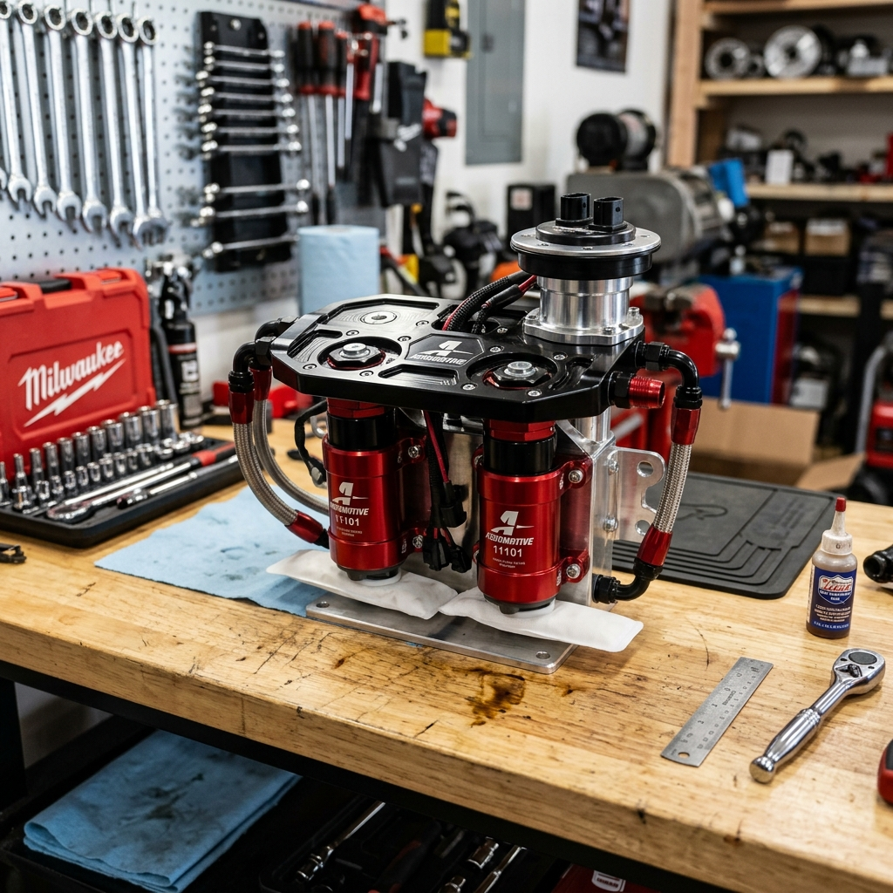

# Fuel Pump Upgrades for E85 Conversions: The Ultimate Guide to Walbro, AEM, and More

When enthusiasts talk about switching to E85 (ethanol fuel), the conversation usually revolves around flex-fuel sensors, larger fuel injectors, and aggressive tuning strategies. However, one of the most critical—and sometimes overlooked—components of a successful and reliable E85 conversion is the fuel pump. E85 demands significantly more fuel volume than standard gasoline, and its chemical properties can wreak havoc on fuel system components that aren't designed to handle it. In this comprehensive guide, we will dive deep into the world of fuel pump upgrades for E85 conversions, with a special focus on industry leaders like Walbro (TI Automotive) and AEM.

Whether you are building a mild street car or a high-horsepower track monster, understanding the requirements of an E85 fuel system is essential. We will explore why E85 requires a pump upgrade, how to calculate your fuel needs, compare the best pumps on the market, and discuss crucial installation and wiring considerations to ensure your engine never runs lean.

## Why E85 Requires a Fuel Pump Upgrade

To understand why a fuel pump upgrade is usually mandatory when converting to E85, we must first look at the fundamental differences between E85 and standard pump gasoline. E85 is a blend of up to 85% ethanol and 15% gasoline. Ethanol is an alcohol-based fuel that has a lower energy density than gasoline. This means that to achieve the same amount of energy (and therefore the same air-fuel ratio in terms of lambda), you need to inject more E85 into the combustion chamber.

### The Volume Demand: The 30% Rule
On average, an engine running on E85 requires approximately 30% to 40% more fuel volume than it would when running on standard gasoline to achieve the same power output. This increased demand places a massive strain on the factory fuel pump. A factory pump that comfortably supplies enough fuel for a 400-horsepower gasoline engine will likely fall short when trying to support that same engine on E85, leading to dangerous lean conditions. 

If your fuel pump cannot keep up with the volume demand, fuel pressure will drop at high RPMs and under heavy load. A drop in fuel pressure means the injectors cannot deliver the required fuel mass, resulting in lean air-fuel mixtures, detonation (engine knock), and potentially catastrophic engine failure. 

### The Compatibility Issue: Corrosion and Lubricity
Volume isn't the only concern; material compatibility is equally important. Ethanol is hygroscopic, meaning it absorbs moisture from the air. It is also inherently more corrosive than gasoline and lacks the lubricating properties of petroleum-based fuels. 

Standard fuel pumps often have internal components—such as seals, armatures, and brushes—that are not designed to withstand prolonged exposure to high concentrations of ethanol. Over time, standard pumps running E85 can experience premature wear, swollen seals, and internal short circuits. Therefore, upgrading to an E85-compatible or E85-certified fuel pump is critical not just for performance, but for long-term reliability.

## Calculating Your Fuel Pump Needs

Before rushing out to buy the biggest fuel pump available, it's important to calculate your actual fuel requirements. An oversized fuel pump can heat up the fuel unnecessarily and overwhelm the factory fuel pressure regulator, causing tuning issues. Conversely, an undersized pump will lead to engine failure.

### Understanding Liters Per Hour (LPH)
Fuel pumps are typically rated in Liters Per Hour (LPH) at a specific pressure (usually 40 or 43.5 PSI). As fuel pressure increases (which it does in boosted applications that use a 1:1 rising rate fuel pressure regulator), the pump's flow volume decreases. Therefore, you must look at a pump's flow chart to determine its flow rate at your maximum operating pressure.

### The Math Behind Fuel Sizing
To roughly estimate the required fuel pump size for E85, you can use the Brake Specific Fuel Consumption (BSFC) formula. BSFC is the amount of fuel consumed per unit of power produced.

For gasoline, BSFC is typically around:
- Naturally Aspirated: 0.45 - 0.50 lbs/hp/hr
- Forced Induction: 0.55 - 0.65 lbs/hp/hr

For E85, you must increase these values by about 30-35%:
- Naturally Aspirated E85: 0.60 - 0.65 lbs/hp/hr
- Forced Induction E85: 0.75 - 0.85 lbs/hp/hr

**Formula:**
`Required Flow (lbs/hr) = Target Horsepower × BSFC`

To convert lbs/hr to LPH (assuming E85 weighs roughly 6.59 lbs per gallon and there are 3.785 liters in a gallon):
`LPH = (lbs/hr / 6.59) × 3.785`

**Example:**
If you want to make 600 horsepower on E85 with a turbocharged engine (BSFC 0.80):
`Required Flow = 600 × 0.80 = 480 lbs/hr`
`LPH = (480 / 6.59) × 3.785 = 275 LPH`

This means you need a pump that can flow *at least* 275 LPH at your maximum boost pressure. However, it is always recommended to build in a 20% safety margin. Therefore, a pump rated around 320-340 LPH at operating pressure would be a safe choice for this application.

## Walbro (TI Automotive) Fuel Pumps: The Industry Standard

Walbro, now officially known as TI Automotive, is arguably the most famous name in aftermarket fuel pumps. They offer a wide range of pumps that have become the go-to choice for E85 conversions. TI Automotive's "F9000" series pumps are specifically designed with sealed components and unique turbine designs to handle the rigors of ethanol.

### 1. Walbro 450 LPH (F90000267 / F90000274)
The Walbro 450, often referred to as the "E85 pump," revolutionized the aftermarket. It features a unique dual-channel turbine design that allows it to operate quietly while flowing massive amounts of fuel at high pressures. 
- **Flow Rate:** ~450 LPH at 40 PSI
- **E85 Compatibility:** Fully compatible (F90000267 is the standard high-pressure version, F90000274 is the high-pressure variant with a higher pressure relief valve setting).
- **Power Capability:** Can typically support up to 700-800 WHP on E85 (depending on engine efficiency and base fuel pressure).
- **Pros:** Proven reliability, extremely quiet operation, excellent high-pressure flow.
- **Cons:** The "bell-bottom" design is wider at the base than standard pumps, which may require modification to the factory fuel pump hanger or bucket for installation.

### 2. Walbro 525 LPH "Hellcat" Pump (F90000285)
Originally designed for the Dodge Challenger SRT Hellcat, the Walbro 525 is a monster of an in-tank fuel pump. It shares the same basic physical dimensions as the 450 (including the bell bottom) but utilizes optimized internals to flow even more fuel.
- **Flow Rate:** ~470-525 LPH depending on voltage and pressure.
- **E85 Compatibility:** Fully compatible.
- **Power Capability:** Can support 800-900+ WHP on E85 in a single-pump configuration.
- **Pros:** Massive flow capability from a single in-tank pump.
- **Cons:** Draws a significant amount of electrical current (often over 20 amps at high pressure). A substantial hardwire kit with thick gauge wire and a heavy-duty relay is absolutely mandatory.

### 3. Walbro 255 LPH (GSS341 / GSS342)
The classic Walbro 255 has been powering street cars for decades. While Walbro produces standard gasoline versions of this pump, they are often used with E85 by budget-conscious builders. However, it is important to note that the standard GSS line is *not* officially E85 certified by TI Automotive, and their lifespan may be reduced when exposed to high ethanol content. 
For low-power E85 builds (under 400 WHP), it can work, but stepping up to a specifically designed E85 pump is highly recommended for peace of mind.

## AEM Performance Electronics Fuel Pumps

AEM has built a strong reputation for offering high-quality, competitively priced fueling components. Their E85-compatible fuel pumps are favored by many tuners for their standard dimensions and reliable performance. 

### 1. AEM 340 LPH E85-Compatible High Flow Pump (50-1200)
The AEM 340 LPH pump is one of the most popular choices for moderate E85 builds. Its biggest advantage over the Walbro 450/525 is its form factor: it utilizes a standard 39mm straight cylindrical body, making it a direct drop-in replacement for many factory fuel pumps without the need to hack up the fuel pump bucket.
- **Flow Rate:** 340 LPH at 40 PSI.
- **E85 Compatibility:** Fully compatible and designed specifically with E85-safe internals.
- **Power Capability:** Can comfortably support 500-600 WHP on E85.
- **Pros:** Compact size, direct fitment for many applications, excellent value, reliable.
- **Cons:** Flow drops off slightly faster at very high pressures compared to the dual-channel Walbro pumps.

### 2. AEM 400 LPH Metric High Flow Pump (50-1005)
This pump is designed primarily for external, inline mounting but can be used in-tank in some custom setups. It features robust roller vane technology.
- **Flow Rate:** 400 LPH at 40 PSI.
- **E85 Compatibility:** Rated for E85, though AEM notes that prolonged use with 100% alcohol may reduce its lifespan.
- **Power Capability:** Up to 700 WHP on E85.
- **Pros:** Very strong flow at high pressures (rated up to 120 PSI), versatile mounting options.
- **Cons:** Can be noisy (typical of inline roller vane pumps), requires custom plumbing.

## Dual and Triple Pump Setups for Extreme Power

When a single pump—even a mighty Walbro 525—is not enough to support your power goals (typically above 900 WHP on E85), the next step is a multi-pump setup. Running two or three fuel pumps in parallel dramatically increases fuel volume.

### The Staged Approach
In a multi-pump system, it is rarely necessary or beneficial to have all pumps running continuously. Running multiple large pumps at idle or low load heats up the fuel, overwhelms the pressure regulator, and draws massive alternator current. 

Instead, a staged approach is used. One pump acts as the primary pump, running full-time to handle idle, cruising, and light acceleration. The secondary (and tertiary) pumps are triggered by the engine management system (ECU) or a standalone Hobbs switch only when a specific boost pressure or load threshold is reached.

### Fuel Pump Hangers and Surge Tanks
To run multiple pumps, you generally have two options:
1.  **Aftermarket In-Tank Hangers:** Companies like Radium Engineering, Fore Innovations, and Squash Performance manufacture billet aluminum fuel pump hangers that replace the factory unit and can house two or three Walbro or AEM pumps directly in the factory fuel tank.
2.  **Surge Tanks:** A surge tank is a small secondary fuel tank (usually 1-3 liters) mounted in the trunk or under the car. The factory in-tank pump (acting as a "lift pump") fills the surge tank. Inside (or outside) the surge tank are massive E85 pumps that feed the engine. Surge tanks completely eliminate fuel starvation issues caused by fuel sloshing during high-G cornering or acceleration.

## Crucial Installation Considerations: Wiring is Everything

Installing a high-flow E85 pump involves much more than just dropping it into the tank. The number one cause of aftermarket fuel pump failure or underperformance is inadequate wiring.

### The Hardwire Upgrade
High-performance fuel pumps draw significantly more electrical current (amps) than factory pumps. The factory wiring gauge in most vehicles is too thin to handle this increased load. If you try to run a Walbro 450 on factory wiring, the voltage reaching the pump will drop significantly. 

Voltage directly dictates pump speed and flow. A pump rated at 450 LPH at 13.5 volts might only flow 380 LPH if it's only receiving 11 volts due to thin wire resistance. Furthermore, the increased resistance can melt factory wiring, relays, or the pins on the fuel pump housing connector, creating a severe fire hazard.

**How to Hardwire:**
To properly install a high-flow pump, you must bypass the factory power wire. 
1.  Run a thick-gauge power wire (usually 10 AWG or 12 AWG) directly from the battery (fused close to the battery) to the trunk/fuel tank area.
2.  Install a high-quality, heavy-duty automotive relay (e.g., 30 or 40-amp relay).
3.  Use the factory fuel pump power wire simply as the "trigger" signal for the new relay.
4.  Ensure you also upgrade the ground wire for the pump to the same thick gauge, grounding it to a clean, bare metal point on the chassis.

### Upgrading the Bulkhead Connector
Many builders upgrade the wiring *up to* the fuel tank lid, but fail to upgrade the wiring passing *through* the lid (the bulkhead) and down into the fuel pump. The factory pins on the bulkhead connector often cannot handle the 15-25 amps drawn by a large pump and will melt over time. It is highly recommended to drill a new hole in the fuel pump housing and install a specialized, sealed electrical bulkhead connector designed for high-current applications.

## Filtration: Protecting Your Investment

E85 acts as a powerful solvent. When you first convert a vehicle that has run gasoline for years to E85, the ethanol will clean all the varnish, sludge, and deposits from the walls of the fuel tank and fuel lines. This debris will immediately be pushed toward your engine.

Furthermore, some aftermarket pumps, like the Walbro 450, have extremely tight internal tolerances. Even tiny particulate matter can jam the turbine, resulting in instant pump failure.

### Pre-Pump Filters (Strainers)
Always install a new, clean "sock" or strainer on the inlet of your new fuel pump. E85-specific strainers are often made of synthetic materials that will not break down in alcohol. 

### Post-Pump Inline Filters
The factory inline fuel filter (if equipped) may have paper elements that degrade in E85, or it may simply be too restrictive for the increased fuel volume. Upgrade to an aftermarket billet aluminum fuel filter with a stainless steel or micro-glass element.
- Use a **10-micron or 6-micron** filter placed *after* the fuel pump and *before* the fuel injectors. This fine filtration is necessary to protect modern, high-precision fuel injectors from clogging.
- Check and clean/replace this filter element frequently during the first few thousand miles of E85 use, as it will catch the "gunk" the ethanol cleans out of the system.

## The Fuel Pressure Regulator (FPR)

Upgrading to a massive fuel pump often introduces a new problem: overpowering the factory Fuel Pressure Regulator (FPR). The FPR's job is to bleed off excess fuel and return it to the tank to maintain a steady base pressure at the fuel rail. 

If you install a Walbro 525 that is pumping massive volume at idle, the tiny orifice in the factory FPR may not be able to flow enough fuel back to the tank. This causes a "backup" in the system, and your base fuel pressure will uncontrollably spike upwards. High base pressure will cause the engine to run incredibly rich at idle and light cruise, making the car difficult or impossible to tune.

If you are stepping up to a 400+ LPH pump, you should plan on upgrading to an adjustable aftermarket Fuel Pressure Regulator (like those from Aeromotive, Fuelab, or AEM) and potentially upgrading the return line size to the tank to handle the bypass flow.

## Returnless vs. Return-Style Fuel Systems

Many modern cars utilize a "returnless" fuel system, where the FPR is located inside the fuel tank on the pump module, and a single dead-end line runs to the fuel rail. 
While you *can* run E85 and upgraded pumps in a returnless system, it presents challenges. Returnless systems rely heavily on voltage control (Pulse Width Modulation) from a Fuel Pump Control Module (FPCM) to regulate pressure. Large aftermarket pumps often draw too much current for the factory FPCM, causing it to overheat or fail.

For serious E85 builds, many tuners opt to convert a returnless system to a traditional "return-style" system. This involves installing an FPR at the fuel rail and running a new return line back to the fuel tank. This ensures stable pressure under all boost conditions and allows for easier integration of massive fuel pumps.

## Maintenance and Long-Term Care

E85 is an incredible performance fuel, but it does require more vigilance than standard gasoline.
1.  **Don't Let it Sit:** Because ethanol absorbs moisture, allowing E85 to sit in your tank for extended periods (e.g., over winter storage) can lead to phase separation, where the water/ethanol mix separates from the gasoline and sinks to the bottom. This can cause severe corrosion in the tank and pump. If storing the car, drain the E85 and fill it with standard ethanol-free pump gas, or use specialized E85 fuel stabilizers.
2.  **Monitor Your Filters:** As mentioned, check your inline filters regularly. A clogged filter will restrict flow, putting strain on your upgraded pump and causing lean conditions.
3.  **Listen to Your Pump:** Pay attention to how your pump sounds. A sudden change in pitch or excessive whining can indicate a restricted filter, a failing relay, or a pump that is beginning to seize.

## Conclusion

Converting to E85 is one of the most cost-effective ways to make massive power, but the fuel system cannot be an afterthought. The fuel pump is the heart of your E85 setup. Whether you choose the compact, drop-in convenience of the AEM 340, the proven massive flow of the Walbro 450, or the extreme capacity of the Walbro 525 Hellcat pump, selecting the right component is vital.

Remember that a pump is only as good as its supporting cast. Proper hardwiring, adequate filtration, an upgraded pressure regulator, and meticulous installation are just as important as the pump itself. By carefully calculating your needs and investing in quality components from trusted brands like TI Automotive (Walbro) and AEM, you can ensure your E85 conversion provides reliable, knock-free performance for years to come.
