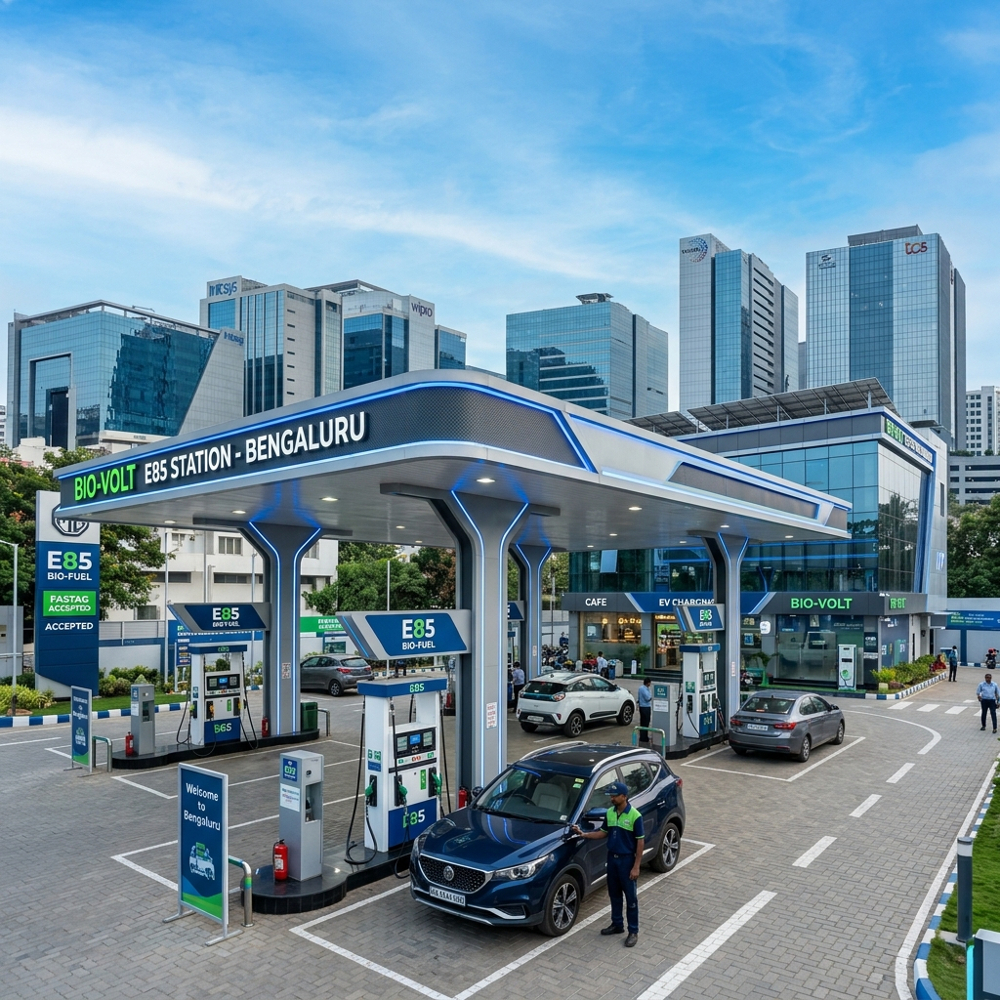

# E85 Fuel Stations in Bengaluru & Hyderabad: The Complete South India Guide

The automotive landscape in India is undergoing a massive transformation, driven by an urgent need for cleaner, greener, and more sustainable fuel alternatives. At the forefront of this green revolution are two of South India's most prominent economic and technological powerhouses: Bengaluru and Hyderabad. Known for their rapid urbanization, booming IT sectors, and unfortunately, their notorious traffic congestion, these cities are now leading the charge in adopting E85 flex-fuel technology.

This comprehensive guide delves deep into the current state of E85 fuel stations in Bengaluru and Hyderabad. Whether you are a daily commuter looking to switch to a flex-fuel vehicle, an environmental enthusiast, or just someone curious about the future of mobility in South India, this article provides you with everything you need to know about E85 availability, pricing, vehicle options, and the road ahead.

## Table of Contents
1. [The Rise of E85 in South India](#the-rise-of-e85-in-south-india)
2. [Why Bengaluru and Hyderabad are Leading the Charge](#why-bengaluru-and-hyderabad-are-leading-the-charge)
3. [E85 Fuel Stations in Bengaluru: A Detailed Breakdown](#e85-fuel-stations-in-bengaluru)
   - [Central Bengaluru](#central-bengaluru)
   - [South Bengaluru](#south-bengaluru)
   - [East Bengaluru (IT Corridor)](#east-bengaluru-it-corridor)
   - [North and West Bengaluru](#north-and-west-bengaluru)
4. [E85 Fuel Stations in Hyderabad: Mapping the Network](#e85-fuel-stations-in-hyderabad)
   - [HITEC City and Madhapur](#hitec-city-and-madhapur)
   - [Secunderabad and Central Hyderabad](#secunderabad-and-central-hyderabad)
   - [Outer Ring Road (ORR) and Suburbs](#outer-ring-road-orr-and-suburbs)
5. [Pricing and Economics: E85 vs. Petrol in South India](#pricing-and-economics)
6. [Government Initiatives: Karnataka and Telangana](#government-initiatives)
7. [Top Flex-Fuel Vehicles for City Commuting](#top-flex-fuel-vehicles)
8. [Maintenance Tips for E85 Users in South India](#maintenance-tips)
9. [The Future of E85 Infrastructure in South India](#future-of-e85-infrastructure)
10. [Conclusion](#conclusion)

---

## 1. The Rise of E85 in South India 

For decades, the Indian automotive sector has relied heavily on imported crude oil, making it susceptible to global price fluctuations and contributing significantly to urban air pollution. The introduction of E85—a high-level blend consisting of up to 85% ethanol and 15% petrol—marks a pivotal shift. Ethanol, primarily derived from sugarcane, maize, and surplus agricultural biomass, offers a renewable and locally produced alternative.

In South India, states like Karnataka and Telangana have recognized the immense potential of ethanol blending. Not only does it align with the national mandate to reduce carbon emissions and achieve net-zero targets by 2070, but it also bolsters the local agricultural economy. Sugarcane farmers in Karnataka and parts of Telangana are finding a new, lucrative market for their produce, bridging the gap between agriculture and energy.

As consumer awareness grows, the demand for E85 is steadily increasing. Motorists are becoming more conscious of their carbon footprint and are actively seeking ways to contribute to a cleaner environment without compromising on vehicle performance. The transition, however, hinges on one critical factor: a robust and accessible network of E85 fuel stations.

---

## 2. Why Bengaluru and Hyderabad are Leading the Charge 

Bengaluru (the Silicon Valley of India) and Hyderabad (Cyberabad) are unique ecosystems that foster innovation and rapid adoption of new technologies. Several factors contribute to their leadership in the E85 space:

### A Progressive Demographic
Both cities boast a young, educated, and environmentally conscious demographic. Tech professionals, startup founders, and students are often the early adopters of green technologies, including electric vehicles (EVs) and flex-fuel cars. They are more likely to research, understand, and appreciate the benefits of E85 over traditional fossil fuels.

### High Traffic Density and Pollution Concerns
The notorious traffic jams of Bengaluru's Silk Board junction or Hyderabad's Ameerpet are well-documented. Stop-and-go traffic significantly increases vehicle emissions. The local governments and citizens alike are desperate for solutions that can clear the air. E85 burns cleaner than pure petrol, producing fewer tailpipe emissions, making it an attractive proposition for these heavily congested urban centers.

### Proximity to Ethanol Production Hubs
Karnataka is one of India's top sugarcane-producing states. The presence of numerous sugar mills and distilleries in regions like Mandya, Belagavi, and Bagalkot ensures a steady and cost-effective supply of ethanol to Bengaluru. Similarly, Telangana and neighboring Andhra Pradesh have robust agricultural sectors capable of supporting ethanol production, facilitating a streamlined supply chain to Hyderabad.

### Supportive State Policies
Both the Karnataka and Telangana state governments have implemented proactive policies to support alternative fuels. From tax incentives for setting up dispensing infrastructure to subsidies for flex-fuel vehicle purchases, the regulatory environment in these states is highly conducive to the growth of E85.

---

## 3. E85 Fuel Stations in Bengaluru: A Detailed Breakdown 

Navigating Bengaluru's vast expanse requires a well-distributed network of fuel stations. Oil Marketing Companies (OMCs) like Indian Oil Corporation (IOCL), Bharat Petroleum (BPCL), and Hindustan Petroleum (HPCL) have aggressively rolled out E85 dispensing units across the city. Here is a zone-wise breakdown of where you can find E85 in Bengaluru.

### Central Bengaluru 
Central Bengaluru, encompassing areas like MG Road, Brigade Road, and Richmond Town, is the commercial heart of the city. While space for new petrol pumps is limited, existing stations are rapidly upgrading.
- **IOCL Station, Residency Road:** One of the first in the city to offer E85, this station is highly convenient for office-goers in the CBD.
- **BPCL Pump, Shanti Nagar:** Located near the major bus terminus, this station serves both private flex-fuel cars and commercial vehicles testing ethanol blends.
- **HPCL, Vasanth Nagar:** A critical pitstop for commuters traveling towards the northern parts of the city.

### South Bengaluru 
Known for its traditional charm and residential layouts like Jayanagar, JP Nagar, and Banashankari, South Bengaluru has seen a steady increase in E85 availability.
- **BPCL Outlet, Jayanagar 4th Block:** Situated in a bustling commercial area, this station reports high volumes of E85 sales, particularly on weekends.
- **IOCL, Bannerghatta Road:** Vital for commuters heading towards the tech parks down south or the national park. This station often features dedicated lanes for E85 to reduce wait times.
- **HPCL, BTM Layout:** Serving a dense population of young professionals and students, the E85 demand here is growing exponentially.

### East Bengaluru (IT Corridor) 
Whitefield, Marathahalli, and Bellandur form the core of Bengaluru's IT industry. The high concentration of techies here makes it a prime market for E85.
- **IOCL, Outer Ring Road (Near Bellandur):** A massive station catering to thousands of tech park employees. The E85 dispensers here are almost always busy during peak hours.
- **BPCL, Whitefield Main Road:** Strategically located to serve the massive residential and commercial complexes in the area.
- **HPCL, Indiranagar 100 Ft Road:** Combines premium fuel offerings with E85, catering to the upscale demographic of Indiranagar and Domlur.

### North and West Bengaluru 
With the airport located in the north and industrial hubs in the west, these zones are critical for comprehensive coverage.
- **IOCL, Hebbal (En route to KIAL):** A flagship station that not only offers E85 but also features educational displays about the benefits of ethanol blending for travelers heading to the airport.
- **BPCL, Rajajinagar:** Serving the traditional industrial and residential belts of West Bengaluru.
- **HPCL, Yeshwanthpur:** Located near the major railway station and industrial suburb, ensuring E85 is available for both passenger and light commercial flex-fuel vehicles.

*(Note: The number of E85 stations is expanding rapidly. Always use the official apps of IOCL, BPCL, or HPCL for real-time availability and navigation.)*

---

## 4. E85 Fuel Stations in Hyderabad: Mapping the Network 

Hyderabad's unique geography, characterized by its historic center and the sprawling modern IT hubs, requires a strategic placement of E85 stations. The city has embraced the transition with open arms.

### HITEC City and Madhapur 
The nucleus of Cyberabad, this area is home to global tech giants and a demographic that is highly receptive to green tech.
- **IOCL, Madhapur Main Road:** Frequently visited by IT professionals, this station was upgraded early to dispense E85, setting a precedent for the area.
- **BPCL, Jubilee Hills Checkpost:** Serving the affluent neighborhoods, this station highlights that E85 is not just an economical choice, but a premium, eco-friendly lifestyle choice.
- **HPCL, Gachibowli:** Located near major universities and corporate campuses, providing easy access to a large volume of daily commuters.

### Secunderabad and Central Hyderabad 
The older, more congested parts of the twin cities are where the emissions-reducing benefits of E85 are needed most.
- **BPCL, Paradise Circle, Secunderabad:** A high-traffic location ensuring that the traditional commercial hubs have access to cleaner fuel.
- **IOCL, Begumpet:** Strategically placed on one of the most vital arterial roads connecting Secunderabad to Hyderabad.
- **HPCL, Himayatnagar:** Catering to the dense residential and commercial blocks in central Hyderabad.

### Outer Ring Road (ORR) and Suburbs 
Hyderabad's ORR is an engineering marvel, and ensuring fuel availability along this stretch is crucial for inter-city and long-distance commuters.
- **IOCL, Shamshabad (Near Airport):** Essential for airport taxis and personal vehicles making the long drive to Rajiv Gandhi International Airport.
- **BPCL, Medchal Highway:** Serving the industrial corridors and acting as a refueling point for vehicles heading north towards Maharashtra.
- **HPCL, LB Nagar:** A critical junction for traffic moving towards Vijayawada, ensuring that the E85 network extends beyond the immediate city limits.

---

## 5. Pricing and Economics: E85 vs. Petrol in South India 

One of the most compelling arguments for adopting E85 in Bengaluru and Hyderabad is the economic advantage. While prices fluctuate based on state taxes, central excise duties, and global crude oil rates, E85 consistently offers a price benefit over regular unleaded petrol.

### The Price Gap
On average, in cities like Bengaluru and Hyderabad, E85 is priced significantly lower than standard petrol. This price differential is primarily because ethanol is domestically produced and is not subject to the same high import tariffs and volatile global market dynamics as crude oil.

For instance, if standard petrol is priced around ₹100 per liter, E85 might be available at a noticeably discounted rate, often between ₹75 to ₹85 per liter (illustrative figures). This upfront saving at the pump is a major draw for high-mileage drivers, such as daily office commuters and cab aggregators.

### Understanding Fuel Efficiency (MPG/KMPL)
It is crucial to understand the thermodynamics of E85. Ethanol has a lower energy density than petrol. This means you need slightly more E85 to generate the same amount of energy as a liter of pure petrol. Consequently, flex-fuel vehicles running on E85 typically experience a slight drop in fuel economy (Kilometers Per Liter - KMPL)—usually around 15% to 25% lower than when running on standard petrol.

### The Break-Even Analysis
Despite the lower fuel economy, the significant price discount of E85 often results in a lower cost per kilometer driven.
- **Cost of Petrol:** High price / Higher KMPL
- **Cost of E85:** Lower price / Slightly lower KMPL

For the average commuter in Bengaluru traffic or Hyderabad's ORR, calculating the "cost per kilometer" usually reveals that running on E85 is lighter on the wallet. Furthermore, as local ethanol production scales up and distribution becomes more efficient, the price gap is expected to widen further in favor of E85.

---

## 6. Government Initiatives: Karnataka and Telangana 

The rapid expansion of E85 infrastructure in South India is not accidental; it is the result of concerted policy efforts by both state and central governments.

### Karnataka's Biofuel Policy
Karnataka has been a pioneer in alternative fuels. The state's biofuel policy aggressively promotes the use of ethanol.
- **Support for Sugar Mills:** The government provides incentives to sugar factories to set up ethanol distilleries, ensuring a robust local supply chain.
- **Infrastructure Subsidies:** OMCs receive support for retrofitting existing fuel stations with dedicated E85 underground tanks and dispensing nozzles.
- **Public Awareness Campaigns:** The state transport department actively runs campaigns in Bengaluru to educate citizens about the environmental benefits of E85.

### Telangana's Green Mobility Push
Telangana is rapidly positioning itself as a hub for sustainable mobility.
- **Investment in Distilleries:** The state has signed numerous MoUs with private players to establish grain-based ethanol plants, diversifying the feedstock away from just sugarcane.
- **Fast-Tracking Approvals:** The municipal corporations in Hyderabad (GHMC) have streamlined the approval processes for upgrading petrol pumps to dispense E85, minimizing bureaucratic delays.
- **Fleet Integration:** There are ongoing discussions to mandate a certain percentage of state transport buses and government vehicles to transition to flex-fuel technology.

---

## 7. Top Flex-Fuel Vehicles for City Commuting 

To utilize E85, you need a Flex-Fuel Vehicle (FFV). These vehicles have specially designed fuel systems (tanks, lines, and injectors) capable of handling the corrosive nature of high-ethanol blends, along with advanced engine control modules (ECMs) that can adjust the air-fuel mixture on the fly depending on the blend of fuel in the tank.

Here are some of the top anticipated or available flex-fuel models suited for the driving conditions in Bengaluru and Hyderabad:

### 1. Toyota Corolla Altis FFV / Innova Hycross Flex-Fuel
Toyota has been a vocal advocate for flex-fuel technology in India. They have showcased prototypes of the Corolla Altis and the Innova Hycross engineered to run on E85. These vehicles offer the premium comfort needed for long commutes in Hyderabad and the reliability essential for Bengaluru's unpredictable traffic.

### 2. Maruti Suzuki WagonR Flex-Fuel
Maruti Suzuki, India's largest carmaker, understands the pulse of the budget-conscious commuter. They have unveiled a flex-fuel prototype of the immensely popular WagonR. Its compact size makes it perfect for navigating the narrow lanes of Indiranagar or Secunderabad, offering an incredibly economical daily drive when powered by E85.

### 3. Bajaj Pulsar / TVS Apache (Two-Wheelers)
In cities where two-wheelers rule the roost, motorcycle manufacturers are not far behind. TVS has already experimented with ethanol-powered Apaches, and Bajaj is developing flex-fuel variants of the Pulsar. An E85-powered motorcycle could revolutionize urban commuting, offering unmatched cost-efficiency and radically lower emissions.

*(Note: The availability of specific FFV models is subject to manufacturer launch timelines in the Indian market. Check with local dealerships in Bengaluru and Hyderabad for the latest updates.)*

---

## 8. Maintenance Tips for E85 Users in South India 

Owning a flex-fuel vehicle in South India requires some specific, albeit simple, maintenance considerations due to the unique properties of ethanol and the local climate.

### 1. Manage Moisture Absorption
Ethanol is hygroscopic, meaning it absorbs moisture from the air. While Bengaluru's climate is relatively moderate, the monsoon seasons in both Bengaluru and Hyderabad bring high humidity.
- **Tip:** Try to keep your fuel tank at least half full to minimize the amount of air (and thus moisture) in the tank. If you plan to leave your car unused for several weeks, it is advisable to fill it with standard E10 or E20 petrol rather than E85, as lower ethanol blends are less prone to moisture issues over long periods.

### 2. Regular Oil Changes
Because E85 burns slightly differently and can sometimes lead to more moisture in the crankcase, adhering strictly to the manufacturer's oil change intervals is crucial.
- **Tip:** Use the specific grade of engine oil recommended for your FFV by the manufacturer, and do not delay scheduled servicing.

### 3. Fuel Filter Replacements
Ethanol is an excellent solvent. When you first switch an older FFV to E85, the ethanol can clean out years of accumulated deposits in the fuel tank and lines.
- **Tip:** Be prepared to replace your fuel filter slightly earlier than usual during the first few months of E85 usage, as it may clog with the dislodged debris.

### 4. Cold Starts in Winter (Bengaluru)
While South India doesn't experience freezing winters, early mornings in Bengaluru (December/January) can be quite chilly. E85 has a lower vapor pressure than petrol, making cold starts slightly more difficult.
- **Tip:** FFVs are designed to handle this, but you might notice the engine turning over a second or two longer on a cold Bengaluru morning. This is normal behavior for E85.

---

## 9. The Future of E85 Infrastructure in South India 

The current network of E85 stations in Bengaluru and Hyderabad is just the tip of the iceberg. The future looks incredibly promising.

### 1. 100% Coverage by Major OMCs
The goal of the central government and OMCs is ubiquitous availability. Over the next five years, we can expect nearly every major fuel station in these two cities to have at least one dedicated E85 dispenser.

### 2. Integration with EV Charging Hubs
Future mobility hubs will be multi-modal. We will likely see large stations on the Outer Ring Roads of both cities offering fast-charging for EVs alongside E85 pumps, catering to all forms of green transportation.

### 3. Advanced Dispensing Technology
To handle the growing demand, stations will employ advanced dispensing units capable of "blending at the pump." This allows a single pump to offer E10, E20, and E85 by dynamically mixing pure ethanol and petrol based on the customer's selection, optimizing underground storage space.

### 4. Expansion to Tier-2 Cities
As the infrastructure solidifies in the capitals, the E85 network will rapidly expand to Tier-2 cities in the region—such as Mysuru, Hubballi, and Mangaluru in Karnataka, and Warangal, Nizamabad, and Karimnagar in Telangana—creating a seamless green corridor across South India.

---

## 10. Conclusion 

Bengaluru and Hyderabad are writing a new chapter in India's automotive history. The rapid deployment of E85 fuel stations across these bustling metropolises is a testament to the region's commitment to sustainable development, economic pragmatism, and technological adoption.

For the residents of these cities, E85 offers a tangible, immediate way to fight air pollution while potentially lowering daily commuting costs. As automakers introduce more flex-fuel vehicles and the government continues to bolster the ethanol supply chain, the transition away from pure fossil fuels is not just a distant dream—it is happening right now, at a fuel station near you.

The next time you pull into an IOCL, BPCL, or HPCL station in Indiranagar or Jubilee Hills, take a look around. You might just spot the green E85 nozzle—the symbol of a cleaner, more sustainable South India.

---
*Disclaimer: Fuel prices, station availability, and vehicle models are subject to change. Always verify with official OMC apps and vehicle manufacturers for the most current information.*
