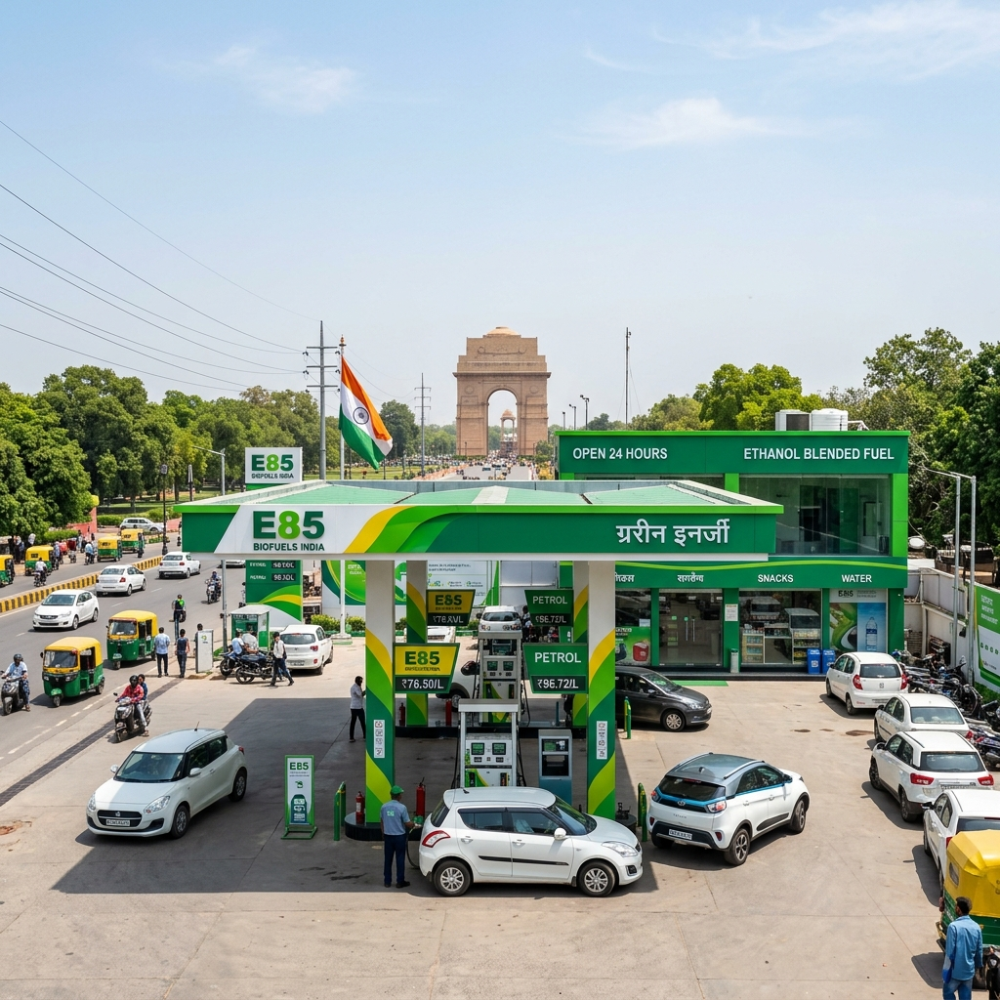

# E85 Fuel Stations in Delhi NCR: Complete Guide to Locations, Prices, and Availability

The automotive landscape in India is undergoing a monumental shift, and the National Capital Region (NCR) is at the very epicenter of this transformation. As the nation aggressively pivots towards sustainable, homegrown alternative fuels to curb massive crude oil import bills and combat the ever-growing air quality crisis, ethanol has emerged as the undisputed champion. While the rollout of E20 (20% ethanol blended with 80% petrol) has already covered significant ground across the country, the true revolution lies in the adoption of E85 fuel—a blend containing 85% ethanol and just 15% petrol.

For residents and commuters in Delhi, Gurugram, Noida, Faridabad, and Ghaziabad, the prospect of E85 fuel represents more than just a cheaper alternative at the pump; it is a critical weapon against the notorious winter smog and a step towards true energy independence. However, the transition from E20 to E85 requires significant infrastructure upgrades, both in terms of vehicle engine technology (Flex-Fuel Vehicles or FFVs) and the establishment of dedicated E85 fuel dispensing stations.

In this comprehensive, extensively detailed guide, we will dive deep into everything you need to know about E85 fuel stations in Delhi NCR. We will explore the current availability, pricing dynamics, the role of major Oil Marketing Companies (OMCs) like IOCL, BPCL, and HPCL, the environmental impact specific to the NCR, and what the future holds for flex-fuel vehicle owners in the capital.

---

## 1. Understanding E85 Fuel and Its Relevance to India

Before we map out the availability of E85 in the Delhi NCR region, it is crucial to understand what exactly this fuel is and why the Indian government, spearheaded by the Ministry of Road Transport and Highways (MoRTH), is pushing so aggressively for its adoption.

### What is E85?
E85 is a high-level ethanol blend consisting of 51% to 83% ethanol (depending on geography and season) and the remaining portion being unleaded gasoline (petrol). In the Indian context, the standard target for E85 generally implies an 85% ethanol blend. Ethanol is a renewable biofuel produced from biomass—primarily sugarcane, maize, broken rice, and agricultural waste (stubble). 

### The Octane Advantage
One of the most significant advantages of E85 is its high octane rating, which typically ranges from 100 to 105. This is substantially higher than standard unleaded petrol in India, which sits at 91 or 95 octane (XP95, Speed 97). A higher octane rating allows engines to run at higher compression ratios without experiencing "engine knock," leading to better performance, increased horsepower, and smoother engine operation in vehicles designed to handle it.

### Why Does India Need E85?
India imports roughly 85% of its crude oil requirements, leading to a massive drain on foreign exchange reserves. By shifting to E85, India can:
1. **Save Billions in Forex:** Replacing petrol with domestically produced ethanol keeps the money within the country, benefiting local farmers rather than foreign oil cartels.
2. **Empower the Annadata (Farmers):** Ethanol production directly boosts the agricultural economy. Farmers selling sugarcane, maize, and biomass have a guaranteed, profitable market.
3. **Slash Emissions:** Ethanol burns much cleaner than petrol. It significantly reduces carbon monoxide, particulate matter, and unburned hydrocarbons—pollutants that constantly choke Delhi NCR.

---

## 2. The Current Landscape of E85 Fuel Stations in Delhi NCR

As of mid-2026, the availability of E85 fuel in India is in a transitional, pilot-to-commercial phase. While E20 is widely available at almost all major petrol pumps across the NCR, dispensing E85 requires dedicated underground storage tanks, specialized dispensers lined with non-corrosive materials (as ethanol is highly corrosive to certain plastics and rubbers), and a steady supply chain from ethanol distilleries to the retail outlets.

The Oil Marketing Companies (OMCs)—Indian Oil Corporation Limited (IOCL), Bharat Petroleum Corporation Limited (BPCL), and Hindustan Petroleum Corporation Limited (HPCL)—are actively establishing Flex-Fuel dispensing corridors. Delhi NCR, being a primary hub for automotive testing and early adoption, is seeing the first wave of these specialized stations.

### A. E85 Stations in New Delhi & Delhi City

The core of the capital is naturally the starting point for alternative fuel infrastructure. Pilot pumps are strategically located near major arterial roads and government hubs to service official flex-fuel fleets and early adopters.

**1. Central and South Delhi**
South Delhi and Central Delhi have been prioritized for the initial E85 rollout due to the high concentration of new vehicle registrations and pilot testing by automakers.
*   **IOCL COCO Pump, Mathura Road:** As one of the flagship Company-Owned, Company-Operated (COCO) stations, this location is often the first to receive new fuel blends. It currently features a dedicated flex-fuel bay capable of dispensing high-level ethanol blends.
*   **BPCL Station, Chanakyapuri:** Located near the diplomatic enclave, this station has been upgraded to support E85, catering to specialized flex-fuel vehicles used by certain embassies and government officials.
*   **HPCL Auto Care Centre, Ring Road (Near South Extension):** A heavily trafficked station that has recently installed flex-fuel compatible underground tanks. 

**2. North and East Delhi**
The infrastructure in North and East Delhi is expanding, albeit at a slightly slower pace compared to the South.
*   **IOCL Station, Patparganj Industrial Area:** Catering to the commercial and private traffic moving towards the Delhi-Meerut Expressway.
*   **BPCL, GT Karnal Road:** A strategic location for inter-state travelers heading towards Haryana and Punjab, this pump is slated for E85 dispensing upgrades to support flex-fuel commercial vehicles.

### B. E85 Stations in Gurugram (Haryana)

Gurugram is a crucial market for E85, given its affluent demographic and high adoption rate of new automotive technologies. Furthermore, Maruti Suzuki, which is actively developing Flex-Fuel vehicles (like the WagonR Flex Fuel prototype), has a massive presence in the region.

*   **IOCL Station, Sector 14:** One of the oldest and largest pumps in Gurugram, which has added a dedicated flex-fuel nozzle.
*   **BPCL Pump, Golf Course Extension Road:** Serving the newer sectors, this modern fuel station has been built with E85 compatibility from the ground up.
*   **HPCL, NH-48 (Delhi-Jaipur Highway):** Crucial for highway commuters, this large-format station provides high-blend ethanol fuels for long-distance flex-fuel testing.

### C. E85 Stations in Noida and Greater Noida (Uttar Pradesh)

Uttar Pradesh is the undisputed king of sugarcane production in India, making it the heartland of ethanol manufacturing. Naturally, Noida and Greater Noida are heavily integrated into the E85 distribution network.

*   **IOCL Pump, Sector 18, Noida:** The commercial hub of Noida features a flagship IOCL pump that has been part of the MoRTH flex-fuel pilot program.
*   **BPCL Station, Noida-Greater Noida Expressway:** A vital stop for high-speed commuters. The Uttar Pradesh government’s push for ethanol ensures that stations on this expressway are well-supplied.
*   **HPCL, Knowledge Park, Greater Noida:** Located near educational institutions and IT parks, this station acts as a testing ground for newer dispensing technologies.

### D. E85 Stations in Faridabad and Ghaziabad

As industrial and residential extensions of Delhi, Faridabad and Ghaziabad are also seeing gradual upgrades to their fuel infrastructure.

*   **IOCL, Mathura Road, Faridabad:** An extension of the Delhi-Agra highway, this pump serves industrial traffic and early flex-fuel adopters.
*   **BPCL, Raj Nagar Extension, Ghaziabad:** Catering to the rapidly expanding residential population in Ghaziabad with cleaner fuel alternatives.

*(Note: The exact availability of E85 at these specific pumps can fluctuate based on supply chain logistics and ongoing pilot testing phases. It is always recommended to use OMC mobile applications like IndianOil ONE, SmartDrive by BPCL, or HP Pay to check real-time availability of Flex Fuel/E85 before visiting.)*

---

## 3. The Price of E85 in Delhi NCR: A Cost Analysis

One of the most compelling arguments for adopting E85 fuel is the price advantage it holds over standard unblended or E10/E20 petrol. Because ethanol is produced domestically and heavily incentivized by the government to reduce the crude oil import bill, it is inherently cheaper than refined petroleum.

### Current Pricing Dynamics (2026 Estimates)
While standard petrol (E20) in Delhi fluctuates around the ₹94 to ₹97 per liter mark, the pricing strategy for E85 is entirely different. 

Ethanol at the distillery gate is procured by OMCs at a fixed price set by the government (ranging roughly between ₹60 to ₹65 per liter depending on the feedstock—sugarcane juice, B-heavy molasses, C-heavy molasses, or maize). When blended at an 85% ratio and factoring in transportation, dealer commissions, and significantly lower taxes compared to petrol, the retail price of E85 is substantially lower.

*   **Standard E20 Petrol Price in Delhi:** ~₹94.00 - ₹96.00 per liter
*   **Estimated E85 Fuel Price in Delhi NCR:** ~₹70.00 - ₹75.00 per liter

**This translates to a direct saving of roughly ₹20 to ₹25 per liter at the pump.**

### The Caloric Value Caveat (Fuel Efficiency)
While the per-liter price of E85 is highly attractive, consumers must understand the concept of energy density. Ethanol contains about 25% to 30% less energy per unit of volume than pure petrol. 

What does this mean for the driver? It means that a Flex-Fuel Vehicle running on E85 will consume more fuel to travel the same distance compared to running on pure petrol. Generally, you can expect a drop in fuel efficiency (mileage) of about 15% to 25% when using E85.

### The Economic Breakdown
Let's do a quick calculation to see if E85 is financially viable despite the lower mileage.

Assume a standard car gives 15 km/l on standard E20 Petrol.
*   Cost to travel 15 km on Petrol = ₹95.00
*   Cost per km = ₹6.33

If the same Flex-Fuel car runs on E85, the mileage drops by 20%, resulting in 12 km/l.
*   Cost to travel 12 km on E85 = ₹72.00
*   Cost per km = ₹6.00

**Conclusion:** Even with the drop in fuel efficiency, the significantly lower retail price of E85 results in an overall lower running cost per kilometer for the consumer. Furthermore, the higher octane rating provides better engine performance, making it a win-win scenario.

---

## 4. Why Delhi NCR Urgently Needs E85 Fuel

The National Capital Region is infamous globally for its severe air quality issues, particularly during the winter months when a combination of vehicular emissions, industrial pollution, stubble burning in neighboring states, and stagnant weather conditions create a toxic smog.

E85 fuel offers a multipronged solution to Delhi's unique environmental challenges:

### 1. Massive Reduction in Tailpipe Emissions
Ethanol contains oxygen in its chemical structure, which leads to a more complete combustion process inside the engine. Compared to standard petrol, E85 reduces tailpipe emissions of carbon monoxide by up to 40% and significantly cuts down on volatile organic compounds (VOCs) and fine particulate matter (PM2.5 and PM10). For a city gasping for clean air, transitioning millions of commuter vehicles to E85 would result in a measurable drop in urban smog.

### 2. Solving the Stubble Burning Crisis
Every winter, Delhi chokes on the smoke generated by crop stubble burning in Punjab and Haryana. The government's ethanol policy is directly addressing this by setting up 2G (Second Generation) bio-refineries. These refineries, like the IOCL plant in Panipat, convert agricultural waste (stubble/parali) into ethanol. 

By creating a massive demand for E85 in Delhi NCR, we create an economic incentive for farmers in neighboring states to sell their stubble to bio-refineries rather than burning it. The problem becomes the solution.

### 3. Lowering Carbon Intensity
Ethanol is a renewable fuel. The carbon dioxide emitted by a vehicle burning E85 is roughly offset by the carbon dioxide absorbed by the plants (sugarcane, maize) grown to produce the ethanol. This creates a much tighter, sustainable carbon cycle compared to extracting and burning fossil fuels from deep underground.

---

## 5. Flex-Fuel Vehicles (FFVs): The Prerequisite for E85

You cannot simply drive a standard petrol car into an E85 pump and fill it up. High-level ethanol blends require specially designed engines. 

### What Happens if You Put E85 in a Standard Car?
1.  **Corrosion:** Ethanol is hygroscopic (absorbs water) and highly corrosive to certain types of rubber seals, gaskets, and plastics used in standard fuel systems. Over time, E85 will eat away at these components, causing massive fuel leaks and engine failure.
2.  **Lean Condition:** E85 requires a different air-to-fuel ratio than petrol. A standard car's Engine Control Unit (ECU) cannot adjust the fuel injection sufficiently, causing the engine to run dangerously "lean," which leads to overheating, misfires, and catastrophic internal engine damage.

### What Makes a Flex-Fuel Vehicle Different?
Automakers design FFVs specifically to handle any blend of petrol and ethanol, from E0 up to E85.
*   **Corrosion-Resistant Materials:** The fuel tank, fuel lines, fuel pump, and injectors are made of stainless steel or specialized plastics that resist ethanol corrosion.
*   **Smart Fuel Sensors:** The fuel line contains an ethanol sensor that reads the exact percentage of ethanol in the fuel in real-time.
*   **Advanced ECU Mapping:** The vehicle's computer reads the sensor data and instantly adjusts the ignition timing and fuel injection pulse width to ensure optimal combustion, whether you just filled up with E20 or E85.

### FFVs Available and Upcoming in India
The Indian government has strongly mandated auto manufacturers to develop FFVs. The transition is currently underway:

*   **Toyota:** Toyota has been at the forefront, having showcased the flex-fuel Corolla Altis hybrid. They are heavily investing in bringing flex-fuel hybrid technology to mass-market vehicles in India.
*   **Maruti Suzuki:** India's largest carmaker showcased a working prototype of the WagonR Flex Fuel, capable of running on anything from E20 to E85. This vehicle is currently undergoing rigorous testing in NCR conditions and is expected to hit commercial production soon.
*   **TVS and Bajaj (Two-Wheelers):** The two-wheeler market is actually moving faster. TVS launched the Apache RTR 200 Fi E100, and Bajaj is aggressively pushing its flex-fuel motorcycle lineup, providing cheap, clean mobility for the masses.

---

## 6. How to Locate E85 Stations in Delhi NCR

As the infrastructure is still scaling up, finding an E85 station requires a bit of planning. You won't find it at every street corner just yet. Here is how you can reliably locate E85 dispensing pumps:

### 1. Official OMC Mobile Applications
This is the most reliable method. The Oil Marketing Companies continuously update their apps with the latest fuel availability at their respective retail outlets.
*   **IndianOil ONE App (IOCL):** Features a robust pump locator where you can filter by fuel type, including Flex Fuel/Ethanol.
*   **SmartDrive App (BPCL):** Allows you to search for specialized fuels and EV charging stations.
*   **HP Pay (HPCL):** Provides real-time data on fuel availability at HP pumps across the NCR.

### 2. The MoRTH and SIAM Portals
The Ministry of Road Transport and Highways, in collaboration with the Society of Indian Automobile Manufacturers (SIAM), frequently publishes press releases and updates regarding the expansion of flex-fuel corridors. Keeping an eye on these portals can give you advance notice of newly commissioned E85 pumps.

### 3. Look for the Dispenser Signage
When you drive into a major pump, look for distinct branding. E85 dispensers are usually clearly marked with green branding, differentiating them from the standard blue/red/yellow petrol and diesel dispensers. They will often explicitly say "E85" or "Flex Fuel."

---

## 7. Challenges and the Road Ahead

While the vision is clear and the benefits are undeniable, rolling out E85 across Delhi NCR is not without its hurdles.

### 1. Infrastructure Upgrades
Upgrading a standard petrol pump to dispense E85 is expensive. It requires digging up the forecourt to install separate, non-corrosive underground storage tanks (USTs) and installing dedicated dispensing units. For many smaller, privately-owned dealerships in crowded areas of Delhi, space and capital constraints make this difficult.

### 2. Supply Chain Logistics
Transporting high-level ethanol blends is tricky because ethanol easily absorbs moisture from the air. It cannot be transported through existing petroleum pipelines because water condensation inside the pipes would ruin the fuel. Therefore, ethanol must be transported via dedicated tanker trucks or rail wagons, increasing logistical complexity.

### 3. Cold Start Issues in Winter
Delhi experiences severe winters, with temperatures occasionally dropping near freezing. E85 has a higher latent heat of vaporization than petrol, meaning it is harder to vaporize in cold temperatures. This can lead to "cold start" issues where the engine struggles to turn over on a cold winter morning. Automakers have to heavily modify engine software and sometimes include engine block heaters or use a slightly lower ethanol blend (like E70 or E75) during peak winter months to combat this.

### 4. Consumer Awareness
There is still a massive gap in consumer knowledge. Many drivers do not understand the difference between E20 and E85, nor do they understand that putting E85 in a non-FFV will destroy their engine. A massive public awareness campaign is required alongside the infrastructure rollout.

---

## 8. Conclusion: The E85 Revolution in the Capital

The introduction of E85 fuel stations in Delhi NCR is not merely an incremental change in how we fuel our vehicles; it is a fundamental paradigm shift towards a sustainable, self-reliant Indian economy. 

For the average consumer in Delhi, Gurugram, or Noida, E85 represents the promise of significantly lower fuel bills and a noticeable improvement in the air they breathe. It connects the prosperity of the sugarcane farmer in Uttar Pradesh with the daily commute of the office worker in Connaught Place.

While the current landscape of E85 stations is limited to strategic pilot locations and major highway corridors, the aggressive push from the government, combined with the rapid development of Flex-Fuel Vehicles by automotive giants like Maruti Suzuki and Toyota, guarantees that E85 will soon become a common sight across the National Capital Region. 

As we move deeper into this decade, tracking the expansion of these green fuel stations will be crucial for anyone looking to purchase a new vehicle. The future of mobility in India is here, and it is powered by homegrown ethanol.

---

## Frequently Asked Questions (FAQs)

**Q1: Can I use E85 in my standard petrol car?**
**Answer:** Absolutely not. E85 contains 85% ethanol, which is highly corrosive to the rubber and plastic components in a standard fuel system. Furthermore, a standard engine cannot properly burn such a high concentration of ethanol, which will lead to severe engine damage. You must own a specialized "Flex-Fuel Vehicle" (FFV) to use E85.

**Q2: Is E85 cheaper than regular petrol in Delhi?**
**Answer:** Yes. Because ethanol is produced domestically and heavily supported by government policies, the retail price of E85 is significantly lower than standard unblended or E20 petrol, often providing a saving of ₹20 to ₹25 per liter.

**Q3: Will using E85 lower my car's mileage?**
**Answer:** Yes, ethanol has a lower energy density than petrol. You can expect a drop in fuel efficiency (mileage) of roughly 15% to 25% when running on E85 compared to standard petrol. However, the significantly lower cost of E85 per liter usually offsets this drop, resulting in overall lower running costs.

**Q4: How do I find the nearest E85 station in Noida or Gurugram?**
**Answer:** The best method is to use the official mobile applications provided by the Oil Marketing Companies, such as the IndianOil ONE app, BPCL SmartDrive, or HP Pay. These apps have locator features that allow you to filter stations dispensing Flex Fuel.

**Q5: How does E85 help reduce Delhi's pollution?**
**Answer:** E85 burns much cleaner than standard petrol, significantly reducing the emission of carbon monoxide, particulate matter, and other smog-forming pollutants. Additionally, producing ethanol from agricultural waste provides farmers an alternative to stubble burning, which is a major contributor to Delhi's winter smog.
