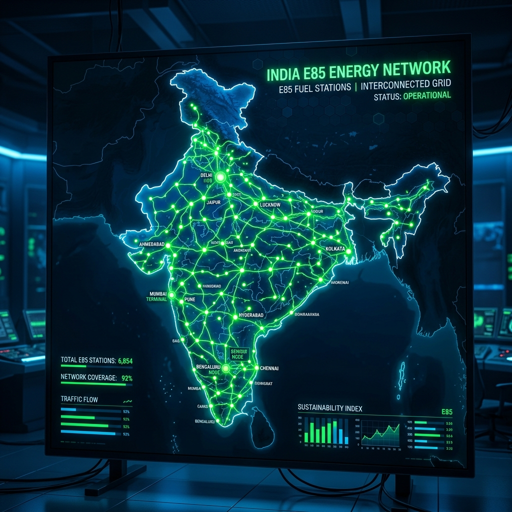

# E85 Fuel Stations in India: Complete City-Wise Directory (2026)

The automotive landscape in India has undergone a massive transformation over the past few years. Following the successful nationwide rollout and adoption of the E20 fuel blend (20% ethanol and 80% petrol) in 2025, the Indian government and major Oil Marketing Companies (OMCs) have rapidly pushed the envelope further. Today, in 2026, Flex-Fuel Vehicles (FFVs) have become a mainstay on Indian roads, capable of running on blends ranging from E20 all the way up to E85 (85% ethanol and 15% petrol). With this shift, the demand for E85 fuel has skyrocketed, prompting a swift infrastructural response from the energy sector.

For the modern Indian motorist driving a flex-fuel car or SUV, the most pressing question is no longer "Should I buy an FFV?" but rather, "Where can I fill up with E85?" Ethanol offers a cleaner burn, significantly lower greenhouse gas emissions, and, crucially, a lower price point per litre compared to unblended or low-blended petrol, thanks to heavy government subsidies and local agricultural sourcing. 

In this comprehensive, city-wise directory, we bring you the ultimate guide to E85 fuel stations across India in 2026. Whether you are navigating the chaotic streets of Mumbai, cruising down the expressways in Delhi NCR, or taking a road trip through the scenic routes of South India, this guide will ensure you never run out of the greener, cheaper E85 fuel.

---

## The E85 Revolution in India (2026 Context)

Before diving into the directory, it is vital to understand the current landscape of E85 availability. As of mid-2026, India boasts over 3,500 dedicated E85 dispensing pumps, a staggering increase from the mere pilot projects seen just two years ago. This rapid expansion is primarily led by state-run giants such as Indian Oil Corporation (IOCL), Bharat Petroleum Corporation Limited (BPCL), and Hindustan Petroleum Corporation Limited (HPCL). Private players like Jio-bp and Nayara Energy are also aggressively expanding their E85 footprint, specifically targeting urban centers and key highway corridors.

The E85 pumps are easily identifiable. OMCs have adopted a universal "Green Dispenser" color-coding scheme. Most stations featuring E85 also display large digital signages indicating the current ethanol price, which usually hovers around ₹60 to ₹65 per litre, making it an incredibly attractive proposition against standard petrol.

Let us explore the city-wise availability of E85 across the nation.

---

## North India: Delhi NCR & Beyond

North India, particularly the Delhi National Capital Region (NCR), has been at the forefront of the E85 rollout. Driven by severe winter pollution and strong government mandates to curb vehicular emissions, the region has seen the highest density of flex-fuel stations.

### New Delhi
The capital city has embraced E85 wholeheartedly. You can find stations spread across all major zones of the city.
*   **Connaught Place & Central Delhi:** The Indian Oil COCO (Company Owned Company Operated) pump on Janpath was one of the first to offer E85. Another reliable spot is the BPCL station near India Gate.
*   **South Delhi:** E85 is widely available here. Notable pumps include the HPCL Auto Care Centre in R.K. Puram, the Jio-bp mobility station in Vasant Kunj, and the IOCL pump on the Outer Ring Road near Okhla.
*   **East Delhi:** Commuters can rely on the BPCL pump in Mayur Vihar Phase 1 and the Nayara Energy station in Patparganj industrial area.
*   **West Delhi:** The massive IOCL complex in Punjabi Bagh and the HPCL station near Rajouri Garden both feature multiple E85 dispensers, minimizing wait times.

### Gurugram (Gurgaon)
As a corporate hub with a high density of early adopters and premium flex-fuel SUVs, Gurugram has excellent E85 coverage.
*   **Cyber City / DLF Phase 2:** The large Indian Oil pump on the NH-48 service lane right outside Cyber Hub is a major E85 refueling point.
*   **Golf Course Road:** The Jio-bp station near Sector 54 offers premium E85 facilities with automated payment options.
*   **Sohna Road:** BPCL has upgraded its major pumps along Sohna Road, particularly near Sector 48, to include E85.

### Noida & Greater Noida
Noida's wide roads and modern infrastructure make it ideal for the new wave of E85 stations.
*   **Sector 18 & Surrounds:** The IOCL pump near the DLF Mall of India is a highly frequented E85 spot.
*   **Noida-Greater Noida Expressway:** Multiple pumps along this stretch, including the massive HPCL COCO pump near Sector 137, cater to highway commuters.
*   **Greater Noida West (Noida Extension):** Nayara Energy and BPCL have newly inaugurated E85 stations here to serve the booming residential population.

### Chandigarh & Tri-City Area
The well-planned city of Chandigarh, along with Mohali and Panchkula, has a growing E85 network.
*   **Sector 21, Chandigarh:** The HPCL pump here is a reliable source for high-quality E85.
*   **Phase 8, Mohali:** The Indian Oil station near the industrial area is fully equipped with green dispensers.

### Jaipur
The Pink City is rapidly catching up, with OMCs upgrading infrastructure along major tourist and transit routes.
*   **MI Road:** The central BPCL pump now features a dedicated E85 lane.
*   **Vaishali Nagar:** IOCL’s large outlet in Vaishali Nagar serves the residential and commercial crowd with uninterrupted E85 supply.

---

## West India: The Flex-Fuel Pioneers

Maharashtra and Gujarat, being the financial and industrial powerhouses of the country, have seen massive investments in ethanol blending infrastructure. The proximity to sugarcane-producing belts also ensures a steady, low-cost supply of ethanol to these states.

### Mumbai
Space constraints in Mumbai mean that not every pump can add an extra underground tank for E85. However, strategic locations have been chosen to ensure city-wide coverage.
*   **Bandra Kurla Complex (BKC):** The flagship Jio-bp station in BKC is the crown jewel of E85 dispensing in Mumbai, offering ultra-fast fueling and a premium lounge.
*   **Andheri & Vile Parle:** The IOCL pump near the domestic airport (Vile Parle) and the BPCL station on the Andheri Link Road are vital E85 nodes.
*   **South Mumbai (SoBo):** The HPCL pump at Pedder Road and the Indian Oil station near Colaba Causeway have successfully integrated E85 dispensers.
*   **Eastern Express Highway:** Several Nayara and BPCL pumps along the stretch from Ghatkopar to Mulund offer E85, catering to the suburban commuters.

### Pune
Pune’s demographic of young IT professionals and environmentally conscious citizens has driven high E85 demand.
*   **Hinjewadi IT Park:** Almost all major pumps in and around Hinjewadi Phases 1, 2, and 3, especially the large IOCL and HPCL stations, dispense E85.
*   **Koregaon Park & Kalyani Nagar:** The BPCL pump in Koregaon Park and the Jio-bp outlet in Kalyani Nagar are the go-to spots.
*   **Baner - Balewadi:** The Nayara Energy pump on the Mumbai-Bengaluru bypass near Baner is perfectly situated for both city dwellers and highway travelers.

### Ahmedabad
Gujarat's push towards green energy has facilitated a smooth E85 rollout in Ahmedabad.
*   **SG Highway:** This arterial road is packed with E85 options. The IOCL COCO pump near ISKCON crossroads and the sprawling HPCL station near Prahlad Nagar are highly recommended.
*   **Navrangpura:** The central BPCL pump serves the bustling commercial district with E85.
*   **Gandhinagar:** The state capital features several heavily subsidized Indian Oil E85 stations, particularly near the Infocity area.

### Surat
Known for its rapid infrastructure development, Surat has integrated E85 pumps seamlessly.
*   **Adajan & Pal:** The HPCL and BPCL pumps in these modern residential areas offer E85.
*   **Ring Road:** The Nayara Energy station on the Ring Road caters to the heavy commercial and passenger traffic requiring flex-fuel.

---

## South India: Tech Hubs Going Green

The southern states, particularly Karnataka and Tamil Nadu, have seen massive adoption of flex-fuel vehicles among tech workers and urban professionals. The E85 network here is highly digitized, with many stations offering app-based pre-booking and automated fueling.

### Bangalore (Bengaluru)
Bengaluru leads the charge in South India with the highest number of E85 stations.
*   **Outer Ring Road (ORR):** The entire stretch from Hebbal to Silk Board is dotted with E85 stations. The Shell pump (which recently entered the E85 market in India) near Bellandur and the IOCL pump at Marathahalli are prime examples.
*   **Koramangala & Indiranagar:** The BPCL Oasis pump in Koramangala and the HPCL station on 100ft Road in Indiranagar are heavily frequented by FFV owners.
*   **Whitefield:** The Jio-bp mobility station near ITPL and the massive Indian Oil COCO pump in Brookefield ensure techies always have access to E85.
*   **Electronic City:** Both HPCL and Nayara have large E85 dispensing facilities catering to the massive IT workforce commuting via the elevated expressway.

### Hyderabad
Hyderabad's expansive road network has allowed for large, multi-dispenser E85 stations.
*   **HITEC City & Madhapur:** The IOCL pump near the Cyber Towers and the BPCL station in Jubilee Hills are the primary hubs for E85 in the IT corridor.
*   **Gachibowli:** The massive HPCL outlet on the Old Mumbai Highway and the Jio-bp station near the Financial District offer 24/7 E85 availability.
*   **Secunderabad:** The BPCL pump near the Paradise intersection and the Nayara station in Bowenpally serve the northern parts of the twin cities.

### Chennai
Chennai's mix of traditional automotive manufacturing and modern IT hubs makes it a strategic market for E85.
*   **OMR (Old Mahabalipuram Road):** The IT expressway is the best place to find E85 in Chennai. The IOCL pump near Sholinganallur and the BPCL station at Thoraipakkam are fully equipped.
*   **Anna Nagar:** The HPCL pump in the heart of Anna Nagar offers E85 for residential consumers.
*   **Guindy:** The major Indian Oil station near the Kathipara Junction is a crucial E85 refueling point for vehicles heading towards the airport or GST road.

### Kochi
Kerala's growing environmental awareness has spurred the E85 network in Kochi.
*   **Edappally:** The large IOCL pump near the Lulu Mall intersection is the busiest E85 station in the city.
*   **Kakkanad (Infopark):** BPCL and HPCL have established E85 pumps near the Infopark area to cater to the IT crowd.

---

## East & Central India: Emerging Markets

While North, West, and South India saw the earliest E85 rollouts, East and Central India have rapidly closed the gap in 2026, with major investments from state-run OMCs to ensure nationwide parity.

### Kolkata
The City of Joy is navigating the transition to flex-fuels with strategic pump placements.
*   **Salt Lake & New Town:** The planned infrastructure here makes E85 integration easier. The IOCL pump in Sector V and the Jio-bp station in New Town Action Area 1 are fully operational.
*   **South Kolkata:** The BPCL pump in Ballygunge and the HPCL station near Rashbehari Avenue are reliable spots for E85.
*   **EM Bypass:** Several Nayara and Indian Oil pumps along the EM Bypass now feature dedicated green E85 lanes.

### Bhubaneswar
Odisha's capital is a fast-emerging smart city with a growing green fuel network.
*   **Patia & Chandrasekharpur:** The IT and educational hubs are served by major IOCL and BPCL E85 stations.
*   **Janpath:** The central HPCL pump offers convenient E85 refueling for city commuters.

### Indore
Consistently ranked as India's cleanest city, Indore has aggressively promoted E85.
*   **AB Road:** The arterial AB Road features multiple E85 pumps, notably the large IOCL COCO and the BPCL station near Vijay Nagar.
*   **Super Corridor:** Newly established Jio-bp and Nayara stations along the Super Corridor cater to highway traffic and the expanding city limits.

### Nagpur
Located at the geographical center of India, Nagpur is a crucial transit hub with an excellent E85 network.
*   **Wardha Road:** The highway stretch leading to the airport has multiple HPCL and IOCL E85 stations.
*   **Dharampeth:** The BPCL pump in this premium residential area offers convenient access to E85.

---

## Upcoming Corridors and Highways with E85 Availability

One of the biggest concerns for early flex-fuel adopters was range anxiety on long road trips. By 2026, the government and OMCs have addressed this by heavily heavily fortifying major national highways and expressways with E85 infrastructure.

### The Delhi-Mumbai Expressway (DME)
As India's premier expressway, the DME is completely flex-fuel ready. Rest areas (Wayside Amenities) managed by Reliance Jio-bp, IOCL, and BPCL almost universally feature E85 dispensers. You can confidently drive a flex-fuel vehicle from Delhi to Mumbai knowing that an E85 pump is available every 50 to 80 kilometers.

### Hindu Hrudaysamrat Balasaheb Thackeray Maharashtra Samruddhi Mahamarg
Connecting Mumbai and Nagpur, this massive 700+ km expressway has seen a rapid upgrade in fuel stations. All major wayside amenities operated by HPCL and Nayara Energy now stock E85, ensuring uninterrupted high-speed travel for flex-fuel cars across Maharashtra.

### Bengaluru-Mysuru Expressway
This high-traffic 10-lane corridor has three major E85 dispensing hubs strategically located near Bidadi, Ramanagara, and Mandya, primarily operated by IOCL and BPCL.

### Yamuna & Agra-Lucknow Expressways
Connecting the NCR to the heart of Uttar Pradesh, these expressways have Indian Oil and Nayara E85 pumps at major food courts and rest stops, alleviating any range anxiety for travelers heading to Agra, Lucknow, or beyond.

### Chennai-Bengaluru Highway (NH48)
The industrial and tech corridor connecting the two southern giants is dotted with E85 stations. Pumps near Sriperumbudur, Vellore, and Krishnagiri feature high-capacity E85 underground tanks to serve heavy commercial and passenger FFV traffic.

---

## How to Locate E85 Stations on the Go (Apps and Navigation)

While this directory provides a comprehensive overview, the fastest way to find an E85 station while driving in 2026 is through technology. 

1.  **Google Maps & Apple Maps Integration:** Both major mapping services have integrated "E85 Fuel" into their POI (Point of Interest) databases. You can simply use voice commands like "Find the nearest E85 station" via Android Auto or Apple CarPlay.
2.  **OMC Specific Apps:** Apps like *IndianOil ONE*, *SmartDrive (BPCL)*, and *HP Pay* have dedicated filters to show only pumps dispensing E85. These apps also provide real-time updates on E85 stock availability, preventing wasted trips to a dry pump.
3.  **Jio-bp mobility & Nayara Apps:** Private players offer excellent app experiences, often allowing you to pre-book a fueling slot or pay directly from the car's infotainment system upon arriving at an E85 pump.
4.  **Flex-Fuel In-Car Navigation:** Most modern FFVs sold in India in 2026 (such as the latest flex-fuel models from Maruti Suzuki, Toyota, Tata Motors, and Hyundai) have built-in navigation systems that automatically route you to the nearest E85 station when the fuel indicator drops below a certain threshold.

---

## Frequently Asked Questions (FAQs)

**Q1: What happens if I cannot find an E85 station and my tank is empty?**
A: That is the beauty of a Flex-Fuel Vehicle (FFV). If you cannot find E85, you can simply fill up with E20, standard petrol, or any blend in between. The vehicle's ECU and flex-fuel sensor automatically detect the ethanol concentration and adjust the engine timing and fuel injection instantly. You will never be stranded just because an E85 pump isn't nearby.

**Q2: Is E85 cheaper than regular petrol in India?**
A: Yes, significantly so. Due to the high ethanol content (which is locally produced from sugarcane, broken rice, and maize) and government subsidies aimed at reducing crude oil imports, E85 is priced substantially lower than unblended or low-blended petrol. In 2026, the price difference can be anywhere from ₹30 to ₹40 per litre, resulting in massive savings for regular drivers.

**Q3: Does using E85 reduce my car's mileage?**
A: Ethanol has a lower energy density than pure petrol. Therefore, running on E85 will result in slightly lower volumetric fuel economy (kilometers per litre). However, because E85 is so much cheaper to buy, the *cost per kilometer* is still significantly lower than running on pure petrol. Additionally, E85 has a higher octane rating (over 100), which can provide better engine performance and power in vehicles optimized for it.

**Q4: Can I put E85 in an older car not rated for flex-fuel?**
A: **No. Absolutely not.** Standard vehicles, even those rated for E20, do not have the specialized fuel lines, pumps, or engine mapping required to handle the highly corrosive nature of 85% ethanol. Putting E85 in a non-FFV will cause severe damage to the fuel system and engine. Always check your owner's manual before fueling.

**Q5: Are E85 stations open 24/7?**
A: Most E85 stations located on highways, expressways, and major city arterial roads are open 24/7. However, smaller pumps in residential areas may follow standard operational hours (e.g., 6 AM to 11 PM). It is always best to check real-time status on the respective OMC's app.

**Q6: Why do some pumps run out of E85?**
A: While supply chains are robust in 2026, localized logistical issues or sudden spikes in demand (e.g., ahead of a long weekend) can occasionally cause a pump to run out of E85 stock temporarily. This is why checking stock availability via apps like *IndianOil ONE* or *BPCL SmartDrive* before heading to the pump is highly recommended.

---

## Conclusion

The year 2026 will be remembered as the tipping point for green mobility in India. The widespread availability of E85 fuel stations across Delhi, Mumbai, Bengaluru, and tier-2 cities proves that the flex-fuel ecosystem is no longer just a government mandate—it is a functional, everyday reality for millions of Indian motorists. 

With Oil Marketing Companies continually expanding their green dispensing infrastructure and automakers rolling out more affordable FFV models, the transition to homegrown, sustainable ethanol blends is firmly on track. Whether you are doing a daily commute to an IT park or embarking on a cross-country drive on the new expressways, the E85 network in India has you covered, promising cleaner air and lighter fuel bills.

*(Disclaimer: Fuel station locations and E85 availability are subject to change based on OMC operations and supply logistics. We recommend using official fuel station locator apps for real-time navigation and stock status.)*
