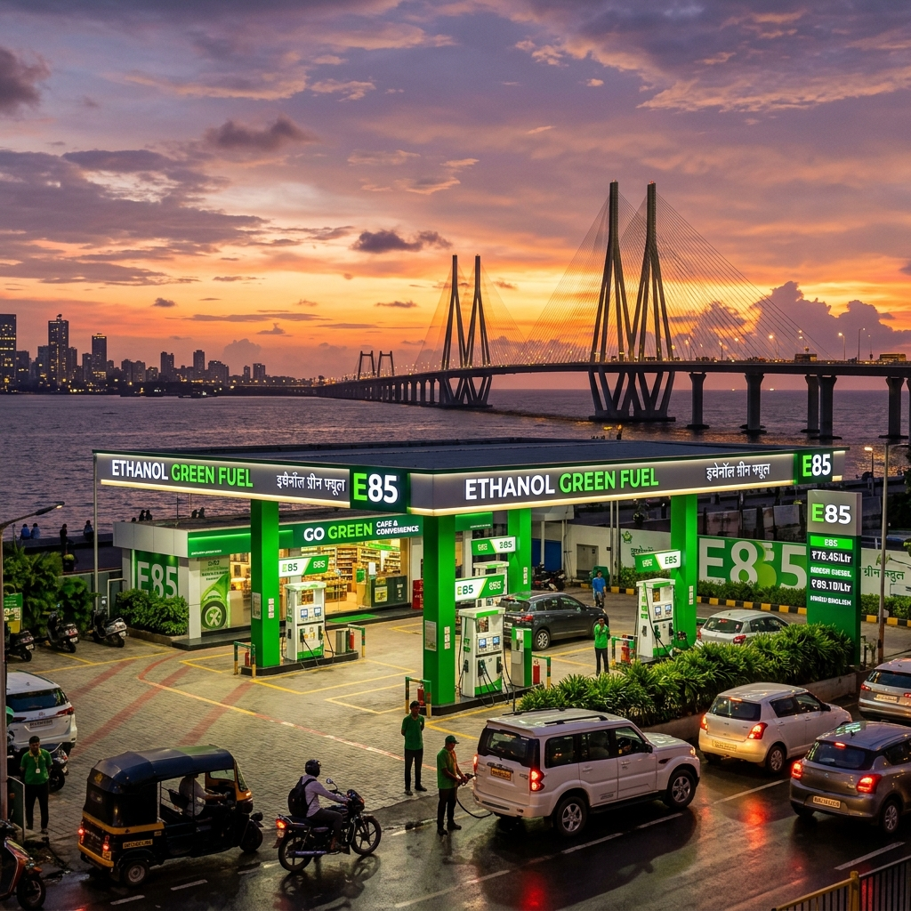

# E85 Fuel Stations in Mumbai & Pune: The Ultimate Locations Map and Guide

The automotive landscape in India is undergoing a seismic shift, and at the epicenter of this transformation is the state of Maharashtra. With the Indian government’s aggressive push towards alternative fuels to reduce crude oil import bills and curb vehicular emissions, ethanol blending has emerged as a cornerstone of the nation's energy strategy. While E20 (20% ethanol blend) has become increasingly common across the country, the true revolution lies in the adoption of E85—a high-level ethanol blend containing up to 85% ethanol and 15% gasoline. For owners of Flex Fuel Vehicles (FFVs), finding reliable E85 fuel stations is paramount. 

In this comprehensive guide, we delve deep into the availability of E85 fuel in two of Maharashtra’s most dynamic cities: Mumbai and Pune. We will explore the regional context, provide detailed location maps, and offer insights into the infrastructure supporting this green energy transition. Whether you are a daily commuter navigating the bustling streets of Mumbai or a weekend traveler cruising down the Mumbai-Pune Expressway, this guide is your ultimate resource for E85 fueling.

## The Flex-Fuel Revolution in Maharashtra

Maharashtra has long been the economic powerhouse of India, and it is fitting that it is taking a leadership role in the transition to renewable automotive fuels. The state's strong agricultural base, particularly its massive sugarcane industry, positions it uniquely to capitalize on ethanol production. Sugarcane molasses, a byproduct of sugar manufacturing, is the primary feedstock for ethanol in India. By leveraging its vast sugarcane resources, Maharashtra is not only supporting its farmers but also leading the charge in establishing a robust ethanol supply chain.

### Why Mumbai and Pune?

Mumbai, the financial capital, and Pune, the cultural and IT hub, are two of the most vehicle-dense cities in India. The sheer volume of traffic in these urban centers has historically contributed to significant air quality issues. The introduction of E85 fuel is a strategic move to address these environmental concerns. E85 burns cleaner than conventional gasoline, significantly reducing greenhouse gas emissions and particulate matter.

Furthermore, Pune is home to several leading automotive research and development centers, as well as manufacturing plants for major automakers. The city's automotive ecosystem is highly conducive to the testing, development, and deployment of Flex Fuel Vehicles. Mumbai, with its massive consumer base and expanding infrastructure, provides the perfect market for the adoption of FFVs. Together, these twin cities form a critical corridor for the rollout of E85 fuel stations in western India.

## E85 Fuel Stations in Mumbai: A Detailed Breakdown

Navigating Mumbai's complex geography requires a well-planned fueling strategy, especially when relying on a specific fuel type like E85. The Oil Marketing Companies (OMCs) in India—namely Indian Oil Corporation (IOCL), Bharat Petroleum (BPCL), and Hindustan Petroleum (HPCL)—have strategically placed E85 dispensing units across the Mumbai Metropolitan Region (MMR) to ensure maximum accessibility. 

Here is a detailed, zone-by-zone breakdown of where you can find E85 fuel in Mumbai.

### South Mumbai (SoBo)

South Mumbai, known for its heritage architecture and premium real estate, is also home to some of the city's most critical infrastructure. While real estate constraints make setting up new fuel stations challenging, existing pumps are being upgraded to dispense E85.

1. **BPCL Auto Care Centre, Colaba**: Located near the iconic Gateway of India, this flagship BPCL station was among the first in South Mumbai to introduce an E85 dispenser. It caters to the high concentration of premium vehicles and early adopters of FFV technology in the area.
2. **HPCL Millennium Pump, Worli Sea Face**: A favorite pitstop for those enjoying a drive along the sea link, this pump offers state-of-the-art E85 dispensing facilities. Its location makes it highly convenient for commuters traveling between South Mumbai and the suburbs.
3. **IOCL Service Station, Marine Drive**: Situated along the picturesque Queen's Necklace, this station provides easy access to E85 for residents of Churchgate and Marine Lines.

### The Western Suburbs

The Western Suburbs stretch from Bandra to Borivali and are characterized by dense residential neighborhoods, commercial hubs, and heavy traffic. The demand for cleaner fuels here is immense.

1. **HPCL Auto Service, Bandra West**: Located on Linking Road, this station is highly popular among the younger, environmentally conscious demographic of Bandra and Khar. The E85 pump here is known for its quick service and minimal wait times.
2. **IOCL Swagat, Andheri East**: Situated near the bustling Chakala metro station, this pump caters to the massive commercial traffic in Andheri. It is an essential fueling point for corporate fleets that have transitioned to Flex Fuel.
3. **BPCL Highway Star, Goregaon East**: Located right on the Western Express Highway, this station is perfectly positioned for daily commuters traveling towards South Mumbai or North towards Dahisar.
4. **IOCL Fuel Point, Borivali West**: Serving the densely populated residential areas of Borivali and Kandivali, this station ensures that E85 is accessible to everyday families running FFVs.

### The Eastern Suburbs

The Eastern Suburbs, encompassing areas from Kurla to Mulund, have seen rapid infrastructure development in recent years. The fuel infrastructure has kept pace, with several E85 stations now operational.

1. **BPCL Eastern Express Auto Care, Chembur**: Strategically located at the junction of the Eastern Express Highway and the Sion-Panvel Expressway, this pump is crucial for vehicles entering or leaving the city limits.
2. **HPCL Vikhroli Highway Station**: Catering to the growing corporate hubs in Vikhroli and Powai, this station provides a reliable E85 supply for the IT and business professionals in the region.
3. **IOCL Mulund Check Naka**: Positioned near the toll plaza, this station is a vital final fueling point for travelers heading towards Thane or Nashik.

### Navi Mumbai and Thane

Navi Mumbai and Thane, once considered mere satellite cities, have evolved into massive urban centers in their own right. Their wider roads and planned infrastructure make them ideal for modern fueling stations.

1. **IOCL Palm Beach Road, Vashi (Navi Mumbai)**: Known for its scenic drive, Palm Beach Road now hosts a state-of-the-art IOCL station dispensing E85. It serves the affluent residents of Vashi, Nerul, and Belapur.
2. **HPCL Turbhe Truck Terminal (Navi Mumbai)**: While primarily catering to heavy vehicles, this massive facility has dedicated lanes for passenger FFVs seeking E85, making it a highly efficient stop.
3. **BPCL Ghodbunder Road, Thane**: As one of the longest and busiest arterial roads in Thane, Ghodbunder Road is dotted with fuel stations, but this specific BPCL outlet has been upgraded to support high-volume E85 dispensing.
4. **IOCL Majiwada Junction, Thane**: A critical node connecting Mumbai, Thane, and the highways beyond, this station is indispensable for FFV owners in the region.

## E85 Fuel Stations in Pune: Navigating the Oxford of the East

Pune’s unique blend of historical charm and rapid IT-driven modernization creates a diverse automotive landscape. The city has a high concentration of two-wheelers and a rapidly growing four-wheeler segment. Pune's robust automotive manufacturing and testing ecosystem means that FFVs are strongly supported here. 

### Central Pune

Navigating the narrow, bustling streets of Central Pune can be challenging, but E85 availability is steadily improving in the core city areas.

1. **HPCL Deccan Gymkhana**: Located in the heart of Pune's cultural center, this station serves the heavy traffic around Fergusson College Road and Jangali Maharaj Road.
2. **BPCL Camp Area**: Catering to the Cantonment region and the upscale neighborhoods of Koregaon Park and Kalyani Nagar, this station is known for its premium service and reliable E85 supply.
3. **IOCL Swargate**: A major transit hub, the Swargate station is essential for inter-city travelers and local commuters alike. The addition of E85 here marks a significant milestone in Pune's green infrastructure.

### The Western IT Corridor (Hinjewadi & PCMC)

The western part of Pune, dominated by the massive Rajiv Gandhi Infotech Park in Hinjewadi and the industrial belt of Pimpri-Chinchwad (PCMC), is a prime market for E85.

1. **IOCL Hinjewadi Phase 1**: Right at the entrance to the IT park, this station is heavily frequented by tech professionals commuting from the main city. Its E85 dispensers are strategically placed for quick access.
2. **BPCL Wakad Junction**: Serving as a gateway to the Mumbai-Pune Expressway, this pump is a crucial top-up point for FFVs heading out of the city.
3. **HPCL Auto Care, Pimpri**: Located in the heart of the industrial twin city, this station supports both passenger FFVs and light commercial vehicles operating on high ethanol blends.

### The Eastern IT Corridor (Kharadi & Magarpatta)

The eastern IT hubs of Pune have witnessed explosive residential and commercial growth, necessitating upgraded fuel infrastructure.

1. **BPCL Magarpatta City Corner**: Serving the massive integrated township of Magarpatta, this station provides E85 to thousands of residents and IT workers.
2. **IOCL Kharadi Bypass**: Located on the busy Pune-Ahmednagar highway, this pump is vital for traffic flowing through the eastern suburbs. E85 availability here helps reduce the carbon footprint of the dense commuter traffic.
3. **HPCL Viman Nagar**: Close to the Pune International Airport, this station caters to the affluent neighborhoods of Viman Nagar and the airport traffic, offering high-quality E85 fuel.

## Cruising the Mumbai-Pune Expressway on E85

The Mumbai-Pune Expressway is arguably the most famous and heavily traversed highway in India. Spanning roughly 95 kilometers, it connects the two metropolises through the scenic Sahyadri mountains. For FFV owners, completing this journey on E85 is not only possible but increasingly convenient, thanks to strategic infrastructure development by the OMCs.

Driving on the expressway demands high performance, and E85, with its high octane rating, provides excellent engine efficiency and power output. Here are the key fueling stops along the route:

1. **Khalapur Toll Plaza Outlets**: Just before the ascent into the ghats (mountain passes) begins from the Mumbai side, there are massive food mall complexes featuring both HPCL and BPCL stations. Both of these stations have been upgraded with dedicated E85 dispensers. It is highly recommended to top up here, as the climb up the Lonavala ghats will consume more fuel than flat-highway driving.
2. **Lonavala Bypass Points**: While you typically wouldn't need to refuel if you topped up at Khalapur, there are emergency IOCL pumps near the Lonavala exits that stock E85, ensuring peace of mind for travelers.
3. **Talegaon Toll Plaza Outlets**: For those traveling from Pune towards Mumbai, the Talegaon toll plaza features comprehensive fueling facilities. The IOCL station here provides a fast and reliable E85 fueling experience before the long descent towards Mumbai.

When traveling between these cities, FFV owners should always plan their stops. While the distance is relatively short, unforeseen traffic or detours in the ghat sections can increase fuel consumption. The E85 infrastructure on the Expressway is designed to handle high volumes, so wait times at the green fuel dispensers are generally minimal.

## How to Plan Your E85 Journey in Maharashtra

Transitioning to an E85 lifestyle requires a slight shift in how you plan your travel, especially in the early stages of infrastructure rollout. Here are some expert tips for FFV owners in Mumbai and Pune:

1. **Use Dedicated Fuel Mapping Apps**: The landscape of E85 availability is changing rapidly. While this guide provides a comprehensive overview, we strongly recommend using the official apps from IOCL (IndianOil ONE), BPCL (SmartDrive), and HPCL (HP Pay). These apps offer real-time updates on fuel availability, which is crucial because E85 supplies can occasionally face temporary disruptions due to logistical challenges in transporting high-ethanol blends.
2. **Understand Your Vehicle's Range**: Ethanol has a lower energy density than pure gasoline. This means you will experience a slight drop in fuel economy (usually around 15-25%) when running on E85 compared to standard petrol. Factor this into your travel plans, especially when undertaking longer inter-city trips or driving through heavy Mumbai traffic.
3. **The 'Flex' Advantage**: The beauty of a Flex Fuel Vehicle is its adaptability. If you are in an area where E85 is unavailable, your vehicle can seamlessly run on standard E20 petrol. The engine control unit (ECU) automatically detects the ethanol content and adjusts the fuel injection and spark timing accordingly. You are never truly stranded just because an E85 pump isn't nearby.
4. **Maintenance Considerations**: While modern FFVs are built with robust fuel lines and corrosion-resistant components designed to handle high ethanol concentrations, it is still vital to adhere to the manufacturer's maintenance schedule. Regular oil changes and fuel filter inspections will ensure your engine continues to perform optimally on E85.

## The Economic and Environmental Impact

The rollout of E85 stations across Mumbai and Pune is more than just a logistical achievement; it represents a fundamental shift in India's environmental and economic trajectory. 

### Environmental Benefits
The air quality in both Mumbai and Pune frequently hits concerning levels, primarily due to vehicular pollution. E85 fuel burns cleaner, resulting in a dramatic reduction in carbon monoxide, particulate matter, and other harmful tailpipe emissions. By choosing E85, motorists in these cities are directly contributing to cleaner air and a healthier urban environment. Over time, as more FFVs hit the road, the cumulative environmental benefits will be substantial.

### Economic Advantages
From an economic standpoint, the push for E85 is highly strategic. India imports a vast majority of its crude oil, which strains the national exchequer. Ethanol, produced domestically from sugarcane and other agricultural byproducts, offers a viable alternative. Maharashtra, being a massive producer of sugarcane, benefits directly from this dynamic. The increased demand for ethanol translates into better remuneration for local farmers and bolsters the state's agricultural economy. 

For the consumer, E85 is generally priced lower per liter than standard petrol. While the slightly lower fuel efficiency offsets some of the savings, the overall cost of running an FFV on E85 remains highly competitive, especially considering the long-term environmental benefits.

## Overcoming the Challenges

Despite the rapid progress, the transition to widespread E85 availability is not without its hurdles. The primary challenge lies in the logistics and storage of high-ethanol blends. Ethanol is hygroscopic, meaning it absorbs moisture from the air. This requires specialized storage tanks and transportation infrastructure to prevent fuel degradation before it reaches the consumer. The OMCs are investing heavily in upgrading their underground tanks and dispensing systems at stations in Mumbai and Pune to handle E85 safely and effectively.

Another challenge is consumer awareness. Many motorists are still unfamiliar with the benefits of FFVs and E85 fuel. Comprehensive education campaigns by the government and automotive manufacturers are necessary to drive adoption. As more flagship E85 stations open in high-visibility areas like Marine Drive in Mumbai or Hinjewadi in Pune, consumer curiosity and acceptance will naturally increase.

## Conclusion

The map of E85 fuel stations across Mumbai and Pune is rapidly filling in, transforming the way these dynamic cities power their vehicles. From the upscale neighborhoods of South Mumbai to the sprawling IT corridors of Pune, and along the vital artery of the Expressway connecting them, E85 is becoming an accessible and practical choice for motorists. By embracing Flex Fuel technology, drivers in Maharashtra are not only experiencing the high-performance benefits of ethanol but are also playing a crucial role in building a greener, more self-reliant India. The revolution is here, and it’s pumping E85.

---

## Frequently Asked Questions (FAQ)

**1. Can any car run on E85 fuel?**
No. E85 is specifically designed for Flex Fuel Vehicles (FFVs). These vehicles have specially designed engines, fuel lines, and engine control units (ECUs) capable of handling high ethanol concentrations. Putting E85 in a standard petrol vehicle not designed for it can cause severe damage to the engine and fuel system components.

**2. How do I know if the E85 station in Mumbai or Pune is currently stocked?**
While the infrastructure is expanding, supply can sometimes fluctuate. We highly recommend using the official mobile applications of the Oil Marketing Companies (like IndianOil ONE, BPCL SmartDrive, or HP Pay). These apps provide real-time inventory updates for specific fuel stations, allowing you to confirm E85 availability before making the trip.

**3. Will my fuel efficiency drop when driving in Mumbai city traffic on E85?**
Yes, it is normal to experience a reduction in fuel efficiency (typically between 15% to 25%) when using E85 compared to standard petrol. This is because ethanol contains less energy per volume than gasoline. However, E85 is usually priced lower per liter, which helps offset the difference in mileage.

**4. What happens if I can't find an E85 pump while driving from Pune to Mumbai?**
The biggest advantage of a Flex Fuel Vehicle is that it can run on any blend of gasoline and ethanol, up to 85% ethanol. If you cannot find an E85 station, you can safely fill up with standard E20 petrol at any regular fuel station. Your vehicle's computer will automatically adjust to the new fuel mixture.

**5. Is E85 fuel cheaper than regular petrol in Maharashtra?**
Generally, E85 is priced lower per liter than standard petrol in order to incentivize its use and account for its lower energy density. Prices fluctuate based on government policies and crude oil rates, but the cost per kilometer typically remains competitive for FFV owners.

**6. Does E85 provide better performance?**
Ethanol has a higher octane rating than standard gasoline (often exceeding 100 octane). This allows FFV engines to run at a higher compression ratio or advance the ignition timing, which can result in increased horsepower and torque, providing a noticeable performance boost on highways like the Mumbai-Pune Expressway.
