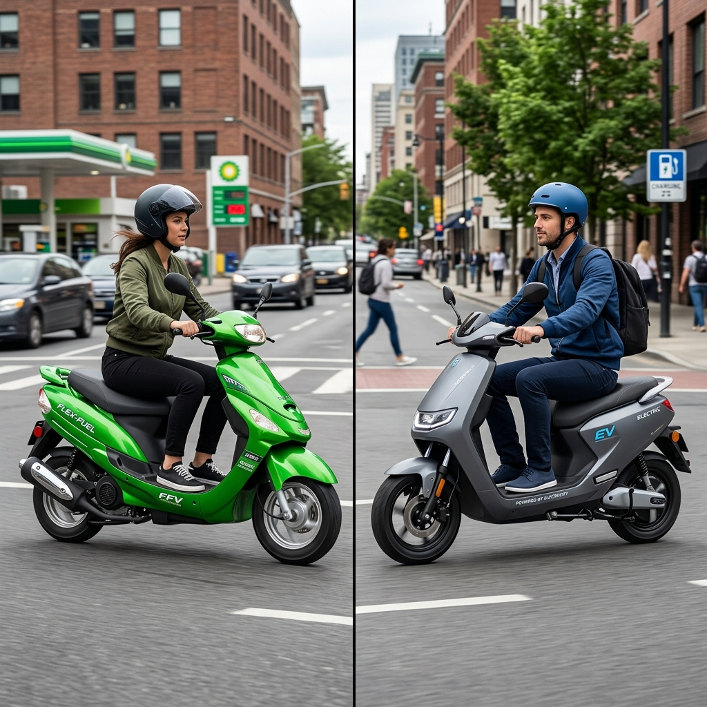

# Flex Fuel Scooters vs Electric Scooters: The Ultimate Comparison

The Indian two-wheeler market is undergoing a massive transformation. For decades, the internal combustion engine (ICE) running on fossil fuels has been the undisputed king of the roads. However, rising fuel prices, severe air pollution in major cities, and a global mandate to reduce carbon footprints have catalyzed a paradigm shift toward sustainable mobility. In this quest for green transportation, two prominent technologies have emerged as the frontrunners to replace conventional petrol-powered two-wheelers: Electric Scooters (EVs) and Flex Fuel Scooters.

While electric scooters have already made a significant dent in the market, thanks to aggressive government subsidies and a growing crop of innovative startups, flex fuel technology—powered by ethanol blends like E85—is rapidly gaining traction as a formidable alternative. Both technologies promise a greener future, but they take fundamentally different approaches to solving the mobility equation. 

If you are in the market for a new scooter today, you are likely faced with a dilemma: Should you join the electric revolution, or should you wait for the ethanol-powered flex fuel vehicles? This comprehensive guide will dissect every aspect of Flex Fuel Scooters vs Electric Scooters, comparing them across initial costs, running expenses, environmental impact, infrastructure, performance, and future viability, to help you make an informed decision.

---

## 1. Understanding the Technologies

Before diving into the comparison, it is crucial to understand what these two technologies entail.

### What is an Electric Scooter?
An electric scooter is propelled by one or more electric motors, which draw power from an onboard rechargeable battery pack (typically Lithium-ion). They have entirely eliminated the internal combustion engine. Instead of visiting a petrol pump, you plug the scooter into an electrical outlet or a dedicated charging station to replenish its energy. 
- **Core Components:** Battery pack, electric motor (hub or mid-drive), motor controller.
- **Key Characteristics:** Zero tailpipe emissions, silent operation, instant torque delivery.

### What is a Flex Fuel Scooter?
A flex fuel scooter, or flexible-fuel vehicle (FFV), features an internal combustion engine designed to run on more than one type of fuel, usually a blend of petrol and ethanol. In India, the push is toward higher ethanol blends, such as E20 (20% ethanol) and eventually up to E85 (85% ethanol) or even E100. The engine is mechanically similar to a standard petrol engine but incorporates modified fuel lines, specialized sensors (to detect the fuel blend), and an engine control unit (ECU) capable of adjusting the air-fuel mixture and ignition timing on the fly based on the ethanol content.
- **Core Components:** Modified ICE, fuel composition sensor, advanced ECU, corrosion-resistant fuel system.
- **Key Characteristics:** Familiar refueling process, reduced tailpipe emissions compared to pure petrol, utilizes renewable biofuels.

---

## 2. Initial Purchase Cost: The Barrier to Entry

For the average Indian consumer, the upfront cost of a vehicle is often the most critical deciding factor. Here is how the two compare.

### Electric Scooters: High Initial Investment
Electric scooters are inherently more expensive to manufacture than traditional ICE scooters, primarily due to the cost of the battery pack. Lithium-ion batteries rely on expensive raw materials like lithium, cobalt, and nickel. While battery prices have dropped over the last decade, a high-quality electric scooter with a decent range (100+ km) still commands a significant premium. 
Historically, government subsidies (like the FAME II scheme in India) heavily subsidized EVs, bringing their upfront cost closer to ICE vehicles. However, as subsidies are gradually reduced or restructured, the true, unsubsidized cost of EVs is becoming apparent, making them a premium purchase for many.

### Flex Fuel Scooters: Cost-Effective Manufacturing
Flex fuel scooters hold a distinct advantage when it comes to manufacturing costs. Because they utilize the existing architecture of internal combustion engines, manufacturers do not need to reinvent the wheel. The modifications required to make an engine flex-fuel compatible—such as upgrading hoses, adding sensors, and re-tuning the ECU—add only a marginal cost to the vehicle. 
Therefore, a flex fuel scooter is expected to be priced very similarly to a standard petrol scooter, making it a highly accessible option for the mass market without the need for heavy government subsidies.

**Winner: Flex Fuel Scooters.** They offer a significantly lower barrier to entry for the average consumer.

---

## 3. Running Costs and Total Cost of Ownership (TCO)

While the initial cost is important, a scooter is a long-term investment. The total cost of ownership (TCO) over 5 to 7 years paints a different picture.

### Electric Scooters: Pennies per Kilometer
This is where electric scooters truly shine. The cost of electricity required to charge an EV is substantially lower than the cost of fossil fuels. An average electric scooter might consume about 2-3 units (kWh) of electricity for a full charge, which yields a range of roughly 100 kilometers. Depending on electricity tariffs, the running cost can be as remarkably low as ₹0.20 to ₹0.40 per kilometer.
Furthermore, EVs have vastly fewer moving parts than ICE vehicles. There is no engine oil to change, no spark plugs to replace, and no complex transmission to maintain. The routine maintenance costs are negligible. The only major long-term expense is the eventual replacement of the battery pack (usually after 5-8 years), but the daily savings usually offset this future cost.

### Flex Fuel Scooters: Dependent on Ethanol Pricing
The running cost of a flex fuel scooter depends heavily on the price of ethanol at the pump. Ethanol is generally cheaper to produce than refining crude oil into petrol. If the government passes these savings on to the consumer, running a scooter on E85 could be noticeably cheaper than running it on E10 petrol. 
However, ethanol has a lower energy density than petrol. This means you need to burn more ethanol to achieve the same power output, resulting in slightly lower fuel efficiency (mileage) compared to pure petrol. While the fuel might be cheaper per liter, you might consume more of it.
Maintenance costs for flex fuel scooters will be similar to existing petrol scooters. You will still need regular servicing, oil changes, and mechanical upkeep.

**Winner: Electric Scooters.** The rock-bottom running and maintenance costs make EVs the undisputed champions of TCO over a long period.

---

## 4. Range Anxiety and Refueling Infrastructure

The convenience of refueling is a massive psychological and practical factor for riders.

### Electric Scooters: The Range Dilemma
Range anxiety—the fear of running out of battery before reaching a destination—remains the Achilles' heel of electric vehicles. While modern electric scooters boast ranges of 100-150 km per charge, this can drop significantly based on riding style, payload, and weather conditions.
More importantly, recharging takes time. A standard home charger can take 4 to 6 hours to fully charge a scooter. While fast-charging networks are expanding, they are still relatively sparse compared to the ubiquity of petrol pumps, and even a "fast" charge takes considerably longer than filling a tank. Battery swapping networks offer a solution, but they require standardization and dense infrastructure.

### Flex Fuel Scooters: Unmatched Convenience
Flex fuel scooters completely eliminate range anxiety. They offer the exact same convenience that riders have enjoyed for decades: pull into a fuel station, fill the tank in two minutes, and ride away for another 200+ kilometers. 
The transition to flex fuel is largely seamless for the consumer. As oil marketing companies upgrade their dispensing infrastructure to offer E20, E85, or E100, riders will have access to a vast, pre-existing network of fuel stations across the country. Whether you are commuting in a metro city or riding through rural India, finding fuel for a flex fuel scooter will not be a challenge.

**Winner: Flex Fuel Scooters.** The sheer convenience of rapid refueling and leveraging existing infrastructure gives flex fuel vehicles a massive edge in practicality.

---

## 5. Environmental Impact: The Big Picture

Both technologies are championed as "green," but their environmental impacts are nuanced and depend on how you measure them (tailpipe vs. well-to-wheel).

### Electric Scooters: Zero Tailpipe, but What About the Grid?
Locally, electric scooters are perfectly clean. They produce absolutely zero tailpipe emissions, which directly contributes to cleaner air and reduced smog in congested urban centers. Furthermore, they drastically reduce noise pollution.
However, a true environmental assessment requires looking at the source of electricity. In India, a significant portion of the electricity grid is still powered by coal. Therefore, charging an EV effectively shifts the emissions from the vehicle's tailpipe to the smokestack of a power plant. While centralized power generation is generally more efficient than millions of small ICE engines, the EV is only as clean as the grid that charges it. Additionally, the mining of battery materials and the eventual disposal/recycling of lithium-ion batteries pose significant environmental challenges.

### Flex Fuel Scooters: The Carbon Cycle
Flex fuel scooters are not zero-emission vehicles; they still combust fuel and emit exhaust gases. However, ethanol burns much cleaner than petrol. High ethanol blends significantly reduce emissions of carbon monoxide (CO), particulate matter (PM), and unburned hydrocarbons.
The most compelling environmental argument for flex fuel is the carbon cycle. Ethanol is derived from agricultural biomass (in India, primarily sugarcane, broken rice, and corn). As these crops grow, they absorb carbon dioxide (CO2) from the atmosphere through photosynthesis. When the ethanol is burned in an engine, it releases this CO2 back. This creates a near-closed carbon loop. While it is not perfectly carbon-neutral (due to emissions in farming, processing, and transportation), the net lifecycle greenhouse gas emissions are substantially lower than those of fossil fuels.

**Winner: Tie (Context Dependent).** EVs are better for immediate urban air quality. Flex fuel offers a practical, immediate reduction in net carbon emissions utilizing renewable agriculture, without waiting for the power grid to go green.

---

## 6. Performance and Riding Dynamics

How do these scooters feel on the road? The riding experience is subjective but vastly different.

### Electric Scooters: Smooth and Instantaneous
Electric motors deliver 100% of their torque instantly from zero RPM. This translates to incredibly peppy acceleration, making EVs fantastic for darting through city traffic. The power delivery is linear and exceptionally smooth, without the vibrations associated with internal combustion engines. The silent operation is a revelation for many, offering a calm and futuristic riding experience. 
Furthermore, the heavy battery pack is usually mounted low in the chassis, giving electric scooters a low center of gravity and excellent handling dynamics.

### Flex Fuel Scooters: The Familiar Roar
For purists, the flex fuel scooter retains the visceral appeal of motorcycling. You have the familiar sound of the engine, the mechanical feedback, and the rising power band as the RPM increases. 
Because ethanol has a higher octane rating than petrol (usually around 108-113 octane), it can withstand higher compression ratios without knocking. If an engine is optimized specifically for high-ethanol blends, it can actually produce more horsepower and torque than it would on standard petrol. However, most initial flex-fuel scooters will be tuned conservatively to run on various blends, so performance will feel virtually identical to a standard petrol scooter.

**Winner: Subjective.** Commuters usually prefer the silent, zippy nature of EVs. Traditionalists and those who appreciate mechanical feedback will lean towards flex fuel.

---

## 7. The Indian Context: Agriculture and Energy Security

To understand the trajectory of these technologies in India, one must look at macroeconomic factors.

### The EV Push for Tech Independence
The Indian government strongly supports EVs because they represent the future of global mobility. By subsidizing EVs and battery manufacturing (through PLI schemes), India aims to become a global hub for EV technology. However, a major vulnerability is India's heavy reliance on imports (primarily from China) for lithium cells and battery components, trading dependence on foreign oil for dependence on foreign minerals.

### The Ethanol Push for Agrarian Economy
The ethanol blending program is fundamentally an agricultural initiative as much as it is an energy policy. India is an agrarian economy and often produces surplus sugarcane and grains. Diverting this surplus to produce ethanol does three critical things:
1.  **Increases Farmer Income:** It creates a massive, guaranteed market for agricultural produce, directly benefiting Indian farmers.
2.  **Reduces Import Bill:** Every drop of ethanol produced domestically is a drop of crude oil India doesn't have to import. This saves billions of dollars in foreign exchange.
3.  **Energy Security:** It utilizes domestic, renewable resources, insulating the economy from geopolitical oil shocks.

For the Indian government, flex fuel is a strategic masterstroke that solves agricultural surplus issues while addressing energy security, making it a highly prioritized parallel track to EVs.

---

## 8. Summary: Pros and Cons

To distill this vast comparison, here is a quick look at the strengths and weaknesses of both:

### Electric Scooters
**Pros:**
- Incredibly low running costs (electricity is cheaper than fuel).
- Minimal maintenance required (fewer moving parts).
- Zero tailpipe emissions; completely silent.
- Instant torque and smooth acceleration.

**Cons:**
- High initial purchase price.
- Range anxiety and long charging times.
- Dependence on charging infrastructure (challenging for apartment dwellers).
- Environmental concerns regarding battery mining and disposal.

### Flex Fuel Scooters
**Pros:**
- Lower initial purchase cost (comparable to petrol scooters).
- No range anxiety; rapid refueling in a few minutes.
- Utilizes the vast, existing network of fuel stations.
- Supports the domestic agricultural economy and reduces oil imports.

**Cons:**
- Running costs are higher than EVs.
- Still requires regular engine maintenance (oil changes, etc.).
- Not completely zero-emission at the tailpipe.
- Fuel efficiency may drop slightly on higher ethanol blends.

---

## 9. The Verdict: Which One Should You Buy?

The debate between Flex Fuel Scooters and Electric Scooters is not a zero-sum game. Both technologies are essential stepping stones toward a sustainable future, but they cater to different use cases and consumer profiles.

**You should buy an Electric Scooter if:**
- Your daily commute is predictable and well within the scooter's range (e.g., 20-50 km per day).
- You have dedicated, reliable charging access at home or at your workplace.
- You want to minimize your daily running expenses to the absolute minimum.
- You prioritize a silent, smooth, and vibration-free ride in city traffic.
- You plan to keep the scooter for a long time to recoup the high initial cost through daily savings.

**You should buy (or wait for) a Flex Fuel Scooter if:**
- You have a limited upfront budget and want the most cost-effective entry price.
- You frequently travel long, unpredictable distances where charging infrastructure is unreliable.
- You live in an apartment complex or area where installing a personal charger is impossible.
- You value the convenience of 2-minute refueling and do not want to change your existing fueling habits.
- You prefer the familiar mechanical feel and performance dynamics of an internal combustion engine.

### The Road Ahead

In the immediate future (the next 5-7 years), **Flex Fuel Scooters** represent the most practical, mass-market solution for India's transition away from pure fossil fuels. They offer a "plug-and-play" transition requiring minimal behavioral change from the consumer while delivering massive macroeconomic benefits to the country's agricultural sector.

However, as battery technology inevitably improves—becoming cheaper, lighter, and faster to charge—and as charging infrastructure densifies across the subcontinent, **Electric Scooters** will increasingly become the default choice for personal urban mobility.

Ultimately, the best choice depends entirely on your lifestyle, your infrastructure access, and your budget. Both paths lead away from imported crude oil, and whichever scooter you choose, you are contributing to a greener, more sustainable mobility ecosystem.
