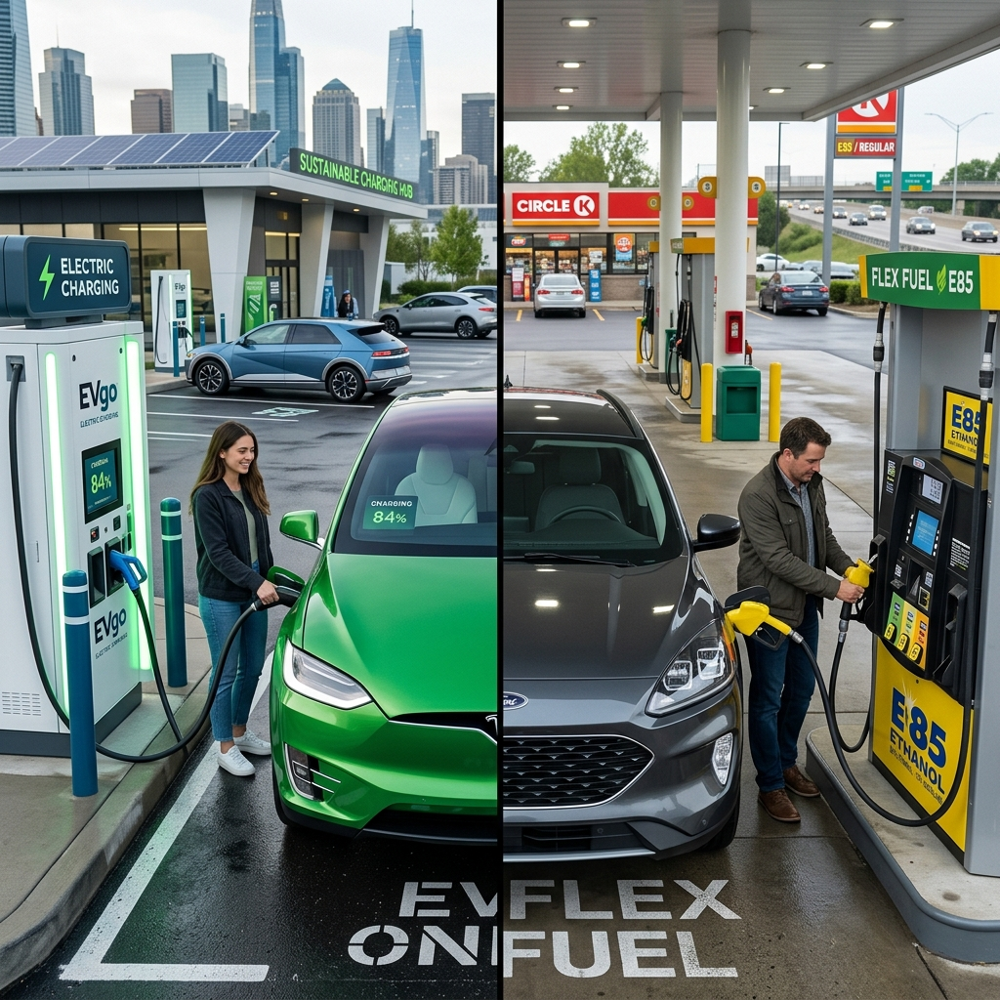

# Flex Fuel vs Electric Vehicles (EVs): Which is Better for India?

India's automotive sector is undergoing a massive transformation, pivoting away from traditional fossil fuels towards cleaner, more sustainable alternatives. In this quest for green mobility, two technologies have emerged as the primary contenders for the future: Flex Fuel Vehicles (FFVs) and Electric Vehicles (EVs). Both promise to reduce India's staggering crude oil import bill and curb the dangerous levels of vehicular pollution choking its cities. But which technology is better suited for the unique realities of the Indian market? 

This comprehensive analysis delves deep into the Flex Fuel vs EV debate, evaluating their respective strengths, weaknesses, infrastructure requirements, costs, and environmental impacts to determine the most viable path forward for India.

---

## 1. The Urgent Need for Alternative Mobility in India

India is the third-largest consumer of crude oil globally, importing over 85% of its oil requirements. This heavy reliance not only drains foreign exchange reserves but also leaves the economy vulnerable to global geopolitical shocks. Furthermore, Indian cities consistently rank among the most polluted in the world, largely due to vehicular emissions from petrol and diesel engines.

To combat these economic and environmental crises, the Government of India has been aggressively pushing for alternative fuels. The two biggest pillars of this strategy are the National Green Hydrogen Mission and the Faster Adoption and Manufacturing of (Hybrid &) Electric Vehicles (FAME) scheme, alongside the Ethanol Blended Petrol (EBP) program. While EVs have captured the public imagination as the ultimate zero-emission solution, flex fuel technology has rapidly gained traction as a highly practical, homegrown alternative.

## 2. Understanding Flex Fuel Vehicles (FFVs)

Flex Fuel Vehicles are essentially internal combustion engine (ICE) vehicles that have been modified to run on a blend of petrol and ethanol. The "flexibility" lies in their ability to operate on any mixture of these fuels, typically ranging from 20% ethanol (E20) up to 85% ethanol (E85) or even 100% ethanol (E100).

The modifications in an FFV compared to a standard petrol car include corrosion-resistant fuel lines, special fuel pumps, and an advanced Engine Control Unit (ECU) equipped with sensors that automatically detect the ethanol-to-petrol ratio in the tank and adjust the fuel injection and spark timing accordingly. 

Ethanol is a biofuel produced by fermenting the sugars found in agricultural crops like sugarcane, maize, and broken rice. Because it is derived from plants that absorb carbon dioxide during their growth phase, ethanol is considered a renewable and much cleaner-burning fuel than fossil-derived petrol.

## 3. Understanding Electric Vehicles (EVs)

Electric Vehicles dispense with the internal combustion engine entirely. Instead, they are powered by large lithium-ion battery packs that store electrical energy, which is then used to drive one or more electric motors. EVs produce zero tailpipe emissions, making them exceptionally clean at the point of use.

The EV ecosystem in India is currently segmented into two-wheelers, three-wheelers, passenger cars, and commercial vehicles. While electric two-wheelers and three-wheelers have seen rapid adoption due to lower upfront costs and favorable economics, electric passenger cars are still in the relatively early stages of mass market penetration.

EVs require a fundamentally different infrastructure compared to ICE vehicles. Instead of fuel stations, they need charging stations, ranging from slow AC home chargers to ultra-fast DC public chargers.

---

## 4. Infrastructure Showdown: Ethanol Pumps vs. Charging Stations

One of the most critical factors determining the success of any automotive technology is the supporting infrastructure.

### Flex Fuel Infrastructure: The Advantage of Legacy
Flex fuel has a massive structural advantage: it utilizes the existing network of petrol pumps. India has over 80,000 retail fuel outlets. Upgrading these stations to dispense ethanol blends requires minimal investment compared to setting up entirely new infrastructure. Dedicated E85 or E100 dispensers can be added to existing forecourts seamlessly. The logistical challenge lies primarily in transporting and storing highly concentrated ethanol safely, but the underlying distribution network is already robust and deeply penetrated into rural India.

### EV Infrastructure: Building from Scratch
EV infrastructure, on the other hand, is being built from the ground up. While home charging is convenient for daily city commutes, long-distance travel necessitates a dense network of public fast chargers. As of 2026, India's public charging network is growing rapidly but remains concentrated in urban centers and along major highways. Range anxiety—the fear of running out of battery before reaching a charger—remains a significant psychological barrier for potential EV buyers, especially in a geographically vast country like India. Furthermore, upgrading the electrical grid to handle the localized spikes in demand from fast-charging hubs is an ongoing challenge for power distribution companies.

**Winner on Infrastructure:** Flex Fuel. The ability to leverage existing petrol pumps gives FFVs a massive head start in terms of national availability, particularly in Tier-2 and Tier-3 cities and rural areas.

---

## 5. Total Cost of Ownership (TCO): Which is Cheaper?

For the price-sensitive Indian consumer, the Total Cost of Ownership—which includes the purchase price, running costs, and maintenance over the vehicle's lifespan—is the ultimate deciding factor.

### Upfront Purchase Cost
EVs are currently significantly more expensive to purchase than their ICE or Flex Fuel counterparts. This premium is almost entirely due to the cost of the lithium-ion battery pack. While battery prices have fallen over the years, a long-range EV still commands a steep premium.

Flex Fuel vehicles, conversely, cost only marginally more than standard petrol cars. The engine modifications and upgraded fuel system components add a relatively small amount to the manufacturing cost, making FFVs highly accessible to the mass market.

### Running and Fuel Costs
This is where EVs shine. Electricity is substantially cheaper than petrol or even highly blended ethanol. Charging an EV at home can cost as little as ₹1 to ₹2 per kilometer. Public fast charging is more expensive but still generally cheaper than fossil fuels.

The running cost of an FFV depends on the price of ethanol. Historically, ethanol is cheaper per liter than petrol. However, ethanol has a lower energy density than petrol (about 30% less energy by volume). This means an FFV running on E85 will experience a drop in fuel efficiency (mileage) compared to running on pure petrol. Even with cheaper per-liter costs, the lower mileage often means the per-kilometer running cost of an FFV is closer to that of a petrol car and higher than that of an EV.

### Maintenance Costs
EVs have a massive advantage in maintenance. With no engine oil, spark plugs, timing belts, or complex exhaust systems, EVs have a fraction of the moving parts of an ICE vehicle. Routine maintenance is essentially limited to tires, brakes, and windshield washer fluid.

FFVs have the same maintenance requirements as standard petrol vehicles, requiring regular oil changes, filter replacements, and engine servicing.

**Winner on TCO:** It depends on usage. For high-mileage users (commercial fleets, long daily commutes), the lower running and maintenance costs of EVs easily offset the higher upfront price over a few years. For low-mileage users or those constrained by upfront budget, Flex Fuel offers a more accessible entry point.

---

## 6. Environmental Impact: Tailpipe vs. Well-to-Wheel

Evaluating the environmental credentials of both technologies requires looking beyond just what comes out of the tailpipe.

### The EV Equation
EVs produce zero tailpipe emissions, which is a massive boon for local air quality in highly polluted Indian cities. However, the true environmental impact (Well-to-Wheel) depends heavily on how the electricity is generated. In India, a significant portion of electricity is still generated from coal-fired power plants. While shifting emissions from the tailpipe to a power plant outside the city improves urban air quality, it means EVs in India are not truly "zero-emission" on a macro level until the grid transitions to renewable sources like solar and wind. Additionally, lithium mining and battery manufacturing are energy-intensive processes with their own environmental footprints.

### The Flex Fuel Equation
FFVs produce tailpipe emissions, but they are significantly cleaner than standard petrol vehicles. High ethanol blends dramatically reduce emissions of carbon monoxide, particulate matter, and unburned hydrocarbons. More importantly, ethanol is carbon-neutral in its lifecycle. The carbon dioxide released when ethanol is burned in the engine is roughly equal to the carbon dioxide absorbed by the sugarcane or corn plants while they were growing. 

**Winner on Environment:** EVs hold the long-term advantage as the electrical grid becomes greener. However, in the immediate term, Flex Fuel offers a highly effective, low-carbon bridging solution that utilizes renewable agricultural resources.

---

## 7. The Agricultural Angle: Why India Loves Ethanol

The push for Flex Fuel in India is not just about mobility; it is a major agricultural and economic policy. India is one of the world's largest producers of sugarcane. Frequently, bumper crops lead to a surplus of sugar, crashing prices and hurting farmers. 

Diverting excess sugarcane (and other crops like damaged food grains) to produce ethanol solves multiple problems simultaneously:
1. It provides a guaranteed, alternative revenue stream for farmers, boosting rural economies.
2. It solves the problem of sugar surpluses.
3. It creates a massive domestic biofuel industry, reducing reliance on imported crude oil.

For the Indian government, promoting Flex Fuel is a strategic masterstroke that marries energy security with agricultural prosperity. EVs, while environmentally critical, do not offer this direct, systemic benefit to the agricultural sector.

---

## 8. Supply Chain Security: Batteries vs. Biofuels

The transition to new mobility technologies shifts the geopolitical dependencies of a nation.

### EV Supply Chain Vulnerabilities
The EV revolution is entirely dependent on critical minerals like lithium, cobalt, nickel, and rare earth elements. Currently, the global supply chain for these materials, particularly processing and battery cell manufacturing, is heavily dominated by a few countries, most notably China. While India is discovering lithium reserves and pushing for domestic cell manufacturing (through PLI schemes), it will take years to build a truly independent battery supply chain. Heavy reliance on EVs potentially shifts India's dependency from Middle Eastern oil to foreign battery minerals.

### Flex Fuel Supply Chain Independence
Ethanol is produced domestically from crops grown on Indian soil. The technology for distillation and the manufacturing of ICE engines are well-established local industries. A Flex Fuel ecosystem represents true energy independence for India, entirely insulated from global supply chain shocks or geopolitical tensions regarding critical minerals.

**Winner on Supply Chain Security:** Flex Fuel. It leverages India's massive agricultural output and existing manufacturing base to create a self-reliant energy ecosystem.

---

## 9. Practicality and Consumer Psychology

### Range Anxiety and Charging Times
The biggest hurdle for EVs remains the time it takes to charge. While a petrol tank can be filled in two minutes, fast charging an EV from 10% to 80% takes anywhere from 30 to 45 minutes, assuming a fast charger is available and working. This makes long interstate road trips in EVs a logistical puzzle requiring careful planning. 

### The Convenience of Flex Fuel
Flex Fuel vehicles offer exactly the same convenience as conventional cars. You pull into a station, fill up with E85 (or petrol if E85 isn't available, thanks to the engine's flexibility), and you are back on the road in minutes. This seamless transition is crucial for mass adoption, as it requires zero change in consumer behavior.

**Winner on Practicality:** Flex Fuel. It eliminates range anxiety and charging downtime, offering the limitless range and convenience Indian drivers are accustomed to.

---

## 10. Resale Value and Lifespan

The secondary market is a massive component of the Indian auto industry.

**EV Resale Value:** The biggest unknown in the EV market is the long-term degradation of the battery pack. Replacing an EV battery out of warranty can cost nearly as much as the car itself. This uncertainty significantly impacts the resale value of older EVs. Consumers are hesitant to buy a 7-year-old EV knowing they might soon face a massive battery replacement bill.

**FFV Resale Value:** Flex Fuel vehicles utilize mature ICE technology. Their lifespan, depreciation curves, and repair costs are predictable and well-understood by mechanics and the used-car market. An FFV will hold its value much like a standard petrol car.

---

## 11. The Policy Landscape

The Government of India is aggressively supporting both technologies, recognizing that a "one size fits all" approach will not work.

- **For EVs:** The government offers substantial subsidies through the FAME schemes (reducing upfront costs), reduced GST rates (5% on EVs vs. up to 28% on ICE cars), and income tax benefits on EV loans. There is also a massive push to establish charging infrastructure and domestic battery manufacturing.
- **For Flex Fuel:** The government has advanced the target for 20% ethanol blending (E20) nationwide to 2025. Nitin Gadkari, the Minister of Road Transport and Highways, has been a vocal champion of Flex Fuel, pushing automakers to launch FFVs in India. The government ensures favorable pricing for ethanol to keep it competitive against petrol.

## 12. Verdict: Which is Better for India?

The answer is not a simple binary; **India needs both**. The two technologies serve different segments of the market and address different systemic challenges.

**Electric Vehicles are the future of urban mobility.**
For intra-city travel, daily commutes, two-wheelers, three-wheelers, and city buses, EVs are unequivocally the better choice. Their zero tailpipe emissions are desperately needed to clean up city air, and their low running costs make immense economic sense for predictable, daily usage patterns where overnight home charging is feasible. As battery technology improves and public charging infrastructure densifies, EVs will gradually dominate the passenger car market as well.

**Flex Fuel is the ultimate transitional technology and the champion of long-distance and rural mobility.**
India cannot flip a switch and turn entirely electric overnight. The grid cannot support it, the infrastructure isn't there, and the upfront costs are too high for a vast majority of the population. Flex Fuel provides an immediate, highly effective way to slash oil imports, reduce carbon emissions, and boost the agricultural economy right now, using existing infrastructure. 

For rural India, where power cuts are common and charging stations are scarce, FFVs are far more practical. For long-distance transport, commercial trucking, and consumers who frequently travel across states, the convenience and limitless range of Flex Fuel are currently unmatched by EVs.

### Summary Comparison

| Feature | Electric Vehicles (EVs) | Flex Fuel Vehicles (FFVs) |
| :--- | :--- | :--- |
| **Upfront Cost** | High (Battery premium) | Low (Similar to petrol cars) |
| **Running Cost** | Very Low | Moderate (Depends on ethanol price/mileage) |
| **Infrastructure** | Developing (Requires new charging networks) | Existing (Uses current petrol pumps) |
| **Refueling Time** | 30 mins to hours | 2-3 minutes |
| **Range Anxiety** | High on long trips | Zero |
| **Tailpipe Emissions**| Zero | Low (Significantly reduced vs petrol) |
| **Macro Impact** | Requires green grid for true zero emissions | Carbon-neutral lifecycle, boosts agriculture |
| **Supply Chain** | Dependent on imported battery minerals | 100% Domestic (Agricultural output) |
| **Best Suited For** | City driving, daily commutes, high mileage | Long highway trips, rural areas, low budget |

## 13. Conclusion

The "Flex Fuel vs EV" debate is often framed as a zero-sum game, but in the context of India's complex energy needs, vast geography, and socioeconomic realities, they are complementary solutions. 

Electric Vehicles represent the ultimate destination—a clean, highly efficient, tech-forward mode of transport that will eventually conquer urban spaces. However, the bridge to that future is paved with Ethanol. Flex Fuel Vehicles offer a pragmatic, immediate, and economically vital solution that leverages India's agricultural strength to solve its energy security problems today.

By simultaneously aggressively expanding the EV ecosystem and rapidly scaling up ethanol blending and Flex Fuel technology, India is uniquely positioned to achieve a sustainable, self-reliant, and economically vibrant automotive future. The winner is not one technology over the other, but the Indian consumer and the Indian economy, which stand to benefit from embracing this multi-pronged approach to green mobility.
