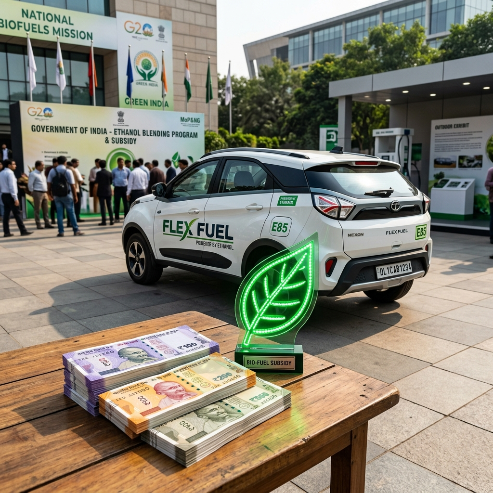

# Flex Fuel vs FAME III: How Subsidies Compare to EVs

The global automotive landscape is undergoing a monumental shift, and India is at the forefront of this green revolution. As the world's third-largest automobile market, the country’s choices significantly impact global emissions and energy markets. At the heart of India's strategy to decarbonize its transport sector lie two primary alternatives to traditional fossil fuels: Electric Vehicles (EVs) and Flex Fuel Vehicles (FFVs) running on ethanol blends.

To accelerate the adoption of these cleaner technologies, the Government of India has introduced various policy interventions and subsidies. The most prominent among these for EVs is the Faster Adoption and Manufacturing of (Hybrid &) Electric Vehicles (FAME) scheme, now in its anticipated third iteration, FAME III. Concurrently, the government is aggressively pushing the Ethanol Blended Petrol (EBP) program and offering incentives for flex-fuel technology. 

This comprehensive analysis delves into the nuances of FAME III subsidies for EVs and compares them with the incentive structures for Flex Fuel Vehicles. We will explore the economic, environmental, and strategic implications of both pathways to understand how they stack up in the race toward sustainable mobility.

## The Push for Green Mobility in India

India's push for green mobility is driven by three critical imperatives:
1.  **Reducing Import Bill:** India imports over 80% of its crude oil requirements, leading to a massive drain on foreign exchange.
2.  **Combating Air Pollution:** Several Indian cities rank among the most polluted globally, primarily due to vehicular emissions.
3.  **Climate Commitments:** India has committed to achieving net-zero emissions by 2070 and reducing the emissions intensity of its GDP.

To address these, the government has adopted a technology-agnostic approach, promoting both electrification and biofuels. However, the nature and scale of subsidies for these two pathways differ significantly.

---

## Understanding FAME III: The Engine for EV Growth

The FAME scheme has been the cornerstone of India's EV policy. FAME I and FAME II laid the groundwork by subsidizing EV purchases and supporting charging infrastructure. As we look towards FAME III, the focus is shifting from simply seeding the market to creating a self-sustaining EV ecosystem.

### What to Expect from FAME III?

While the exact contours of FAME III are continually evolving, several key trends are apparent based on industry demands and government indications:

#### 1. Shift from Direct Subsidies to Ecosystem Support
FAME II relied heavily on direct upfront subsidies to consumers, which significantly reduced the purchase price parity gap between EVs and internal combustion engine (ICE) vehicles. FAME III is expected to gradually phase out these direct consumer subsidies, especially for segments like electric two-wheelers (E2Ws) and three-wheelers (E3Ws), which are nearing cost parity. 

Instead, the funds are likely to be redirected towards:
*   **Charging Infrastructure:** A massive expansion of public charging stations, fast-charging networks on highways, and battery swapping stations.
*   **R&D and Innovation:** Subsidies for developing indigenous battery technologies, motors, and controllers.
*   **Public Transport:** Increased outlay for electric buses for state transport undertakings (STUs).

#### 2. Focus on PLI (Production Linked Incentive)
The government is increasingly relying on the PLI schemes for Advanced Chemistry Cell (ACC) battery storage and Auto components to drive localization. By incentivizing domestic manufacturing rather than just consumption, the aim is to bring down the fundamental cost of EVs in the long run.

#### 3. Stringent Localization Norms
To qualify for FAME III benefits (whatever form they take), manufacturers will have to meet even stricter Phased Manufacturing Program (PMP) guidelines, ensuring that a higher percentage of the EV components are made in India.

### The Impact of FAME Subsidies on EVs

FAME subsidies have been incredibly successful in kickstarting the EV revolution in India, particularly in the two-wheeler and three-wheeler segments. 
*   **Price Parity:** The upfront subsidy under FAME II (historically up to ₹15,000 per kWh for 2Ws) made EVs highly competitive with ICE vehicles.
*   **Adoption Rates:** E2W and E3W sales have seen exponential growth, driven by the attractive economics of low running costs combined with subsidized purchase prices.

However, the reduction in direct subsidies (as seen in the latter stages of FAME II and the transitional EMPS scheme) often leads to temporary sales dips, highlighting the market's price sensitivity. The transition to FAME III signifies a maturation of the EV market, moving from subsidy-dependence to fundamental economic viability.

---

## Subsidies and Incentives for Flex Fuel Vehicles (FFVs)

While EVs have FAME, the incentive structure for Flex Fuel Vehicles is fundamentally different. It is less about direct consumer subsidies for buying the vehicle and more about supply-side incentives, fuel pricing, and manufacturing support.

### 1. The Ethanol Blended Petrol (EBP) Program

The backbone of the flex-fuel push is the EBP program. The government has successfully achieved the target of 10% ethanol blending (E10) and has advanced the target for 20% blending (E20) to 2025. 

The incentives here are indirect but powerful:
*   **Lower GST on Ethanol:** The GST on ethanol meant for blending with petrol was reduced from 18% to 5%. This makes ethanol a cheaper fuel component.
*   **Administered Pricing:** The government sets lucrative procurement prices for ethanol derived from various sources (sugarcane juice, B-heavy molasses, C-heavy molasses, damaged food grains). This guarantees returns for distilleries and sugar mills, ensuring a steady supply of ethanol.
*   **Fuel Price Differential:** For FFVs to be successful, E85 (85% ethanol) or E100 must be significantly cheaper than regular petrol at the pump to offset the lower energy density of ethanol (which results in slightly lower mileage). The government’s taxation policy on blended fuels will dictate this price differential.

### 2. Production Linked Incentive (PLI) Scheme for Auto Sector

This is where the direct manufacturing support comes in for FFVs. The PLI scheme for the automobile and auto component industry specifically includes flex-fuel engines and components as "Advanced Automotive Technology" (AAT) products.

*   **Incentives for OEMs:** Automakers manufacturing FFVs can avail of incentives ranging from 13% to 18% on their determined sales value. This helps offset the R&D and re-tooling costs required to develop flex-fuel engines (which need corrosion-resistant components and modified engine mapping).
*   **Impact on Pricing:** These supply-side incentives allow OEMs to price FFVs competitively. Unlike EVs, which require expensive batteries, FFVs are fundamentally ICE vehicles with modifications. The PLI benefits can help keep the price premium of an FFV over a standard petrol vehicle to a minimum.

### 3. Potential Tax Benefits for Consumers

While not as direct as FAME subsidies, there are discussions and proposals regarding tax benefits for consumers purchasing FFVs:
*   **GST Reduction:** There is an ongoing industry demand to reduce the GST on FFVs from the current 28% (applicable to standard ICE vehicles) to 12% or even 5% (which is the rate for EVs). If implemented, this would act as a massive direct subsidy, making FFVs immediately cheaper than standard petrol cars.
*   **Road Tax Waivers:** Similar to EVs, state governments could offer road tax and registration fee waivers for FFVs to encourage adoption.

---

## A Direct Comparison: FAME III vs Flex Fuel Incentives

To understand which pathway offers a stronger value proposition, we must compare the nature, scale, and impact of the respective subsidies.

### 1. Direct vs Indirect Subsidies

**EVs (FAME III):** Moving from direct consumer subsidies to infrastructure and manufacturing support (PLI). The upfront purchase price of an EV will increasingly depend on battery cost reductions rather than government handouts.
**FFVs:** Primarily supply-side incentives (PLI for manufacturing) and fuel-side incentives (lower GST on ethanol, guaranteed procurement prices). Consumer subsidies (like GST cuts on the vehicles) are currently speculative but would be game-changing.

### 2. Upfront Purchase Cost Parity

**EVs:** Still carry a significant premium over ICE vehicles, especially in the four-wheeler segment, primarily due to battery costs. Subsidies have bridged this gap in 2Ws and 3Ws, but as FAME III reduces direct subsidies, OEMs will have to rely on economies of scale.
**FFVs:** The cost premium for manufacturing an FFV over a standard petrol vehicle is relatively small (estimated between ₹15,000 to ₹25,000 for a car). With PLI benefits, OEMs can absorb this cost. Therefore, FFVs are much closer to upfront cost parity with standard ICE vehicles than EVs are.

### 3. Total Cost of Ownership (TCO)

The TCO is where the true battle lies, and it is heavily influenced by the subsidy structure.

*   **EV TCO:** EVs have an undeniably lower running cost (electricity is significantly cheaper than petrol/diesel per km). They also have lower maintenance costs. Despite the higher initial purchase price (even with dwindling FAME subsidies), the TCO over 5-7 years for high-usage scenarios (like commercial fleets or daily commuters) heavily favors EVs.
*   **FFV TCO:** The TCO for FFVs depends entirely on the price of E85/E100 fuel relative to standard petrol. Ethanol has a lower calorific value (about 30% less energy by volume than petrol). Therefore, an FFV will return lower fuel efficiency (mileage). For the running cost to be lower or equal to petrol, the ethanol blend must be priced at a significant discount (at least 30-35% cheaper). The government's subsidy on ethanol procurement and fuel taxation will determine if FFVs can offer a compelling TCO advantage.

### 4. Infrastructure Dependency

**EVs:** Highly dependent on the rollout of charging infrastructure. FAME III's focus on this is crucial. Range anxiety and charging times remain psychological barriers for many consumers, necessitating massive capital investment in chargers.
**FFVs:** Leverage the existing fuel retail network. Dispensing E85 or E100 only requires adding new tanks and dispensing nozzles at existing petrol bunks. The infrastructure cost is a fraction of what is required for a nationwide EV fast-charging network.

---

## The Broader Economic and Strategic Impact

Subsidies are not just about helping consumers buy cheaper cars; they are strategic investments by the government to shape the economy.

### The EV Economy

The FAME subsidies and the EV PLI schemes are driving a massive transformation:
*   **New Ecosystem:** It is creating a completely new ecosystem of battery manufacturers, cell chemistry researchers, charging point operators (CPOs), and software developers.
*   **Import Substitution (Oil for Lithium):** While EVs reduce oil imports, they currently increase dependence on imported lithium and other critical minerals (primarily refined in China). The PLI for ACC batteries is aimed at mitigating this new import dependency.
*   **Grid Integration:** Widespread EV adoption requires significant upgrades to the power grid, but also offers opportunities for vehicle-to-grid (V2G) energy storage solutions.

### The Flex Fuel Economy (The Agrarian Advantage)

The incentives for ethanol and FFVs have a profound socio-economic impact that is unique to India:
*   **Boosting the Agrarian Economy:** The ethanol blending program directly benefits farmers. By providing a guaranteed market for surplus sugarcane, maize, and damaged food grains, it increases farmer income and ensures timely payments by sugar mills. This is a massive political and economic dividend.
*   **Energy Security:** Ethanol is produced domestically. Increasing the blend rate directly and immediately reduces crude oil imports, enhancing energy security without relying on imported battery minerals.
*   **Circular Economy:** Utilizing agricultural waste (through 2G ethanol plants) promotes a circular economy and helps address issues like stubble burning.

---

## Environmental Impact: Tailpipe vs Well-to-Wheel

A critical aspect of comparing these subsidies is analyzing the environmental outcomes they purchase.

### EVs: Zero Tailpipe, But What About the Grid?

EVs offer zero tailpipe emissions, which is revolutionary for urban air quality. The FAME subsidies directly purchase cleaner air for Indian cities. 

However, the "Well-to-Wheel" emissions depend on how the electricity is generated. Currently, over 70% of India's electricity comes from coal. While EVs are still generally cleaner than ICE vehicles even on a coal-heavy grid (due to the higher efficiency of electric motors), their true environmental benefit will only be realized as India greens its power grid through massive investments in solar and wind energy.

### FFVs: Lower Emissions, Not Zero

FFVs are not zero-emission vehicles. However, running on E85 or E100 significantly reduces greenhouse gas emissions compared to standard petrol.
*   **Carbon Cycle:** The CO2 emitted by burning ethanol is roughly offset by the CO2 absorbed by the crops (sugarcane, corn) during their growth. This makes ethanol a near carbon-neutral fuel on a lifecycle basis.
*   **Tailpipe Emissions:** High ethanol blends burn cleaner, reducing carbon monoxide and particulate matter emissions.

The subsidies for ethanol are purchasing a significant reduction in net carbon emissions and utilizing an existing IC engine technology that the Indian auto industry has already mastered.

---

## Challenges and Roadblocks

Both pathways face significant challenges that could alter the effectiveness of their respective subsidies.

### Challenges for FAME III and EVs

1.  **Battery Costs:** The recent drop in global lithium prices has helped, but batteries remain expensive. If costs spike again, the withdrawal of direct consumer subsidies under FAME III could severely dampen EV adoption.
2.  **Infrastructure Bottlenecks:** Despite FAME III's expected focus on charging infrastructure, the sheer scale required for a country like India is daunting. Grid stability in tier-2 and tier-3 cities is a concern.
3.  **Resale Value:** The secondary market for EVs is still nascent, and uncertainties around battery life affect resale values, impacting the overall TCO for consumers.

### Challenges for Flex Fuel and Ethanol

1.  **Food vs. Fuel Debate:** As ethanol blending targets increase, there is a risk of diverting arable land and food crops towards fuel production, potentially impacting food security and inflation. The government is mitigating this by promoting 2G ethanol (from agricultural waste), but commercial scaling is slow.
2.  **Water Intensity:** Sugarcane, the primary source of ethanol in India, is a highly water-intensive crop. Expanding its cultivation in water-stressed regions is environmentally unsustainable.
3.  **Fuel Pricing Policy:** For FFVs to succeed, the government must maintain a consistent taxation policy that keeps E85 significantly cheaper than petrol. Any fluctuation in this price differential will immediately kill consumer demand for FFVs.

---

## The Verdict: Coexistence, Not Competition

Analyzing the subsidies—FAME III for EVs and the PLI/EBP incentives for Flex Fuel—reveals that they are not necessarily competing forces, but complementary strategies. India's vast and diverse automotive market requires a multi-pronged approach.

### Segment-Wise Domination

*   **Two-Wheelers & Three-Wheelers:** This segment is rapidly electrifying. The TCO advantages are clear, and the infrastructure requirements (home charging, battery swapping) are manageable. FAME III (or its successors) will likely cement EV dominance here. Flex fuel is less relevant in these lower-cost segments where the upfront cost of fuel injection modifications might be prohibitive.
*   **Urban Four-Wheelers & Public Transport:** EVs are the logical choice for urban environments where reducing tailpipe emissions is paramount. Electric buses (supported heavily by FAME) and urban commuter cars will see strong EV adoption.
*   **Long-Haul Commercial & Rural Mobility:** This is where EVs struggle due to battery weight, range limitations, and lack of fast-charging infrastructure in remote areas. **This is the sweet spot for Flex Fuel Vehicles.** FFVs offer the range and quick refueling of traditional ICE vehicles while providing a significantly greener alternative. Subsidizing FFVs for rural and semi-urban markets makes economic and strategic sense.

### Conclusion

The comparison between Flex Fuel incentives and FAME III subsidies highlights a pragmatic approach by the Indian government. 

FAME III is designed to build a futuristic, high-tech ecosystem for Electric Vehicles, addressing urban pollution and pushing the boundaries of automotive technology. It is a long-term play requiring massive infrastructure overhaul.

Conversely, the subsidies and incentives for Flex Fuel and ethanol represent a pragmatic, immediate solution. It leverages the existing massive investments in ICE manufacturing and fuel retail infrastructure, while simultaneously injecting billions of rupees into the rural, agrarian economy. 

Ultimately, the true winner of this dual-subsidy strategy is the Indian consumer and the environment. By fostering healthy competition between two viable green technologies, India is ensuring that its transition away from fossil fuels is not just environmentally sustainable, but also economically robust and socially inclusive. The road to net-zero is not a single highway, but a network of interconnected paths, and both EVs and FFVs have crucial roles to play in the journey ahead.

---
*Disclaimer: The details regarding FAME III are based on industry projections and government indications as of mid-2026, as the finalized policy parameters are subject to official notification.*
