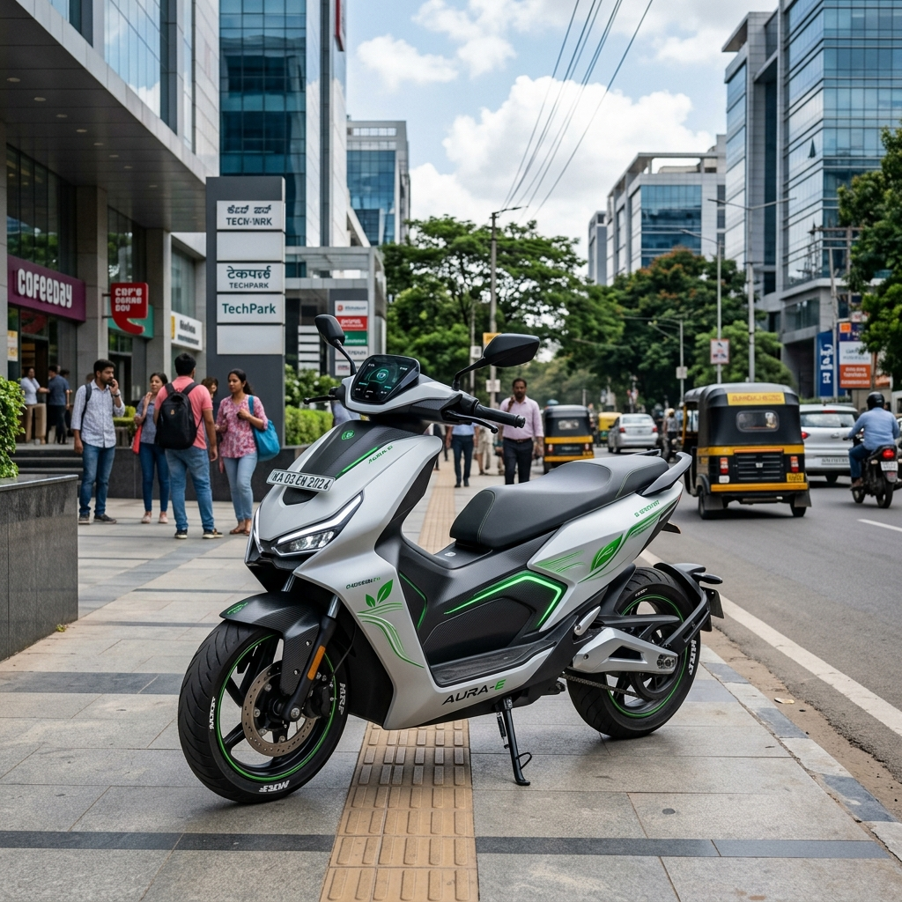

# Honda Activa Flex Fuel Launch Timeline and Expected Price: A Comprehensive Guide

The Indian two-wheeler market is on the cusp of a major transformation, with flex-fuel technology leading the charge toward greener and more sustainable mobility. Among the most anticipated launches in this category is the flex-fuel variant of India's undisputed scooter king—the Honda Activa. As the government pushes for higher ethanol blending to reduce dependence on crude oil imports and cut down emissions, Honda Motorcycle & Scooter India (HMSI) is preparing to introduce its global flex-fuel expertise to the Indian market.

In this comprehensive guide, we delve into the expected launch timeline, projected price, technological readiness, and everything else you need to know about the upcoming Honda Activa Flex Fuel.

## The Shift Towards Flex-Fuel in India

Before understanding the specifics of the Honda Activa Flex Fuel, it is crucial to look at the broader context of the Indian automotive sector. The Government of India has been actively promoting ethanol-blended petrol (EBP). Currently, the E20 blend (20% ethanol and 80% petrol) is being rolled out across the country, with a target to achieve nationwide availability by 2025. 

Flex-fuel vehicles (FFVs) take this a step further by being capable of running on a flexible blend of petrol and ethanol, right up to E85 (85% ethanol). This technology has been highly successful in countries like Brazil, where Honda has a significant presence and a proven track record of offering flex-fuel motorcycles.

## Honda's Flex-Fuel Strategy for India

Honda Motorcycle & Scooter India (HMSI) has not been quiet about its intentions. The company's leadership has repeatedly affirmed its commitment to a "multifuel product offensive." Honda already possesses the technological know-how for flex-fuel engines, thanks to its extensive operations in Brazil. 

The strategy for India involves a phased rollout. All current BS6 Phase 2 compliant Honda two-wheelers sold in India, including the standard Activa 6G and Activa 125, are already compatible with E20 fuel. The next logical step is introducing dedicated flex-fuel models capable of handling much higher ethanol blends.

### Why Start with the Activa?

The Honda Activa is not just a scooter; it is a household name in India. Launching a flex-fuel variant of their highest-selling model makes strategic sense for several reasons:

1.  **Mass Market Penetration:** To make a significant impact on emissions and fuel consumption, flex-fuel technology needs to reach the masses. The Activa offers the perfect platform for this.
2.  **Consumer Trust:** The Activa brand is synonymous with reliability. Consumers are more likely to adopt a new technology if it comes packaged in a trusted brand name.
3.  **Economies of Scale:** By implementing flex-fuel technology in their highest-volume product, Honda can achieve economies of scale, helping to keep the final price competitive.

## Honda Activa Flex Fuel: Launch Timeline

The million-dollar question for many prospective buyers is: When will the Honda Activa Flex Fuel launch in India?

As of mid-2026, **Honda has not officially announced a specific, fixed launch date for the Activa Flex Fuel.** 

However, we can make educated projections based on industry trends, government deadlines, and statements from HMSI leadership.

### The Waiting Game: Infrastructure Readiness

Honda’s top management has stated that they are technologically prepared to launch flex-fuel products in India immediately. The primary reason for the delay is the maturation of localized fueling infrastructure. 

For a flex-fuel vehicle (especially one optimized for E85 or E100) to be viable, consumers need easy access to high-blend ethanol fuel at regular petrol stations. While the E20 rollout is progressing well, the infrastructure for E85 is still in its nascent stages. Honda wants to ensure that when they launch the Activa Flex Fuel, owners will not struggle to find the right fuel.

### Expected Launch Window

Given the aggressive push by the Indian government to expand ethanol dispensing stations and the recent entry of competitors (like Hero MotoCorp and Suzuki) into the flex-fuel space, it is highly likely that Honda will accelerate its plans.

*   **Late 2026 / Early 2027:** This is the most probable launch window for Honda's first flex-fuel two-wheeler in India. If the infrastructure development hits critical mass, Honda might showcase the production-ready Activa Flex Fuel by late 2026, with deliveries beginning in early 2027.
*   **The "Activa 7G" Factor:** There is widespread speculation that the flex-fuel technology will debut alongside the next major generation upgrade of the scooter, colloquially referred to as the Activa 7G. If Honda plans a major revamp, combining it with the flex-fuel launch would make for a blockbuster event.

## Expected Price of the Honda Activa Flex Fuel

Pricing is a critical factor in the price-sensitive Indian market. Because there is no official product announcement yet, **there is no confirmed price for the Activa Flex Fuel.** 

However, we can estimate the expected price by analyzing the cost implications of flex-fuel technology.

### The Cost of Flex-Fuel Technology

Converting a standard internal combustion engine to run on high blends of ethanol requires specific modifications:

*   **Corrosion-Resistant Materials:** Ethanol is corrosive. Therefore, the fuel tank, fuel lines, injectors, and engine components must be made of or coated with materials that can withstand prolonged exposure to ethanol.
*   **Engine Calibration and ECU:** The Engine Control Unit (ECU) needs to be upgraded with specialized sensors to detect the ethanol-to-petrol ratio in real-time and adjust the fuel injection and spark timing accordingly.
*   **Fuel Pump Upgrades:** A more robust fuel pump is often required to handle the different viscosity and properties of high-blend ethanol.

These modifications inherently increase the manufacturing cost compared to a standard petrol-only model.

### Price Projections

Currently, standard Honda Activa models (like the 6G) are priced between ₹76,000 and ₹82,000 (ex-showroom), depending on the variant. 

Taking into account the additional hardware and software required for flex-fuel compatibility, we can expect a premium over the standard models.

*   **Estimated Premium:** The flex-fuel technology is expected to add roughly ₹5,000 to ₹8,000 to the base cost of the scooter.
*   **Expected Ex-Showroom Price:** Therefore, the expected price for the Honda Activa Flex Fuel will likely fall in the range of **₹85,000 to ₹92,000 (ex-showroom).**

It is important to note that the government may offer subsidies or tax incentives for flex-fuel vehicles in the future to encourage adoption, which could help offset the initial premium. Furthermore, the lower cost of ethanol fuel compared to petrol means that the total cost of ownership over the scooter's lifespan could be lower, despite the higher initial purchase price.

## Design and Features: What to Expect

While the core change will be in the powertrain, what else can we expect from the Honda Activa Flex Fuel? 

### Familiar Yet Modern Design

Honda is known for its conservative yet universally appealing design language, especially for the Activa. We do not expect a radical departure from the familiar silhouette. The Activa Flex Fuel will likely retain the family look but might feature specific badging or color schemes (perhaps incorporating green accents) to highlight its eco-friendly credentials. 

If the flex-fuel tech is introduced with the "Activa 7G" generation, we might see a more substantial design update, including a sharper front apron, modernized LED lighting, and perhaps slightly larger dimensions for better road presence.

### Expected Feature List

To justify the expected premium and compete in a rapidly evolving market, the Activa Flex Fuel should come equipped with modern features:

*   **Fully Digital Instrument Cluster:** A modern digital display is essential. It should ideally provide real-time information on the fuel blend currently in the tank, along with standard metrics like speed, trip meter, and fuel level.
*   **Bluetooth Connectivity:** Smartphone connectivity for call/SMS alerts and basic turn-by-turn navigation is becoming a standard expectation in this price bracket.
*   **Enhanced H-Smart Keyless System:** Honda’s H-Smart technology, which offers keyless start, smart find, and anti-theft features, is likely to be standard on the top-spec flex-fuel variants.
*   **Telescopic Front Suspension & Alloy Wheels:** For better ride quality and handling, telescopic forks and alloy wheels with tubeless tires should be standard.
*   **External Fuel Filler:** A convenience feature that has become standard on the Activa line and will definitely be retained.

## Performance and Mileage: The Ethanol Effect

Running on a high-blend ethanol fuel will inevitably affect the performance and fuel efficiency characteristics of the Activa.

### Performance Adjustments

Ethanol has a higher octane rating than standard petrol, which can allow for higher compression ratios and potentially slightly better peak power. However, ethanol also has a lower energy density (calorific value) than petrol. 

Honda’s engineers will need to tune the ECU meticulously to balance these factors. The goal will be to provide a performance feel that is identical to, if not slightly peppier than, the standard petrol Activa. The transition between different fuel blends should be seamless and unnoticeable to the rider.

### Fuel Efficiency (Mileage)

Because ethanol contains less energy per unit volume than petrol, you will need more ethanol to travel the same distance. Consequently, **the outright mileage (km per liter) on E85 fuel will be lower than on pure petrol or E20.**

Estimates suggest a drop in fuel efficiency of around 15% to 25% when running on E85 compared to standard petrol. 

However, the crucial metric for consumers is not just mileage, but the **running cost per kilometer**. Because ethanol is significantly cheaper than petrol in India (and the price gap is expected to widen), the overall cost of running the scooter on E85 should be lower or on par with petrol, despite the lower mileage.

## The Competition in the Flex-Fuel Scooter Segment

Honda will not be entering an empty market. Several key competitors are also gearing up to launch flex-fuel two-wheelers in India.

*   **TVS Motor Company:** TVS was the first to launch an ethanol-capable motorcycle in India with the Apache RTR 200 Fi E100 years ago. They are actively working on flex-fuel variants for their scooter lineup, including the Jupiter and NTorq.
*   **Hero MotoCorp:** Hero has already showcased flex-fuel prototypes of its popular motorcycles and is expected to bring this technology to its scooters like the Destini and Maestro Edge.
*   **Bajaj Auto:** Bajaj is a strong proponent of alternative fuels (including CNG) and is aggressively developing its own flex-fuel platforms.
*   **Suzuki:** Suzuki has recently entered the fray, indicating that the Japanese manufacturers are taking the Indian flex-fuel mandate seriously.

The competition will be fierce, but Honda’s sheer brand strength and expansive service network will give it a significant advantage.

## Environmental Impact: Why Flex Fuel Matters

The shift to flex-fuel technology is not just an automotive trend; it is a critical environmental and economic imperative for India.

1.  **Reduced Emissions:** Ethanol burns cleaner than petrol. Vehicles running on high ethanol blends produce significantly lower emissions of carbon monoxide, unburned hydrocarbons, and particulate matter, contributing to better air quality in polluted Indian cities.
2.  **Lower Crude Oil Imports:** India imports over 80% of its crude oil requirements. By blending domestically produced ethanol with petrol, the country can significantly reduce its import bill, saving valuable foreign exchange.
3.  **Boost to the Agricultural Sector:** Ethanol in India is primarily produced from sugarcane and other agricultural byproducts. Increased demand for ethanol directly benefits Indian farmers, providing them with an additional source of income and boosting the rural economy.

## Conclusion: The Road Ahead for the Activa Flex Fuel

The Honda Activa Flex Fuel represents the next major evolutionary step for India's favorite scooter. While a specific launch date and official price are yet to be announced, the technological groundwork is already in place. Honda is currently playing a strategic waiting game, ensuring that the necessary fueling infrastructure is robust enough to support a mass-market product.

When it does launch—likely between late 2026 and early 2027—we can expect a scooter that retains the core Activa DNA of reliability and practicality while embracing the future of green mobility. With an expected price premium of ₹5,000 to ₹8,000 over the standard models, the Activa Flex Fuel will offer a compelling proposition for environmentally conscious buyers looking for lower running costs.

The success of the Activa Flex Fuel will depend heavily on the continuous expansion of E85 fuel stations across the country. But given the government's strong backing for the ethanol blending program and Honda's unmatched market presence, the Activa Flex Fuel is poised to lead the green revolution in the Indian two-wheeler industry.

---
### Frequently Asked Questions (FAQs)

**1. Is the current Honda Activa compatible with ethanol fuel?**
Yes, all current BS6 Phase 2 compliant Honda Activa models sold in India are compatible with E20 fuel (20% ethanol blend). However, they are not full "flex-fuel" vehicles capable of running on E85.

**2. What is the expected launch date for the Honda Activa Flex Fuel?**
Honda has not announced an official date, but based on market trends and infrastructure development, a launch between late 2026 and early 2027 is highly probable.

**3. How much will the Honda Activa Flex Fuel cost?**
The expected price is between ₹85,000 and ₹92,000 (ex-showroom), representing a slight premium over the standard petrol models due to the specialized hardware required for flex-fuel capability.

**4. Will the mileage of the Activa drop when using flex fuel?**
Yes, the outright mileage (kmpl) is expected to be lower when running on high-blend ethanol (like E85) because ethanol has a lower energy density than petrol. However, because ethanol is cheaper, the overall running cost should be economical.

**5. Why is Honda delaying the launch of the Activa Flex Fuel?**
Honda has stated that they have the technology ready but are waiting for the E85 fueling infrastructure to become more widespread in India to ensure a hassle-free ownership experience for their customers.
