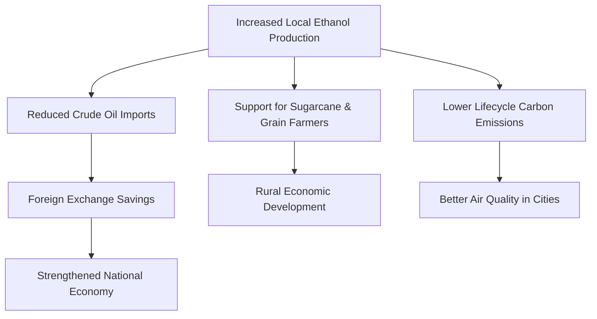

# Is E85 Cheaper Than Regular Petrol in India? A Deep-Dive Cost-Benefit Analysis

In recent years, the Indian automotive landscape has experienced a monumental shift toward sustainable mobility. While electric vehicles (EVs) grab the headlines, a quieter but equally significant revolution is unfolding in the internal combustion engine (ICE) space: the transition to ethanol-blended fuels. Following the nationwide rollout of E20 petrol (petrol blended with 20% ethanol), the Indian government, spearheaded by the Ministry of Road Transport and Highways (MoRTH), has increasingly championed the cause of E85—a high-blend fuel consisting of 85% ethanol and 15% regular petrol.

With leading manufacturers showcasing prototype Flex-Fuel Vehicles (FFVs) and the government aggressively expanding ethanol production capacity, Indian consumers are left with a critical question: **Is E85 actually cheaper than regular petrol in India?**

The immediate appeal of E85 is its significantly lower retail price per liter at the pump compared to petrol. However, evaluating the economic viability of a fuel goes beyond the price tag on the dispensing nozzle. Because ethanol contains less energy by volume than petrol, vehicles running on E85 experience a notable drop in fuel efficiency. To determine whether E85 is truly a cost-effective alternative, we must analyze the chemistry of the fuels, the taxation differences in the Indian market, the mileage penalty, and calculate the actual cost per kilometer (CPK).

---

## The Chemistry and Physics of E85 vs. Regular Petrol

To understand the economics of E85, one must first understand its fuel properties. Ethanol ($C_2H_5OH$) is an alcohol-based fuel derived primarily from the fermentation of biomass, such as sugarcane juice, molasses, maize, and damaged food grains. Regular petrol, on the other hand, is a hydrocarbon fuel refined from imported crude oil. These differing chemical structures result in distinct physical properties that directly influence engine performance and fuel consumption.

### Calorific Value and Energy Density

The primary metric governing fuel economy is energy density, which is measured by its net calorific value (NCV). Energy density determines how much chemical energy is contained within a specific volume of fuel, which translates directly to the mechanical work the engine can perform per liter of fuel consumed.

*   **Regular Petrol (90-95% Hydrocarbons):** Pure petrol possesses a high energy density, yielding approximately 32 to 34 Megajoules per liter (MJ/L).
*   **Pure Ethanol (E100):** Anhydrous ethanol has a significantly lower energy density, containing roughly 21.2 MJ/L. This is approximately 33% to 35% less energy than regular petrol.
*   **E85 (85% Ethanol, 15% Petrol):** Because E85 is a blend, its energy density lies between the two extremes. Mathematically, E85 contains approximately 22.8 to 23.5 MJ/L of energy.

| Fuel Type | Ethanol Content | Approximate Energy Density (MJ/L) | Relative Energy Content vs. Petrol |
| :--- | :--- | :--- | :--- |
| Regular Petrol (Pure) | 0% | 34.2 MJ/L | 100% |
| Indian E20 Petrol | 20% | 31.6 MJ/L | ~92.4% |
| **E85 Flex-Fuel** | **85%** | **23.1 MJ/L** | **~67.5%** |

Because E85 contains roughly 67.5% of the energy found in pure petrol (and about 73% of the energy in standard Indian E20 petrol), a flex-fuel engine must inject more fuel into the cylinders to achieve the same combustion energy. This is the root cause of the "ethanol mileage penalty."

### Octane Rating and Engine Tuning

While ethanol lags in energy density, it excels in octane rating. The octane rating measures a fuel's resistance to pre-ignition or knocking, which occurs when the fuel-air mixture ignites prematurely under pressure.

*   **Regular Petrol in India:** Typically has an octane rating of 91 RON (Research Octane Number).
*   **E85 Flex-Fuel:** Boasts an octane rating ranging from **105 to 108 RON**. 

This exceptionally high octane rating allows engine designers to increase the compression ratio of flex-fuel engines and advance the ignition timing. In high-performance or optimized flex-fuel engines, the thermal efficiency increases, which can partially offset the energy density disadvantage. However, in standard passenger vehicles retrofitted with conversion kits or older engines not fully optimized for high-octane fuels, the high octane rating remains underutilized, and the mileage drop remains steep.

### Air-Fuel Ratio (AFR) and Fuel Flow Rates

The stoichiometric air-fuel ratio—the ideal ratio of air to fuel for complete combustion—varies dramatically:

*   **Regular Petrol:** The stoichiometric AFR is 14.7:1 (14.7 parts air to 1 part fuel by weight).
*   **E85:** The stoichiometric AFR is approximately 9.7:1 to 10.0:1.

Because E85 requires significantly less air per unit of fuel to burn completely, the engine's fuel injectors must spray more volume of fuel into the combustion chamber. In fact, to maintain the correct air-fuel mixture, the fuel delivery system must supply roughly 27% to 30% more volume of E85 than regular petrol under similar driving conditions.

---

## India's Ethanol Blending Programme (EBP) Roadmap

The push toward E85 in India is driven by national policy rather than market demand alone. The Indian Government's Ethanol Blending Programme (EBP) is a strategic initiative aimed at achieving energy security, reducing carbon emissions, and supporting the domestic agricultural sector.

### The Shift from E10 to E20

India successfully advanced its target of achieving a 20% ethanol blend in petrol (E20) to 2025-2026. Today, E20 petrol is widely available across retail outlets in India. All vehicles manufactured in India since April 2023 are material-compliant with E20, and their engines are tuned to handle the mild calorific drop associated with 20% blending without noticeable performance degradation.

### The Flex-Fuel Vehicle (FFV) Push

To transition beyond E20, the government is focusing on Flex-Fuel Vehicles (FFVs) and Flex-Fuel Strong Hybrid Electric Vehicles (FF-SHEVs). These vehicles feature modified engines, specialized fuel systems, and Engine Control Units (ECUs) capable of dynamically adjusting to any ethanol blend ranging from E20 to E85.

The Ministry of Road Transport and Highways has consistently urged major manufacturers to accelerate the commercial launch of FFVs. Prototypes from Toyota (such as the Corolla Altis Flex-Fuel and the Innova Hycross Flex-Fuel), Maruti Suzuki (WagonR Flex-Fuel), and several two-wheelers from TVS and Bajaj have demonstrated that the hardware is ready for commercialization in the Indian market.

### Localized Ethanol Production: Feedstock and Capacity

India's ability to supply E85 economically depends on its domestic production capacity. India is one of the world's largest producers of sugar, and sugarcane juice and molasses serve as the primary feedstocks for ethanol. 

To prevent seasonal fluctuations, the government has diversified the feedstock basket to include starchy grains (like maize and damaged food grains), excess rice stocks from the Food Corporation of India (FCI), and agricultural residues (second-generation ethanol). This domestic supply chain insulates ethanol prices from the volatile geopolitics of the global crude oil market, creating a structural pricing advantage for ethanol-rich fuels like E85.

---

## The Economics of Fuel Pricing in India

To determine if E85 is cheaper, we must analyze the contrast in taxation and pricing mechanisms between regular petrol and ethanol in India.

### Why Regular Petrol is Expensive: Taxes, Duties, and Surcharges

In India, regular petrol is heavily taxed, making up a significant portion of its retail price. Petrol is kept outside the Goods and Services Tax (GST) regime, allowing both the Central Government and State Governments to levy independent taxes:

1.  **Base Price:** The actual cost of refining crude oil, transport, and oil marketing company (OMC) margins.
2.  **Central Excise Duty:** A flat excise tax levied by the Central Government.
3.  **State VAT / Sales Tax:** A percentage-based tax levied by individual states, which varies widely (e.g., higher in Maharashtra and Karnataka, lower in Delhi and Goa).
4.  **Dealer Commission:** The margin paid to fuel station operators.

Combined, taxes account for roughly 45% to 55% of the final pump price of petrol. When crude oil prices rise globally, the base price surges, pushing retail prices beyond ₹100 per liter in many metropolitan areas.

### How E85 is Priced: Subsidies, Lower GST, and Feedstock Costs

E85 pricing operates under a completely different economic model. Because ethanol is a domestically produced agricultural product, it benefits from government-backed pricing and tax incentives:

*   **Ethanol Administered Price:** The government sets the procurement price of ethanol directly for OMCs, depending on the feedstock used (e.g., sugarcane juice vs. maize). This price generally ranges between ₹55 to ₹66 per liter.
*   **GST Benefit:** Ethanol meant for blending is taxed at a concessionary GST rate of **5%**.
*   **State Tax Exemptions:** To promote green fuels, many state governments have proposed reducing or completely waiving local VAT and cess on E85.

By bypassing the heavy excise and VAT structures applied to fossil fuels, E85 can be retailed at a significantly lower baseline price.

### Expected Retail Price of E85 at the Pump

While exact retail pricing varies by state and oil marketing company, the projected pricing model for E85 in India aligns as follows:

*   **Average Regular Petrol Price:** ~₹95 to ₹105 per liter (depending on the state).
*   **Expected E85 Retail Price:** ~₹65 to ₹75 per liter.

At first glance, a price of ₹70 per liter for E85 compared to ₹100 per liter for petrol represents a **30% savings per liter**. But does this saving survive the test of real-world fuel economy? Let's run the numbers.

---

## The Core Comparison: The Mathematics of Fuel Economy

The true cost of running a vehicle is not the cost of purchasing a liter of fuel, but the cost incurred to drive the vehicle over a set distance. This is measured as the **Cost Per Kilometer (CPK)**.

$$\text{Cost Per Kilometer (CPK)} = \frac{\text{Fuel Price per Liter}}{\text{Fuel Economy (Mileage in km/L)}}$$

### The E85 Mileage Penalty Explained

Due to the chemical differences discussed earlier, a vehicle burning E85 will consume more fuel to travel the same distance. The actual mileage drop depends on whether the vehicle is optimized for E85:

1.  **Non-Optimized Flex-Fuel Engines / Retrofitted Cars:** Typically experience a **28% to 33% drop** in mileage compared to regular petrol.
2.  **Optimized OEM Flex-Fuel Engines (High Compression / Variable Valve Timing):** Experience a milder **22% to 26% drop** because the engine utilizes the 108 RON octane rating to improve combustion efficiency.
3.  **Flex-Fuel Strong Hybrids (FF-SHEVs):** The electric motor offsets the fuel consumption during low-speed start-stop driving, keeping the overall efficiency high.

For our calculations, we will assume a realistic, middle-of-the-road fuel economy drop of **30%** for a standard OEM flex-fuel hatchback or sedan.

*   If a car achieves **15 km/L** on regular petrol (E20),
*   Its projected mileage on E85 will be:
    $$15 \text{ km/L} \times (1 - 0.30) = 10.5 \text{ km/L}$$

---

### Cost Per Kilometer (CPK) Scenarios

Let's evaluate three different pricing scenarios representing different regions and policy environments in India.

#### Scenario 1: Low-Cost E85 vs. Standard Petrol (Highly Subsidized State)
In this scenario, we assume a state with aggressive tax incentives on green fuels, pricing E85 at the lower end of projections.

*   **Regular Petrol Price:** ₹100.00 per liter
*   **E85 Price:** ₹65.00 per liter (35% cheaper than petrol)
*   **Petrol Mileage:** 15.0 km/L
*   **E85 Mileage (30% drop):** 10.5 km/L

$$\text{CPK (Petrol)} = \frac{\text{₹100.00}}{15.0 \text{ km/L}} = \text{₹6.67 per km}$$
$$\text{CPK (E85)} = \frac{\text{₹65.00}}{10.5 \text{ km/L}} = \text{₹6.19 per km}$$

*   **Savings:** ₹0.48 per kilometer (7.2% savings). E85 is financially viable.

#### Scenario 2: Moderate-Cost E85 vs. Standard Petrol (Standard Market Pricing)
In this scenario, E85 is priced with moderate OMC marketing margins and standard transportation costs.

*   **Regular Petrol Price:** ₹100.00 per liter
*   **E85 Price:** ₹70.00 per liter (30% cheaper than petrol)
*   **Petrol Mileage:** 15.0 km/L
*   **E85 Mileage (30% drop):** 10.5 km/L

$$\text{CPK (Petrol)} = \frac{\text{₹100.00}}{15.0 \text{ km/L}} = \text{₹6.67 per km}$$
$$\text{CPK (E85)} = \frac{\text{₹70.00}}{10.5 \text{ km/L}} = \text{₹6.67 per km}$$

*   **Savings:** ₹0.00 per kilometer (Break-even). E85 costs exactly the same as petrol per kilometer.

#### Scenario 3: High-Cost E85 vs. Premium / High-VAT Petrol
In this scenario, we evaluate a metropolitan area with high petrol prices but where E85 distribution costs are slightly elevated.

*   **Regular Petrol Price:** ₹105.00 per liter
*   **E85 Price:** ₹75.00 per liter (28.5% cheaper than petrol)
*   **Petrol Mileage:** 15.0 km/L
*   **E85 Mileage (30% drop):** 10.5 km/L

$$\text{CPK (Petrol)} = \frac{\text{₹105.00}}{15.0 \text{ km/L}} = \text{₹7.00 per km}$$
$$\text{CPK (E85)} = \frac{\text{₹75.00}}{10.5 \text{ km/L}} = \text{₹7.14 per km}$$

*   **Savings:** -₹0.14 per kilometer (Loss). E85 is 2% more expensive to run than regular petrol.

---

### Cost Per Kilometer Matrix (Table)

The matrix below illustrates the running cost per kilometer (CPK) across various price points of regular petrol and E85, assuming a base petrol fuel economy of **15 km/L** and an E85 fuel economy of **10.5 km/L** (30% drop).

| Petrol Price (per Liter) | E85 Price (per Liter) | Petrol CPK (₹) | E85 CPK (₹) | Net Savings per km (₹) | Economically Viable? |
| :---: | :---: | :---: | :---: | :---: | :---: |
| ₹95.00 | ₹60.00 | 6.33 | 5.71 | +0.62 | **Yes (9.8% Savings)** |
| ₹95.00 | ₹65.00 | 6.33 | 6.19 | +0.14 | **Yes (2.2% Savings)** |
| ₹95.00 | ₹70.00 | 6.33 | 6.67 | -0.34 | No (5.4% Loss) |
| ₹100.00 | ₹65.00 | 6.67 | 6.19 | +0.48 | **Yes (7.2% Savings)** |
| ₹100.00 | ₹70.00 | 6.67 | 6.67 | 0.00 | **Break-even (0%)** |
| ₹100.00 | ₹75.00 | 6.67 | 7.14 | -0.47 | No (7.0% Loss) |
| ₹105.00 | ₹65.00 | 7.00 | 6.19 | +0.81 | **Yes (11.6% Savings)** |
| ₹105.00 | ₹70.00 | 7.00 | 6.67 | +0.33 | **Yes (4.7% Savings)** |
| ₹105.00 | ₹75.00 | 7.00 | 7.14 | -0.14 | No (2.0% Loss) |
| ₹110.00 | ₹70.00 | 7.33 | 6.67 | +0.66 | **Yes (9.0% Savings)** |
| ₹110.00 | ₹75.00 | 7.33 | 7.14 | +0.19 | **Yes (2.6% Savings)** |

From this comprehensive matrix, a clear rule of thumb emerges:
**For E85 to be economically viable in India, the price of E85 per liter must be at least 32% to 35% lower than the retail price of regular petrol.** 

---

## Vehicle Modification, Material Compatibility, and Hardware Costs

Before switching to E85, vehicle owners must understand the engineering challenges involved. You cannot simply pour E85 into a standard, unmodified petrol vehicle. Doing so will cause immediate engine performance issues and severe long-term mechanical damage.

### Can You Run E85 in a Standard Petrol Car?

No. Standard gasoline engines are designed to operate within a narrow range of fuel properties. Running E85 in a standard car introduces several critical issues:

1.  **Running Lean:** Because E85 requires a lower air-fuel ratio, a standard engine's fuel system will not inject enough fuel. This causes the engine to run "lean" (too much air, too little fuel), leading to misfires, hesitation, loss of power, and high combustion chamber temperatures that can damage valves and pistons.
2.  **Cold Start Issues:** Ethanol has a lower vapor pressure than petrol and does not vaporize easily at cold temperatures. In winter or cold mornings, standard engines running on E85 will struggle to start.
3.  **Sensor Errors:** The Engine Control Unit (ECU) will detect anomalous readings from the oxygen sensors and trigger the Check Engine light.

### OEM Flex-Fuel Vehicles (FFVs) in India: The Current Landscape

For the general consumer, buying a factory-built OEM Flex-Fuel Vehicle is the safest and most practical route. Unlike retrofitted cars, OEM FFVs are engineered from the ground up to handle high ethanol concentrations:

*   **Corrosion-Resistant Materials:** Fuel tanks are made of high-density polyethylene (HDPE) or stainless steel. Fuel lines, seals, gaskets, and O-rings are made of specialized fluoropolymers (like Viton) that resist chemical degradation by alcohol.
*   **Upgraded Fuel Delivery:** Fuel pumps have higher flow capacities, and injectors are designed with larger orifices to handle the 30% increase in fuel volume.
*   **Hardened Valve Seats:** Cylinder heads feature hardened valves and valve seats to withstand the less lubricative nature of ethanol combustion.
*   **Smart ECUs:** The factory ECU uses closed-loop feedback from an ethanol sensor to alter ignition timing, fuel trim, and cold-start parameters dynamically.

OEM FFVs are expected to command a small price premium—roughly **₹15,000 to ₹30,000 higher** than their standard petrol counterparts—due to the upgraded materials and components.

### Long-term Maintenance Implications of E85

Even if the cost per kilometer favors E85, owners must factor in potential changes in maintenance costs:

*   **Hygroscopic Properties and Phase Separation:** Ethanol is highly hygroscopic, meaning it absorbs moisture from the air. If water concentration in the tank exceeds 0.5%, the water-ethanol mix separates from the petrol, settling at the bottom. The fuel pump then draws this corrosive mix, causing misfires and potential fuel pump failures.
*   **Corrosion:** Ethanol can facilitate galvanic corrosion in metals like aluminum and brass, and can degrade rubber hoses.
*   **Lubrication and Oil Changes:** Ethanol burns cooler but produces acidic byproducts that dilute engine oil and deplete its Total Base Number (TBN). Special API SP or ILSAC GF-6 oils are required, and manufacturers may recommend shortening oil change intervals by **20% to 25%**.

---

## The Macroeconomic and Environmental Equation

To fully evaluate E85, it is important to look at the broader picture. Even if the immediate financial savings for an individual consumer are marginal, the macroeconomic and environmental benefits are substantial.

### Impact on India's Crude Import Bill and Trade Deficit

India imports over **85% of its crude oil requirements**, costing the national exchequer billions of dollars annually. By replacing 85% of the petroleum content in fuel with domestically produced ethanol, wide-scale E85 adoption can dramatically reduce foreign exchange outflows. The savings accrued from reduced imports can be redirected toward national infrastructure.

### Agricultural Growth and Rural Economy Support

The money spent on procuring ethanol flows directly into the Indian rural economy, supporting sugarcane farmers by providing mills with alternate revenue streams, and providing grain farmers with price stability. Building and operating ethanol distilleries in rural areas also creates local jobs.

### Lifecycle Carbon Emissions

From an environmental standpoint, E85 offers a cleaner combustion profile, resulting in lower tailpipe emissions of carbon monoxide (CO), nitrogen oxides (NOx), and particulate matter. The crops grown to produce the ethanol absorb $CO_2$ during growth, making the net lifecycle greenhouse gas emissions of E85 **30% to 50% lower** than regular petrol.

---

## Conclusion and Final Verdict: Should You Switch to E85?

Deciding whether E85 is cheaper than regular petrol in India depends on a careful balance between the lower cost of the fuel and its lower energy density. 

### The Bottom Line: When is E85 Cheaper?

1.  **Price-Per-Liter Threshold:** E85 is only cheaper to run if its retail price is at least **32% lower** than regular petrol. If petrol is ₹100/liter, E85 must be priced **below ₹68/liter** to deliver true savings.
2.  **Vehicle Suitability:** You must own a factory-built Flex-Fuel Vehicle (FFV) to safely run E85. Retrofitting older vehicles with aftermarket kits is currently not viable due to high upfront costs and regulatory hurdles.
3.  **Maintenance Costs:** You must factor in slightly higher maintenance costs, including more frequent oil changes and the potential risk of water contamination in humid regions.

### Summary Verdict

For the average Indian commuter, E85 is not a magic bullet for saving money on fuel today. Instead, it is a specialized fuel option that offers **marginal savings (between 5% and 10%) under optimal pricing scenarios**, while breaking even under standard conditions. 

The primary incentive to switch to E85 is a combination of **decent running costs, significantly lower tailpipe emissions, and the patriotic benefit of supporting Indian farmers while reducing national crude oil imports**. As automakers launch more optimized flex-fuel engines and state governments offer tax breaks on ethanol blends, the economic case for E85 will continue to strengthen.
