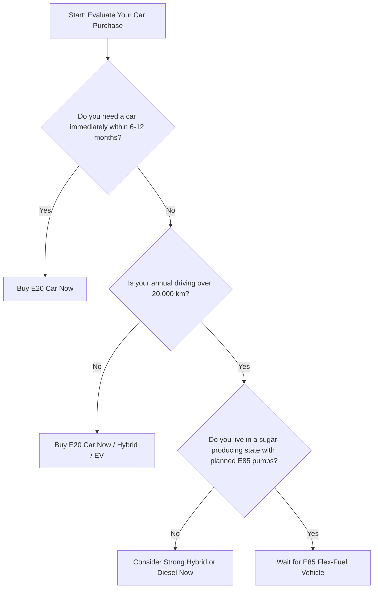

The Indian automotive landscape is undergoing one of its most rapid and disruptive transformations in history. For decades, the choice of buying a car was simple: petrol, diesel, or perhaps CNG. Today, the conversation has expanded to include electric vehicles (EVs), strong hybrids, and, most recently, biofuel blends. If you are standing in a dealership in 2026, looking at a shiny new car, you are likely encountering stickers and brochures proudly highlighting "E20 Compliance." 

Yet, in the background, another term is gaining massive traction in government announcements and industry forums: **E85 and Flex-Fuel Vehicles (FFVs)**.

This has left thousands of prospective car buyers in a state of analysis paralysis. The dilemma is stark: Should you pull the trigger on a standard, readily available E20-compliant vehicle today? Or should you hold off your purchase, keep your current vehicle running, and wait for the imminent wave of E85-capable flex-fuel cars to hit the Indian market?

This comprehensive guide is designed to dissect this decision from every angle. We will explore the technical differences, analyze the economic realities of mileage and fuel pricing, project the rollout timelines, and ultimately provide you with a concrete decision framework to determine whether waiting is a smart financial move or a recipe for unnecessary frustration.

---

## Part 1: Decoding the Biofuel Roadmap (E20 vs. E85)

To make an informed decision, we must first understand the fuel types and the regulatory environment shaping their availability. 

### What is E20?
E20 is a blend of 20% ethanol and 80% petrol. In India, the transition to E20 has been an aggressive, phased rollout. As of 2026, E20 fuel is widely available across the vast majority of retail outlets in the country. Correspondingly, all new cars manufactured and sold in India since the implementation of BS6 Phase 2 emission norms are built to be fully E20-compliant. 

In an E20-compliant vehicle:
* The rubber hoses, gaskets, and plastic fuel lines are reinforced to resist the mildly corrosive effects of ethanol.
* The engine control unit (ECU) is calibrated to adjust fuel injection timing to account for the slightly lower energy density of a 20% ethanol blend.
* The fuel pump and fuel injectors are designed to handle the higher flow rates required by ethanol-blended fuels.

### What is E85 (Flex-Fuel)?
E85, commonly referred to as Flex-Fuel, is a high-concentration blend consisting of up to 85% ethanol and 15% gasoline. Because ethanol concentrations can vary depending on seasonal factors and regional supplies, a Flex-Fuel Vehicle (FFV) is engineered to run on **any** combination of petrol and ethanol—ranging from pure petrol (E0) all the way up to E85.

To achieve this level of fuel flexibility, FFVs require substantial hardware and software upgrades compared to standard E20 cars:
1. **Ethanol Sensors:** A specialized sensor in the fuel line continuously measures the exact ratio of ethanol to petrol entering the engine.
2. **Dynamic ECU Mapping:** The engine computer must instantly adapt its spark timing, ignition maps, and fuel injection volumes in real-time based on the ethanol percentage detected.
3. **Advanced Metallurgy and Polymer Chemistry:** Because ethanol is highly hygroscopic (it attracts water) and acts as a solvent, the fuel tank, fuel lines, valves, pistons, and cylinder heads must be made of highly corrosion-resistant materials (like stainless steel, anodized aluminum, and specialized synthetic rubbers).
4. **High-Capacity Fuel Systems:** Ethanol has a lower energy density than petrol. To produce the same amount of power, the engine must burn more fuel. Therefore, FFVs require larger fuel injectors and high-capacity fuel pumps.

---

## Part 2: The Core Technical Dilemma

A common point of confusion is whether a standard E20-compliant car can run on E85, or vice versa. The short answer is: **No, you cannot run E85 in a standard E20 car.**

Doing so poses severe risks to your vehicle's health:
* **Corrosion and Degradation:** The highly corrosive nature of E85 will rapidly degrade the standard rubber gaskets, hoses, and plastic fuel lines found in E20 cars, leading to fuel leaks and fire hazards.
* **Lean Engine Operation:** Because E85 requires more fuel volume to combust properly, an E20 engine's fuel injectors and ECU will not be able to deliver enough fuel. This causes the engine to run "lean" (too much air, too little fuel), leading to severe engine knock, overheating, misfires, and eventual catastrophic engine failure.
* **Cold Start Issues:** Ethanol has a high latent heat of vaporization, making it difficult to ignite in cold weather. Without the dedicated cold-start assistance systems built into FFVs, an E20 car filled with E85 will refuse to start on chilly mornings.

Conversely, a Flex-Fuel Vehicle is perfectly capable of running on E20 or even E10 fuel. It simply adjusts its parameters down to match the fuel in the tank. 

This means that if you buy an E20 car today, you are locked into using fuel blends containing no more than 20% ethanol. If the government heavily subsidizes E85 in the future to make it the cheapest fuel on the market, you will not be able to capitalize on those savings.

---

## Part 3: The Economic Realities (The Calorific Value Trap)

When evaluating E85, many buyers focus solely on the potential price per liter. Historically, ethanol is cheaper to produce than petrol, especially in India, where it is derived from sugarcane molasses and agricultural waste. If the government prices E85 significantly lower than E20 or pure petrol, it looks like a financial slam dunk.

However, we must address the law of physics: **The Energy Density Penalty.**

| Metric | Pure Petrol (E0) | E20 Blend | E85 (Flex-Fuel) |
| :--- | :--- | :--- | :--- |
| **Energy Density (MJ/kg)** | ~44 | ~41.8 | ~29.1 |
| **Energy Loss vs. Petrol** | 0% | ~3% to 5% | ~25% to 30% |
| **Fuel Efficiency (Mileage) Impact** | Baseline (e.g., 15 km/l) | ~14.3 km/l | ~10.5 km/l |

Because ethanol contains roughly 33% less energy by volume than gasoline, an engine running on E85 must consume significantly more fuel to cover the same distance. In practice, an E85 vehicle will experience a **25% to 30% drop in fuel economy (mileage)** compared to when it runs on pure petrol, and roughly a **20% to 25% drop** compared to E20.

### Calculating the Financial Break-Even Point
For E85 to make financial sense for your wallet, the price of E85 at the pump must be at least **30% cheaper** than E20 to offset the loss in mileage.

Let us look at a real-world mathematical scenario:
* Assume **E20 Petrol** costs **₹100 per liter**.
* Your car gets **15 km/l** on E20.
* Your cost per kilometer on E20 is:  
  $$\text{Cost per km} = \frac{₹100}{15 \text{ km}} = \mathbf{₹6.67 \text{ per km}}$$

Now, let us assume you are driving an E85 Flex-Fuel vehicle running on E85 fuel:
* Your mileage drops by 25% due to the lower energy density of E85.
* Your mileage is now:  
  $$15 \text{ km/l} \times 0.75 = \mathbf{11.25 \text{ km/l}}$$

For the running cost of E85 to be equal to E20 (₹6.67 per km), the price of E85 must be:  
$$\text{Max Price of E85} = 11.25 \text{ km/l} \times ₹6.67/\text{km} = \mathbf{₹75.03 \text{ per liter}}$$

In this scenario, if E85 is priced at **₹75 per liter** (a 25% discount), you break even. If it is priced at **₹80 per liter** (a 20% discount), you are actually **paying more** to run your car on E85 than on standard E20, despite the fuel looking "cheaper" on the billboard. For E85 to be truly economical, it needs to be priced at **₹65 to ₹70 per liter** (a 30% to 35% discount).

While the Indian government has hinted at tax incentives and lower GST rates for ethanol to keep E85 highly competitive, we must also consider the upfront cost of the vehicle. FFVs require more expensive components (sensors, stainless steel parts, upgraded injectors), which will likely add a premium of **₹20,000 to ₹50,000** to the purchase price of the car. You will need to drive a significant number of kilometers on highly discounted E85 just to recoup this initial purchase premium.

---

## Part 4: Why Wait? The Case for Holding Out for E85

For those who are leaning toward waiting, there are several compelling arguments in favor of patience. If your current car is running fine and you are not in a rush, waiting for E85/Flex-Fuel models presents clear strategic advantages.

### 1. Future-Proofing Against E20 Phase-Outs
While E20 is the standard today, India's long-term energy strategy is deeply committed to maximizing biofuel usage to achieve carbon neutrality and reduce crude oil import bills. Over the next 10 to 15 years, it is highly probable that ethanol blending levels will continue to rise. 

While a sudden jump past E20 for standard vehicles is unlikely due to compatibility limits, the market distribution of fuels could shift. If E85 pumps become dominant, finding E20 or E10 might become harder or more expensive in certain regions. Purchasing an FFV guarantees that no matter how the fuel retail landscape changes over the next decade, your vehicle will remain compatible and operational.

### 2. Environmental Stewardship and Carbon Reduction
If reducing your carbon footprint is a priority, E85 is a much cleaner option than E20. Ethanol is a renewable fuel source. When burned, it releases carbon dioxide, but because the crops (sugarcane, corn) absorb carbon dioxide while growing, the net life-cycle greenhouse gas emissions of E85 are up to **40% to 50% lower** than those of conventional petrol.

For environmentally conscious buyers who are not yet ready to make the jump to battery electric vehicles (EVs) due to range anxiety or high upfront costs, a Flex-Fuel vehicle running on E85 offers a fantastic, low-emission middle ground.

### 3. Hedging Against Geopolitical Fuel Shocks
Petrol prices are tied to global crude oil markets, which are notoriously volatile and subject to geopolitical conflicts, OPEC supply decisions, and currency fluctuations. Ethanol, on the other hand, is produced domestically. 

By owning a Flex-Fuel vehicle, you decouple your daily commuting costs from international oil market shocks. If global oil prices spike, driving up the cost of E20 petrol, you can switch entirely to E85, which is insulated from global oil dynamics due to domestic pricing controls.

---

## Part 5: Why Buy Now? The Case for E20 Vehicles

On the flip side, there are strong, pragmatic reasons why buying an E20-compliant vehicle today is the more sensible decision for the vast majority of consumers.

### 1. Infrastructure Reality: The Pump Bottleneck
A car is only as good as the fuel you can put in it. While the government has mandated E20 blending nationwide, setting up dedicated E85 fuel dispensers at thousands of petrol pumps is a massive logistical and financial challenge.

Currently, petrol stations must dedicate separate underground storage tanks, pipelines, and nozzles for E85. Because ethanol absorbs water easily, these storage systems require specialized dehumidification and sealing equipment. 

If you buy an E85 car in 2026 or 2027, you may find that E85 pumps are only available in major metropolitan areas or in sugar-producing states like Maharashtra, Uttar Pradesh, and Karnataka. If you plan to take your car on inter-state road trips, travel to remote locations, or live in a tier-2 or tier-3 city, you will likely spend most of your time running your Flex-Fuel vehicle on standard E20 or E10 fuel anyway—rendering your expensive FFV hardware useless.

### 2. Immediate Technological Maturity
The current crop of E20-compliant engines represents the absolute pinnacle of internal combustion engine (ICE) refinement. Manufacturers have spent the last three years perfecting E20 engine calibrations, testing material durability over millions of cumulative kilometers, and resolving early teething issues.

When you buy a BS6 Phase 2 E20 car today, you are buying a mature, highly reliable product with a proven track record.

In contrast, the first generation of mass-market Flex-Fuel vehicles will inevitably face early-adopter challenges:
* Software glitches in ethanol sensors failing to accurately read fuel ratios.
* Accelerated wear on fuel pumps due to varying qualities of ethanol.
* Cold-starting issues during winter months.
* Dealership mechanics who are not yet fully trained to diagnose complex FFV system faults.

### 3. The Urgent Need for Personal Mobility
If you need a car today because your family is growing, your current vehicle is unsafe, or your daily commute has become unbearable, waiting is a poor strategy. 

The rollout of a diverse range of E85 vehicles from major manufacturers (Maruti Suzuki, Hyundai, Tata, Mahindra) will take time. Currently, only a few prototype and pilot models exist. Waiting for your preferred brand, body style (SUV, sedan, hatchback), and budget range to offer a reliable, mass-production E85 variant could easily push your buying timeline out by 2 to 3 years. The utility and comfort you lose during those years of waiting often outweigh the speculative fuel savings.

---

## Part 6: Technical Maintenance Concerns for E85 Owners

Before committing to wait for an E85 vehicle, it is critical to understand that these cars come with unique maintenance requirements that do not apply to standard E20 vehicles.

### The Problem of Fuel Phase Separation
Because ethanol is highly hygroscopic, it eagerly absorbs moisture from the air. If a Flex-Fuel vehicle is left parked for extended periods (such as when you go on a long vacation or if it is a secondary car that is rarely driven), moisture will accumulate in the fuel tank.

Once the water content in the tank reaches a critical threshold, a process called **phase separation** occurs. The water and ethanol bond together and sink to the bottom of the tank, leaving a layer of low-octane gasoline on top. 

If this happens:
* The fuel pump, which draws from the bottom of the tank, will suck pure water and ethanol into the engine, causing it to stall, misfire, or refuse to start.
* The separation can cause localized corrosion inside the tank and fuel lines.
* Fixing phase separation requires draining the entire fuel system, cleaning the tank, and replacing the fuel filters—a costly and labor-intensive repair that is rarely covered under vehicle warranties.

If you do not drive your vehicle regularly, or if you live in highly humid, coastal regions (like Mumbai, Chennai, or Kolkata), owning an E85 vehicle requires careful fuel management, including the use of fuel stabilizers or ensuring the tank is kept full to minimize air space.

### Oil Dilution and Specialized Lubricants
Engines running on high concentrations of ethanol are prone to fuel dilution of the engine oil. During cold starts, unburnt ethanol can bypass the piston rings and mix with the oil in the crankcase. 

Because ethanol does not evaporate out of the engine oil as easily as petrol, it can dilute the oil's viscosity, reducing its lubricating properties. Consequently, FFVs often require specialized, more expensive engine oils (typically synthetic oils with specific additive packages designed to handle ethanol contamination) and may require **more frequent oil change intervals** (e.g., every 7,500 km instead of the standard 10,000 km).

---

## Part 7: Comprehensive TCO Comparison: E20 vs. E85

To put these factors into perspective, let us look at a Total Cost of Ownership (TCO) simulation over a 5-year ownership period. 

We will compare a standard E20 compact SUV against an identical model equipped with Flex-Fuel (E85) technology.

### Assumptions:
* **Annual Mileage:** 12,000 km (roughly 1,000 km per month).
* **Ownership Period:** 5 Years (Total 60,000 km).
* **E20 Petrol Price:** ₹100/liter (held constant for simplicity).
* **E85 Fuel Price:** ₹70/liter (reflecting a highly optimistic 30% government subsidy).
* **E20 Mileage:** 15 km/liter.
* **E85 Mileage:** 11.25 km/liter (25% drop due to energy density).
* **Vehicle Premium for FFV:** ₹35,000 upfront cost.
* **Maintenance Premium for FFV:** ₹2,500 extra per year (due to specialized oil and more frequent changes).

---

### Step-by-Step Cost Analysis

#### 1. Upfront Purchase Cost
* **E20 Vehicle:** Base Cost (e.g., ₹10,00,000)
* **E85 Flex-Fuel Vehicle:** ₹10,35,000 (Base Cost + ₹35,000 FFV technology premium)

#### 2. Lifetime Fuel Consumption (60,000 km)
* **E20 Fuel Required:**  
  $$\frac{60,000 \text{ km}}{15 \text{ km/l}} = \mathbf{4,000 \text{ liters}}$$
* **E85 Fuel Required:**  
  $$\frac{60,000 \text{ km}}{11.25 \text{ km/l}} = \mathbf{5,333.33 \text{ liters}}$$

#### 3. Lifetime Fuel Cost
* **E20 Fuel Cost:**  
  $$4,000 \text{ liters} \times ₹100/\text{liter} = \mathbf{₹4,00,000}$$
* **E85 Fuel Cost:**  
  $$5,333.33 \text{ liters} \times ₹70/\text{liter} = \mathbf{₹3,73,333}$$
* **Fuel Savings with E85:**  
  $$₹4,00,000 - ₹3,73,333 = \mathbf{₹26,667 \text{ saved over 5 years}}$$

#### 4. Additional Maintenance Costs (5 Years)
* **E20 Vehicle:** Standard Maintenance (Baseline)
* **E85 Flex-Fuel Vehicle:**  
  $$5 \text{ years} \times ₹2,500/\text{year} = \mathbf{₹12,500 \text{ extra}}$$

---

### Summary TCO Matrix

| Cost Component | E20 Vehicle | E85 Flex-Fuel Vehicle | Difference (E85 vs E20) |
| :--- | :--- | :--- | :--- |
| **Upfront Premium** | ₹0 | ₹35,000 | +₹35,000 |
| **Lifetime Fuel Cost** | ₹4,00,000 | ₹3,73,333 | -₹26,667 |
| **Lifetime Maintenance Premium** | ₹0 | ₹12,500 | +₹12,500 |
| **Total Cost of Ownership (TCO)** | **₹4,00,000** | **₹4,20,833** | **+₹20,833 (More Expensive)** |

### Key Insight from TCO Analysis
As the calculation clearly demonstrates, even with an optimistic **30% discount on E85 fuel**, a typical driver covering 12,000 km per year will **not** save money by waiting for or buying an E85 vehicle. The combinations of the upfront vehicle premium, the maintenance premium, and the mileage penalty completely wipe out the savings at the pump, resulting in a net loss of ₹20,833 over 5 years.

For E85 to deliver real-world financial savings under these parameters, one of two things must happen:
1. **High Daily Running:** If you drive more than **20,000 km per year** (e.g., commercial drivers, long-distance commuters), the fuel savings will accumulate faster, eventually overcoming the upfront and maintenance premiums.
2. **Aggressive Pricing:** The price of E85 must drop to **₹60/liter or lower** (a 40%+ discount compared to petrol), which would require massive, sustained government subsidies that may not be fiscally viable long-term.

---

## Part 8: The Strategic Decision Matrix

To simplify your choice, we have created a decision matrix based on your driving profile, geographic location, and lifestyle.

### Profile A: The "Buy E20 Now" Candidate
You should proceed with buying a standard E20-compliant car immediately if you meet any of the following criteria:
* **Immediate Need:** Your current car is constantly breaking down, or you lack a safe mode of transport for your family.
* **Low to Moderate Mileage:** You drive less than 15,000 km annually. As proven by the TCO calculations, you will not drive enough to offset the efficiency loss and technology premiums of E85.
* **Non-Sugar Belt Geography:** You live in hilly areas, remote regions, or states without major agricultural sugar production. The likelihood of finding stable E85 fuel infrastructure near you in the next 5 years is low.
* **Risk Aversion:** You prefer buying mature, highly reliable technology with simple, standard maintenance procedures and readily available spare parts.

### Profile B: The "Wait for E85" Candidate
You should consider waiting for E85 Flex-Fuel vehicles if you align with the following profile:
* **Very High Mileage:** You drive 20,000+ km annually, making fuel running costs a massive component of your monthly budget.
* **Sugar Belt Location:** You reside in Maharashtra, Karnataka, or Uttar Pradesh, where the state governments are highly motivated to deploy E85 pumps rapidly to support local agricultural lobbies.
* **Eco-Conscious Buyer:** You want to minimize your carbon footprint but cannot buy an EV due to apartment charging constraints, frequent long-distance travel, or budget limitations.
* **Flexible Timeline:** You have a reliable vehicle today and do not mind waiting until late 2027 or 2028 for the second generation of refined Flex-Fuel models to hit the market.

---

## Conclusion & Verdict

The promise of E85 and Flex-Fuel technology is undoubtedly exciting. It represents a vital step toward domestic energy security for India, support for the agricultural sector, and a reduction in urban tailpipe emissions. 

However, from an individual consumer's perspective, **the economics of E85 require a hard reality check.**

The 25% to 30% energy density penalty of ethanol is a physical constant that cannot be engineered away. Unless the government guarantees a massive, permanent discount on E85 fuel that sits at least 35% below standard petrol, the financial benefits of owning an FFV are negligible or even negative for the average driver. Combine this with the slow, localized rollout of E85 fueling stations and the higher maintenance complexities of handling moisture-sensitive fuel, and the case for waiting becomes weak for the average buyer.

**The Verdict:** If you need a car, **buy an E20-compliant vehicle now.** 

The current generation of E20 cars is highly refined, reliable, and perfectly aligned with the fuel that is available at every corner of the country. Waiting for E85 is only recommended for very high-mileage drivers living in sugar-producing states who are willing to navigate the early-adopter hurdles of new vehicle tech and spotty fuel infrastructure. For everyone else, the car market of today has excellent, mature, and efficient E20 models ready to serve your needs without the wait.
