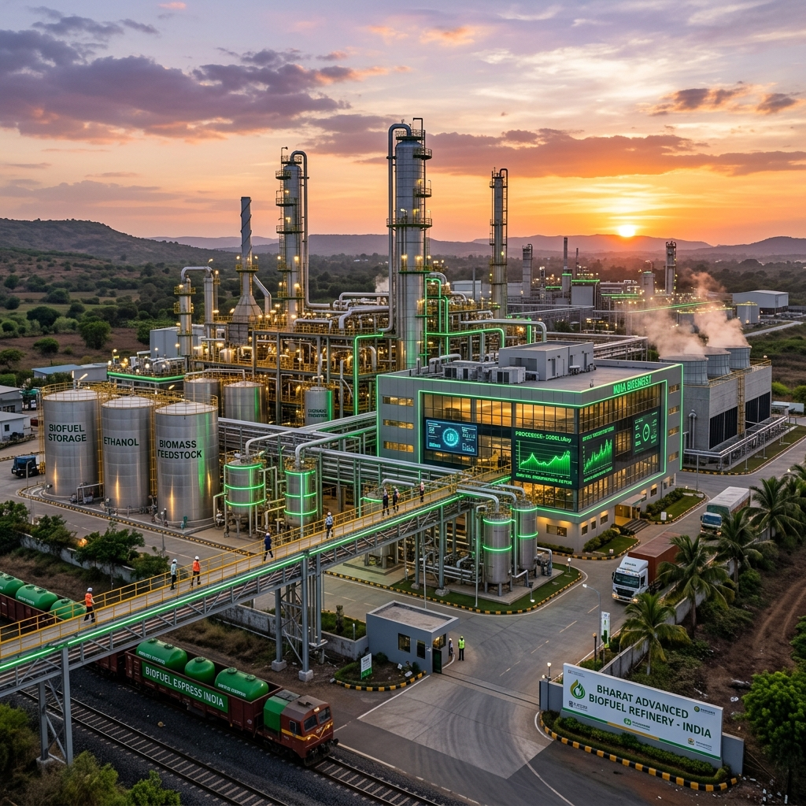

# Praj Industries & Other Top Biofuel Companies in India

India’s transition toward sustainable energy is accelerating at an unprecedented pace, largely fueled by the nation's ambitious biofuel mandates. With the government’s aggressive push to achieve 20% ethanol blending in petrol (E20) by 2025-2026 and the establishment of the Global Biofuels Alliance (GBA), the spotlight is firmly on the companies turning this vision into reality. 

From engineering behemoths designing state-of-the-art biorefineries to traditional sugar mills pivoting into massive ethanol production hubs, the Indian biofuel landscape is vibrant, dynamic, and critical to the nation's energy security. At the forefront of this revolution is Praj Industries, a global titan in biofuel technology, alongside a host of sugar manufacturers, distilleries, and innovative startups. 

In this comprehensive guide, we delve deep into the ecosystem of India’s top biofuel companies, exploring their histories, technological capabilities, market impact, and the future they are building for a greener, energy-independent India.

---

## The Catalyst: Why Biofuel Companies Are Booming in India

Before diving into the specific companies, it is crucial to understand the macroeconomic and policy drivers fueling their growth:

1. **The National Policy on Biofuels (2018):** This landmark policy expanded the scope of raw materials for ethanol production, moving beyond just sugarcane juice to include B-heavy molasses, C-heavy molasses, damaged food grains, and surplus rice.
2. **Advancement of the E20 Target:** Originally set for 2030, the target for 20% ethanol blending was advanced to 2025-2026, creating massive, immediate demand for ethanol.
3. **SATAT Initiative (Sustainable Alternative Towards Affordable Transportation):** Launched to promote Compressed Bio-Gas (CBG) as an alternative green transport fuel.
4. **Energy Security and Forex Savings:** India imports over 85% of its crude oil. Substituting a portion of this with domestically produced biofuels saves billions in foreign exchange and shields the economy from volatile global oil prices.
5. **Agricultural Economy Boost:** Biofuel production directly benefits millions of farmers by providing a remunerative market for their crops and agricultural residue.

With these powerful tailwinds, the companies operating in the biofuel space have transitioned from niche players to central pillars of India's energy infrastructure.

---

## The Undisputed Leader: Praj Industries

When discussing biofuels in India—and indeed, globally—it is impossible not to start with **Praj Industries**. Headquartered in Pune, Maharashtra, Praj is not merely an ethanol producer; it is an engineering and technology solutions provider that builds the infrastructure *for* biofuel production.

### A Legacy of Innovation

Founded in 1983 by Dr. Pramod Chaudhari, Praj Industries began with a vision to modernize India's agro-based processing industries. Over four decades, it has evolved into a globally recognized industrial biotechnology company. Praj has executed over 1,000 reference plants across more than 100 countries across five continents, holding a dominant market share in the domestic ethanol plant installation sector.

### Technological Prowess

Praj's success is rooted in its relentless focus on Research and Development. Its R&D center, **Praj Matrix**, is one of the most advanced in the world for industrial biotechnology. 

#### 1G (First Generation) Ethanol
Praj revolutionized the 1G ethanol space by developing highly efficient, zero-liquid-discharge (ZLD) technologies. Their processes maximize yield from traditional feedstocks like sugarcane molasses, juice, and starchy grains. As India shifted its policy to allow grain-based ethanol to meet the E20 target, Praj quickly adapted, offering dual-feed (sugar and grain) modular plant designs.

#### 2G (Second Generation) Ethanol
While 1G relies on edible crops, 2G ethanol utilizes lignocellulosic biomass—agricultural waste such as rice straw, wheat straw, and cotton stalks. This is critical for India, as it solves the dual problem of energy generation and stubble burning (a major cause of winter air pollution in North India). Praj developed its proprietary **enfinity™** technology for 2G bio-ethanol. In a historic milestone, Indian Oil Corporation (IOCL) commissioned India's first 2G ethanol plant in Panipat, Haryana, using Praj's technology.

#### Compressed Bio-Gas (CBG)
Under the SATAT scheme, Praj has developed **RenGas™**, a technology to produce CBG from agricultural residue and press mud (a byproduct of sugar mills). This provides a clean alternative to CNG for transportation and industrial use.

#### Sustainable Aviation Fuel (SAF)
Looking toward the future, Praj has heavily invested in Sustainable Aviation Fuel. Through strategic partnerships, including with Gevo Inc. (USA) and Indian Oil Corporation, Praj is developing Alcohol-to-Jet (ATJ) technologies to help the aviation sector achieve net-zero emissions. In 2023, India's first commercial passenger flight powered by an SAF blend took off, utilizing SAF produced by Praj Industries.

### Market Impact

Praj is an enabler. By providing turnkey solutions to sugar mills and distilleries, it acts as the backbone of India's ethanol blending program. Its robust order book reflects the aggressive expansion of ethanol capacity across the country. As a publicly traded company on the NSE and BSE, Praj is widely considered a bellwether for the green energy and biotechnology sector in India.

---

## The Sugar Giants: India’s Ethanol Powerhouses

While Praj builds the plants, it is the sugar companies that operate them and produce the bulk of India's ethanol. The National Policy on Biofuels transformed Indian sugar mills from highly cyclical, sugar-dependent businesses into integrated energy companies. By diverting excess sugarcane to ethanol, these companies have stabilized their revenues, improved cash flows, and ensured timely payments to farmers.

### 1. Balrampur Chini Mills Limited (BCML)

Balrampur Chini Mills, headquartered in Kolkata and operating primarily in Uttar Pradesh, is one of India's largest integrated sugar manufacturing companies. Recognizing the potential of ethanol early on, BCML has aggressively expanded its distillery capacity.

*   **Ethanol Focus:** BCML has strategically shifted its focus from sugar to ethanol to maximize realization and improve profitability. They have heavily invested in expanding their distillery capacities to process B-heavy molasses, sugarcane juice, and syrup directly into ethanol.
*   **Scale:** The company boasts a massive distillery capacity, making it a leading supplier of ethanol to India's Oil Marketing Companies (OMCs).
*   **Sustainability:** BCML operates on a zero-waste model, utilizing bagasse (sugarcane fiber) to co-generate power and press mud to produce bio-compost, making their operations highly sustainable.

### 2. Shree Renuka Sugars

A subsidiary of the global agribusiness group Wilmar International, Shree Renuka Sugars is one of the largest sugar and green energy producers in India. Headquartered in Mumbai, its operations span across states like Karnataka, Maharashtra, and Gujarat.

*   **Capacity Expansion:** Shree Renuka has undertaken significant capacity expansions in its distilleries to capitalize on the government's ethanol blending mandates. 
*   **Port-Based Refineries:** A unique advantage for Shree Renuka is its port-based refineries, which allow for efficient raw sugar processing and provide logistical advantages for both domestic supply and potential future exports of biofuels.
*   **Integrated Model:** Like BCML, Shree Renuka utilizes an integrated model, generating captive power from bagasse and maximizing the value chain of sugarcane.

### 3. Triveni Engineering and Industries

Triveni Engineering, a prominent player in the sugar sector with a strong presence in Uttar Pradesh, has also transformed into a major biofuel producer.

*   **Dual-Feed Strategy:** Triveni operates state-of-the-art distilleries capable of processing multiple feedstocks. To de-risk against cyclical sugarcane availability, they have set up multi-feed distilleries that can operate on both molasses and grain, ensuring year-round ethanol production.
*   **Quality and Efficiency:** Triveni is known for its high operational efficiencies and strict quality control, ensuring their anhydrous ethanol meets the stringent specifications of OMCs for blending.
*   **Engineering Division:** Triveni also has a strong engineering division (steam turbines and water treatment), providing synergistic benefits and technical expertise for their distillery operations.

### 4. Bajaj Hindusthan Sugar Limited

As the largest sugar producer in India, Bajaj Hindusthan naturally commands a significant presence in the ethanol space. With numerous sugar mills clustered in Uttar Pradesh, they have access to an immense volume of molasses.

*   **Volume Player:** Bajaj Hindusthan’s sheer scale allows it to contribute massive volumes of ethanol to the national grid. 
*   **Turnaround Strategy:** While the company has faced financial challenges in the past, the robust ethanol pricing set by the government has been a key component of its financial turnaround and debt restructuring efforts, highlighting how critical biofuel policies are to the financial health of the agro-sector.

### 5. E.I.D. Parry (India) Limited

Part of the Murugappa Group, E.I.D. Parry is a historical giant in the Indian sugar industry, with a strong footprint in South India (Tamil Nadu, Karnataka, and Andhra Pradesh).

*   **Pioneering Spirit:** E.I.D. Parry has a long history of innovation in sugar and agriculture. They have steadily expanded their ethanol production capabilities, focusing on efficiency and sustainability.
*   **Diversification:** Beyond ethanol, they are deeply involved in nutraceuticals and biopesticides, reflecting a broader commitment to bio-based products.

### 6. Dhampur Sugar Mills

Dhampur Sugar Mills is another key player in Uttar Pradesh that has fully embraced the transition to green energy.

*   **Flexibility:** Dhampur has invested in flexible manufacturing processes, allowing them to switch seamlessly between producing sugar, power, and ethanol depending on market dynamics and government policies.
*   **Chemicals Division:** They utilize ethanol not just for fuel blending but also as a feedstock for producing ethyl acetate and other vital chemicals, maximizing value addition.

---

## The Grain-Based Ethanol Pioneers

While sugar companies dominate 1G ethanol from molasses, the government's push to utilize damaged food grains (FCI surplus) and maize has created a massive opportunity for grain-based distilleries. 

### 1. Gulshan Polyols Limited

Gulshan Polyols is a leading manufacturer of ethanol, calcium carbonate, and starch derivatives. 

*   **Grain Specialization:** Unlike the sugar mills, Gulshan Polyols specializes in grain-based ethanol. They have set up massive ethanol plants utilizing rice and maize as feedstocks.
*   **Strategic Locations:** They have strategically established plants in states like Madhya Pradesh and Assam, ensuring geographical diversity in ethanol supply for OMCs.

### 2. Globus Spirits Limited

Traditionally known for its consumer liquor business (IMFL) and bulk alcohol, Globus Spirits has aggressively expanded into the fuel ethanol space.

*   **Capacity Ramp-up:** Leveraging its expertise in grain distillation, Globus Spirits has added significant capacity dedicated exclusively to producing fuel-grade ethanol for OMCs.
*   **Value-Added Byproducts:** Grain-based distillation produces DDGS (Distillers Dried Grains with Solubles), a highly nutritious animal feed. Globus Spirits effectively monetizes this byproduct, significantly improving the overall economics of their biofuel operations.

### 3. BCL Industries Limited

BCL Industries has emerged as a powerhouse in the grain-based ethanol sector. Operating out of Punjab and West Bengal, they have capitalized on the abundant availability of rice and maize in these regions.

*   **Massive Capacities:** BCL operates some of the largest grain-based distilleries in India. They were quick to identify the shift in government policy favoring grain ethanol and executed large-scale capacity additions.
*   **Edible Oil Synergy:** BCL also operates an edible oil refining business, creating a diversified agro-processing portfolio that provides financial stability.

---

## Innovators and Startups: The Future of Biofuels

While the giants focus on volume, a dynamic ecosystem of startups is solving critical supply chain issues and innovating in advanced biofuels like biodiesel and Compressed Bio-Gas (CBG).

### 1. GPS Renewables

Based in Bengaluru, GPS Renewables is a pioneering clean-tech startup focusing on waste-to-energy solutions.

*   **Bio-CNG / CBG:** They specialize in setting up biogas and CBG plants that process municipal solid waste, agricultural residue, and industrial organic waste. 
*   **Technology-Driven:** Utilizing AI and IoT, their proprietary technologies ensure high uptime and maximum gas yield from decentralized waste plants, directly supporting the government's SATAT initiative.

### 2. Buyofuel

The biofuel supply chain in India has historically been fragmented and unorganized. Buyofuel, an online marketplace for biofuels and organic waste, is changing that.

*   **Digitalizing the Supply Chain:** Buyofuel connects buyers (industries, OMCs) with sellers (manufacturers of biodiesel, bio-pellets, CBG) and raw material aggregators. 
*   **Transparency:** By bringing transparency, standardized pricing, and reliable logistics to the biofuel trade, they are removing major bottlenecks that have historically hindered the sector's growth.

### 3. BioD Energy

BioD Energy is a key player in the biodiesel segment, focusing on producing biodiesel from Used Cooking Oil (UCO).

*   **Repurpose Used Cooking Oil (RUCO):** Under the FSSAI's RUCO initiative, BioD Energy collects used cooking oil from restaurants, hotels, and food processing industries—which would otherwise cause health hazards or clog drainage systems—and converts it into high-quality biodiesel.
*   **Circular Economy:** They represent a perfect example of the circular economy, turning a hazardous waste product into a clean-burning fuel that can be blended with traditional diesel.

---

## The Role of Oil Marketing Companies (OMCs)

No discussion of India's biofuel ecosystem is complete without mentioning the state-run Oil Marketing Companies: **Indian Oil Corporation Limited (IOCL), Bharat Petroleum Corporation Limited (BPCL), and Hindustan Petroleum Corporation Limited (HPCL)**.

While these companies are primarily known for fossil fuels, they are the vital link in the biofuel chain. 

*   **The Buyers:** OMCs are the mandated buyers of fuel-grade ethanol and biodiesel. Their procurement policies, tender processes, and timely payments are the financial lifeblood of the biofuel manufacturing companies.
*   **Infrastructure Investment:** The OMCs are investing heavily in blending infrastructure at their fuel terminals across the country. They are upgrading storage tanks, pipelines, and dispensing units to handle higher blends like E20.
*   **Producers in their own right:** The OMCs are not just buyers; they are also becoming producers. They are setting up their own 2G ethanol plants (like IOCL’s Panipat plant) and establishing massive CBG networks to secure their future supply chains.

---

## Challenges Facing the Sector

Despite the explosive growth, the Indian biofuel sector faces several significant hurdles that companies must navigate:

1. **Feedstock Availability and Pricing:** The fundamental challenge is ensuring a consistent, reasonably priced supply of raw materials. Sugar production is highly dependent on monsoons. In years of drought, prioritizing food security over fuel can restrict ethanol production. Similarly, maize and rice prices fluctuate wildly.
2. **Supply Chain Logistics for 2G and CBG:** Gathering agricultural waste (biomass) from thousands of small-holder farmers and transporting it to a centralized 2G ethanol or CBG plant is a logistical nightmare. Startups are working on this, but it remains a bottleneck.
3. **Vehicle Compatibility:** While E20 is the target, millions of older vehicles on Indian roads are only optimized for E10 (10% blending). Moving towards flex-fuel vehicles (FFVs) capable of running on E85 or E100 requires massive investments from automakers and consumer adoption.
4. **Policy Consistency:** The rapid growth of the sector has been driven by favorable government policies and fixed procurement prices. Any sudden shift in these policies, taxation, or subsidies can severely impact the profitability of biofuel companies.

---

## The Road Ahead: What’s Next for Biofuel Companies in India?

The future for biofuel companies in India is incredibly promising, expanding far beyond just blending ethanol with petrol. 

### Sustainable Aviation Fuel (SAF)
The aviation sector is under immense global pressure to decarbonize. With India’s aviation market growing rapidly, SAF represents a multi-billion dollar opportunity. Companies like Praj Industries are already laying the groundwork to supply SAF to Indian and international airlines, transitioning from road transport to the skies.

### Bio-Plastics and Bio-Chemicals
As the world moves away from petrochemicals, biofuel companies are looking to move up the value chain. Ethanol is a building block for numerous green chemicals and bio-plastics. Companies that can effectively pivot from just producing fuel to producing high-value biochemicals will secure long-term profitability.

### Green Hydrogen Synergy
Biofuels and green hydrogen are complementary technologies. Biogas (CBG) can be reformed to produce green hydrogen, and advanced biorefineries can capture CO2 to produce e-fuels. The top biofuel companies are already exploring research partnerships to integrate hydrogen into their future portfolios.

### Flex-Fuel Infrastructure
With the introduction of prototypes like the Toyota Innova Hycross Flex-Fuel, India is taking its first steps toward E85 and beyond. As flex-fuel vehicles become mainstream, the volume demand for ethanol will skyrocket, requiring biofuel companies to expand capacities exponentially.

---

## Conclusion

The story of India's biofuel sector is a masterclass in how targeted government policy, combined with private sector innovation and execution, can create a massive, sustainable industry practically overnight. 

At the center of this are companies like **Praj Industries**, providing the technological bedrock; the **sugar and grain giants**, delivering the necessary scale and volume; and agile **startups**, solving niche supply chain issues. Together, they are doing more than just manufacturing fuel. They are saving foreign exchange, boosting the rural agricultural economy, cleaning the air in our cities, and securing India’s energy future. 

As we inch closer to the 2025 E20 target and look beyond to SAF and Flex-Fuel technologies, these companies are not just riding a trend—they are fundamentally redefining the energy landscape of the 21st century.

***
*Stay tuned to e85india.com for more deep dives into the technologies, policies, and vehicles driving India's green energy revolution.*
