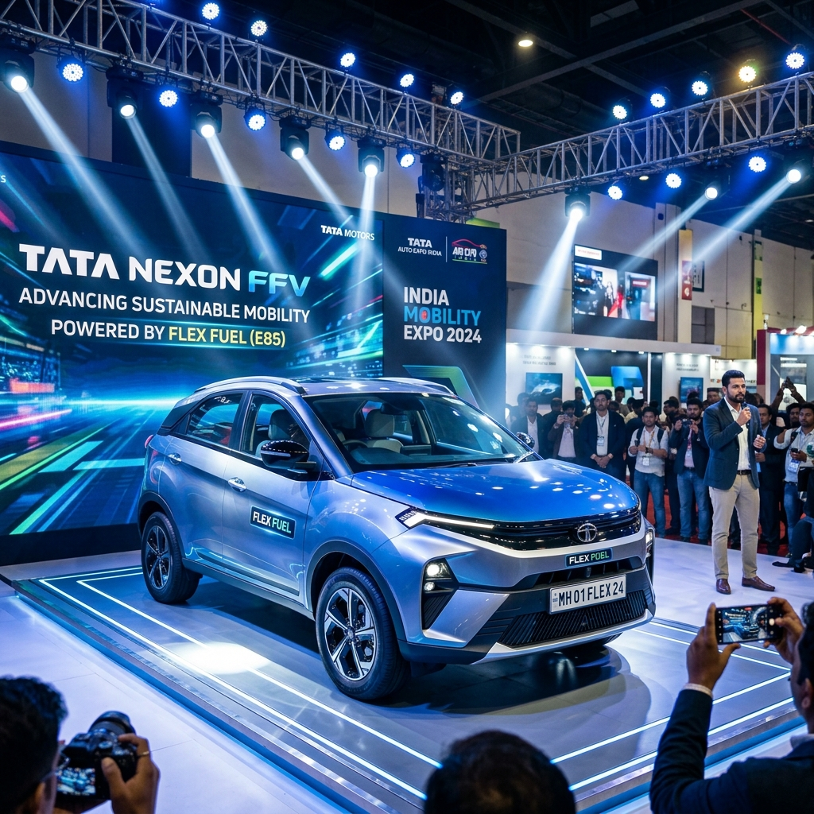

# Upcoming Flex Fuel Cars in India: 2026-2027 Launch Timeline

The automotive landscape in India is undergoing a massive transformation, driven by the pressing need for sustainable and eco-friendly mobility solutions. As the world shifts towards greener alternatives to combat climate change and reduce dependence on fossil fuels, India has positioned itself at the forefront of this revolution with its aggressive push for biofuels, specifically ethanol. Flex-fuel vehicles (FFVs), which can run on varying blends of petrol and ethanol (ranging from E20 to E85 and even 100% ethanol), are emerging as a crucial bridge between conventional internal combustion engine (ICE) vehicles and fully electric vehicles (EVs). 

The Indian government has laid down a clear roadmap for ethanol blending, aiming for 20% blending (E20) nationwide. Beyond E20, the push for higher blends like E85 has gained significant momentum. Consequently, automakers operating in the Indian market are actively developing and testing flex-fuel technologies to align with the country's vision of becoming a global hub for biofuel-powered mobility.

This comprehensive guide explores the upcoming flex-fuel cars in India, focusing on the highly anticipated launch timeline for the years 2026 and 2027. We will delve into the specific models expected from leading manufacturers like Maruti Suzuki, Toyota, Tata Motors, and others, examining the technology, expected specifications, and the impact these vehicles will have on the Indian automotive sector.

## The Ethanol Advantage: Why Flex Fuel Matters for India

Before diving into the specific models, it is essential to understand why flex-fuel technology is of paramount importance for a country like India.

1.  **Reduction in Crude Oil Imports:** India is heavily dependent on imported crude oil to meet its energy demands, which puts a massive strain on the country's foreign exchange reserves. By substituting a significant portion of petrol with domestically produced ethanol, India can drastically reduce its import bill and enhance its energy security.
2.  **Environmental Benefits:** Ethanol is a renewable fuel derived from agricultural products such as sugarcane, corn, and damaged food grains. Burning ethanol produces significantly fewer greenhouse gas emissions compared to fossil fuels, leading to improved air quality and a smaller carbon footprint.
3.  **Boost to the Agricultural Economy:** The increased demand for ethanol creates a lucrative market for farmers, providing them with an additional source of income and boosting the rural economy. This aligns with the government's objective of doubling farmers' income and promoting agricultural prosperity.
4.  **Cost-Effective Transition:** While electric vehicles offer zero tailpipe emissions, the transition to EVs requires massive investments in charging infrastructure and battery technology. Flex-fuel vehicles, on the other hand, utilize the existing internal combustion engine architecture with relatively minor modifications, offering a more immediate and cost-effective pathway to reducing emissions.

## The 2026-2027 Timeline: A Critical Window for Flex Fuel Cars

The years 2026 and 2027 are expected to be pivotal for the introduction and proliferation of flex-fuel cars in India. The government's mandate for E20 compatibility has already laid the groundwork, and the focus is now shifting towards higher blends. Automakers have been conducting extensive research and development, and several prototype models have already been showcased at major automotive events. 

During this 2026-2027 window, we expect a transition from mere prototypes to mass-market production models. The infrastructure for dispensing higher ethanol blends (like E85) is also projected to expand significantly during this period, creating a conducive ecosystem for the adoption of FFVs.

Let's take a detailed look at the upcoming flex-fuel cars expected to hit the Indian roads between 2026 and 2027, categorized by the leading automotive manufacturers.

---

## Maruti Suzuki: Leading the Mass Market Flex Fuel Revolution

Maruti Suzuki, India's largest carmaker, has been a vocal advocate for alternative fuel technologies, including CNG, hybrids, and flex-fuel. The company has already demonstrated its commitment to the flex-fuel cause by showcasing a working prototype of the WagonR Flex Fuel. Over the next few years, Maruti Suzuki is expected to roll out a comprehensive lineup of FFVs catering to various segments.

### 1. Maruti Suzuki WagonR Flex Fuel (Expected Launch: Late 2026)

The WagonR has been a quintessential family car in India for decades. The flex-fuel version of the WagonR is arguably the most anticipated FFV in the mass-market segment. Maruti Suzuki showcased the WagonR Flex Fuel prototype, designed to run on any ethanol-petrol blend between 20% (E20) and 85% (E85).

*   **Engine & Technology:** The WagonR Flex Fuel is expected to be powered by an upgraded version of the familiar 1.2-litre K-Series engine. To handle the corrosive nature of ethanol and its different combustion characteristics, the engine will feature modified fuel injectors, strengthened fuel lines, and a recalibrated Engine Control Unit (ECU). The vehicle will also include a cold-start assist system, crucial for ethanol blends in colder climates, as ethanol has a lower vapor pressure than petrol.
*   **Expected Price:** Maruti Suzuki is known for its competitive pricing. The WagonR Flex Fuel is likely to be priced at a slight premium over its standard petrol counterpart, making it an accessible option for budget-conscious buyers looking for an eco-friendly alternative.
*   **Significance:** The launch of the WagonR Flex Fuel will be a watershed moment for the Indian auto industry, democratizing flex-fuel technology and making it available to the masses.

### 2. Maruti Suzuki Brezza Flex Fuel (Expected Launch: Early 2027)

Following the WagonR, the highly popular compact SUV, the Brezza, is a prime candidate for the flex-fuel treatment. SUVs constitute a massive chunk of the Indian car market, and offering a flex-fuel option in this segment is crucial for widespread adoption.

*   **Engine & Technology:** The Brezza Flex Fuel will likely utilize a modified version of the 1.5-litre K15C engine. This engine, already known for its refinement and efficiency, will undergo similar modifications as the WagonR's engine to become E85 compatible.
*   **Market Positioning:** The Brezza Flex Fuel will target urban consumers looking for a stylish, practical, and environmentally responsible SUV. It will compete directly with upcoming flex-fuel compact SUVs from other manufacturers.

### 3. Maruti Suzuki Swift and Baleno (Expected Launch: Mid to Late 2027)

Maruti Suzuki's premium hatchbacks, the Swift and the Baleno, are also expected to join the flex-fuel lineup. These models are favored for their sporty appeal and feature-rich interiors. Introducing flex-fuel variants will further enhance their appeal among environmentally conscious younger buyers.

---

## Toyota Kirloskar Motor: Pioneering Advanced Flex Fuel Technologies

Toyota has been a global pioneer in alternative fuel technologies, particularly hybrids and flex-fuel vehicles (especially in markets like Brazil). In India, Toyota is actively collaborating with the government and has already introduced advanced flex-fuel prototypes to demonstrate the technology's viability.

### 1. Toyota Corolla Altis Flex Fuel Hybrid (Expected Launch: Early 2026)

Toyota made headlines in India by importing and showcasing the Corolla Altis Flex Fuel Hybrid from Brazil. This vehicle represents the pinnacle of flex-fuel technology, combining an E85-compatible engine with a self-charging hybrid system.

*   **Engine & Technology:** The Corolla Altis Flex Fuel Hybrid features a 1.8-litre Atkinson cycle engine coupled with an electric motor. The combustion engine is designed to run on ethanol blends up to E85. The synergy between the flex-fuel engine and the hybrid system results in exceptional fuel efficiency and incredibly low emissions. This dual-technology approach significantly mitigates the typical drop in fuel efficiency associated with high-ethanol blends.
*   **Significance:** While the Corolla Altis itself might not see mass-market volumes in India due to its premium positioning, the technology it showcases is invaluable. It serves as a technology demonstrator and a testbed for Toyota's future flex-fuel endeavors in the country.

### 2. Toyota Innova Hycross Flex Fuel (Expected Launch: Mid 2026)

The Innova Hycross is currently one of the most sought-after MPVs in India, known for its comfort, space, and efficient hybrid powertrain. A flex-fuel version of the Innova Hycross has been showcased in prototype form and is expected to be a major launch for Toyota.

*   **Engine & Technology:** Similar to the Corolla Altis, the Innova Hycross Flex Fuel will likely utilize a modified version of its 2.0-litre strong hybrid powertrain, making it capable of running on high-ethanol blends while retaining the benefits of electric propulsion.
*   **Target Audience:** This model will appeal to fleet operators, large families, and environmentally conscious buyers who require a spacious and reliable vehicle with a reduced carbon footprint.

### 3. Toyota Urban Cruiser Hyryder (Expected Launch: Late 2026 - Early 2027)

Developed in collaboration with Maruti Suzuki, the Urban Cruiser Hyryder is a popular mid-size SUV. Given its shared platform and powertrain options with Maruti Suzuki (specifically the Grand Vitara), the introduction of a flex-fuel variant is highly probable as both companies expand their FFV portfolios.

---

## Tata Motors: Expanding the Green Portfolio

Tata Motors has been the undisputed leader in the Indian electric vehicle segment. However, the company recognizes that a multi-pronged approach is necessary to achieve rapid decarbonization. Tata is expected to leverage its strong indigenous engineering capabilities to introduce competitive flex-fuel models.

### 1. Tata Nexon Flex Fuel (Expected Launch: Late 2026)

The Tata Nexon is consistently one of the best-selling SUVs in India. It is already available in petrol, diesel, and electric variants. Adding a flex-fuel option will make the Nexon one of the most versatile vehicles on the market.

*   **Engine & Technology:** The Nexon's 1.2-litre turbocharged Revotron engine is expected to undergo modifications to handle E85 fuel. Tata Motors will likely focus on optimizing the engine mapping to ensure performance is not significantly compromised when running on higher ethanol blends.
*   **Market Impact:** A flex-fuel Nexon will provide a compelling alternative for buyers who want the robust build and features of a Tata SUV but prefer the convenience and lower upfront cost of a combustion engine compared to the EV variant, while still being environmentally friendly.

### 2. Tata Punch Flex Fuel (Expected Launch: Early 2027)

The Tata Punch has revolutionized the micro-SUV segment in India. Its affordable pricing and rugged styling have made it a massive success. A flex-fuel version of the Punch would be a strategic move to capture the budget-conscious, eco-friendly buyer segment.

*   **Engine & Technology:** The 1.2-litre Revotron engine will be the powerplant of choice, updated with robust fuel lines, a modified injection system, and an advanced ECU to manage the variable air-fuel ratios required for different ethanol blends.

---

## Hyundai and Kia: The Korean Strategy

Hyundai and Kia have a strong presence in the Indian market, known for their feature-rich and stylish vehicles. While their immediate focus has been on electric vehicles (like the Ioniq 5 and EV6) and expanding their standard ICE lineups, they cannot ignore the growing momentum of flex-fuel technology in India.

### 1. Hyundai Creta & Kia Seltos Flex Fuel (Expected Launch: 2027)

The Hyundai Creta and Kia Seltos dominate the mid-size SUV segment. While official announcements regarding flex-fuel variants are still awaited, industry experts predict that both manufacturers are working on making their popular 1.5-litre naturally aspirated engines flex-fuel compatible.

*   **Challenges and Opportunities:** The challenge for Hyundai and Kia will be to balance the performance and refinement their customers expect with the technical requirements of running high-ethanol blends. However, successfully introducing flex-fuel versions of these highly popular SUVs could significantly boost the overall acceptance of FFVs in India.

---

## Honda: Leveraging Global Flex Fuel Expertise

Honda has significant experience with flex-fuel technology in markets like Brazil, where it sells flex-fuel versions of models like the City and the HR-V. Transferring this technology to India should be relatively straightforward for the Japanese automaker.

### 1. Honda City Flex Fuel (Expected Launch: Mid 2027)

The Honda City is a legendary nameplate in the Indian sedan market. A flex-fuel version of the City, drawing on Honda's Brazilian expertise, could revitalize the sedan segment with an eco-friendly offering.

*   **Engine & Technology:** Honda's proven 1.5-litre i-VTEC engine is highly adaptable. With upgraded fuel system components and a flex-fuel sensor to detect the ethanol concentration in the fuel tank, the City could seamlessly transition to running on E85.

### 2. Honda Elevate Flex Fuel (Expected Launch: Late 2027)

Honda's recent entry into the mid-size SUV segment, the Elevate, shares its platform and powertrain with the City. If the City receives a flex-fuel upgrade, it is highly likely that the Elevate will follow suit shortly after.

---

## The Infrastructure Imperative: Beyond the Vehicles

The successful rollout of flex-fuel cars in 2026-2027 hinges entirely on the parallel development of a robust ethanol dispensing infrastructure. While E20 fuel is becoming widely available, higher blends like E85 require dedicated dispensing pumps and specialized storage tanks to prevent water absorption (ethanol is highly hygroscopic).

The Indian government and Oil Marketing Companies (OMCs) are actively working on expanding the biofuel infrastructure. The 2026-2027 timeline will see a concerted effort to establish E85 pumps, starting with major metropolitan areas and gradually expanding across the national highway network. Without this critical infrastructure, the adoption of flex-fuel cars will remain limited, regardless of the models available.

## Overcoming the Challenges of Flex Fuel Adoption

While the future of flex-fuel cars in India looks promising, several challenges need to be addressed to ensure mass adoption:

1.  **Fuel Efficiency Concerns:** Ethanol has a lower energy density than petrol. Consequently, running a vehicle on a high ethanol blend like E85 typically results in lower fuel efficiency (lower mileage per liter) compared to pure petrol. Automakers are working on advanced engine mapping and hybrid technologies (as seen in Toyota's prototypes) to mitigate this issue, but consumer education is essential to manage expectations.
2.  **Pricing Parity:** For flex-fuel to be economically viable for the end consumer, the price of E85 fuel must be significantly lower than that of petrol to offset the drop in fuel efficiency. The government plays a crucial role here in structuring taxes and subsidies to ensure ethanol remains an attractive financial proposition.
3.  **Awareness and Education:** There is currently a lack of awareness among Indian consumers regarding flex-fuel technology, its benefits, and how it differs from standard petrol or CNG vehicles. A massive educational campaign is required to build consumer confidence and drive demand.
4.  **Supply Chain Stability:** The consistent availability of ethanol is dependent on agricultural output, which can be affected by weather conditions and other factors. Ensuring a stable and uninterrupted supply chain for ethanol production and distribution is critical for the long-term success of the flex-fuel ecosystem.

## Future Outlook: A Multi-Fuel Landscape

The period between 2026 and 2027 will mark the true beginning of the flex-fuel era in India. However, it is important to recognize that flex-fuel is not a silver bullet but rather a crucial component of a broader, multi-fuel strategy. 

The Indian automotive landscape of the future will be diverse, featuring a mix of internal combustion engines running on higher ethanol blends, strong hybrids offering exceptional efficiency, battery electric vehicles (BEVs) for zero-emission driving, and potentially hydrogen fuel cell vehicles in the long term.

Flex-fuel cars will serve as a vital stepping stone, allowing India to rapidly reduce its carbon emissions and oil imports using existing manufacturing infrastructure while the ecosystem for fully electric vehicles matures.

## Conclusion

The impending launch of flex-fuel cars in India between 2026 and 2027 represents a monumental shift towards sustainable mobility. With industry giants like Maruti Suzuki, Toyota, and Tata Motors leading the charge, Indian consumers will soon have access to a wide array of eco-friendly and cost-effective vehicles.

From the budget-friendly Maruti Suzuki WagonR to the technologically advanced Toyota Corolla Altis Hybrid, the upcoming flex-fuel lineup promises something for everyone. As the government continues to support ethanol production and expand the dispensing infrastructure, flex-fuel vehicles are poised to become a mainstream choice, driving India towards a greener and more energy-independent future. The automotive revolution is here, and it's powered by biofuels.

---
**Disclaimer:** *The launch dates, specifications, and prices mentioned in this article are based on current industry trends, manufacturer announcements, and market speculations. Actual product details and launch timelines may vary.*
