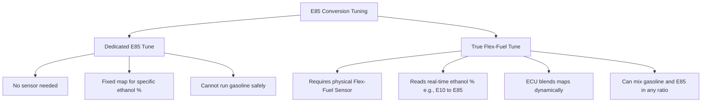
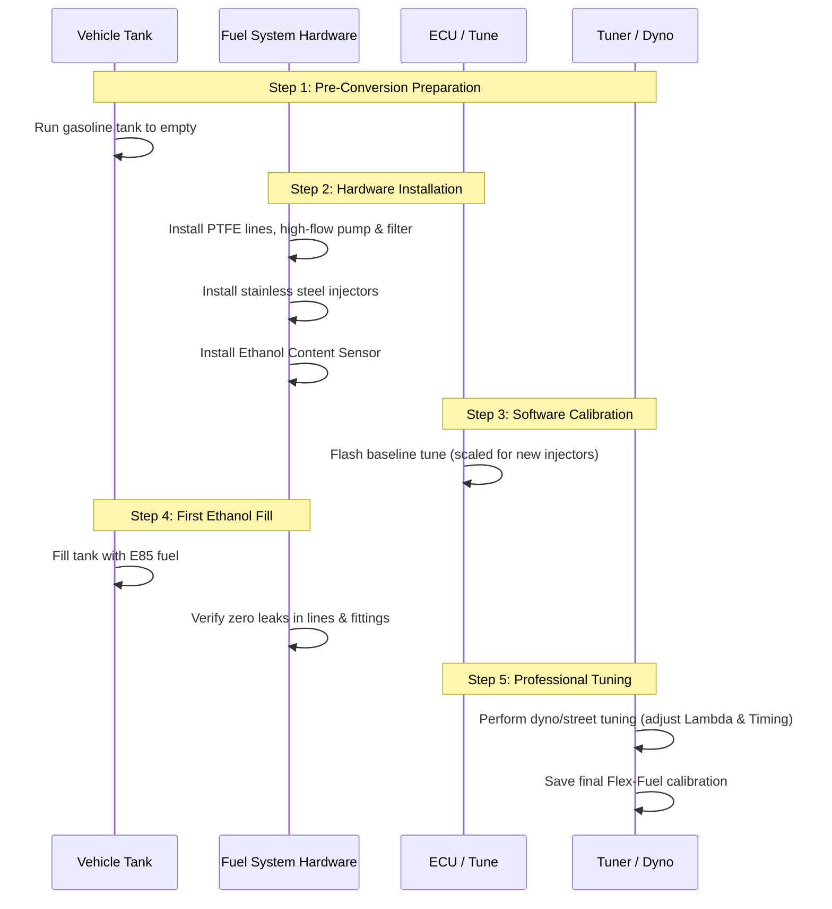

# What Should I Know Before Switching to E85?

For automotive enthusiasts and performance seekers, few modifications offer the same cost-to-horsepower ratio as switching to E85 fuel. Often referred to in tuning circles as "poor man's race gas," E85 delivers high octane, cooler combustion temperatures, and the ability to run more aggressive ignition timing and boost pressures. On paper, it seems like the ultimate performance upgrade: race-fuel performance at pump-gas prices.

However, E85 is not a simple "fill up and drive" fuel for standard passenger cars. Because ethanol possesses fundamentally different chemical and physical properties compared to standard unleaded petrol, running high-concentration ethanol requires a comprehensive understanding of your vehicle’s mechanical limitations, electrical adaptability, and long-term maintenance requirements. Making the switch without proper preparation can result in clogged fuel systems, degraded lines, lean engine conditions, and potentially catastrophic engine failure.

This guide serves as a comprehensive, highly detailed pre-conversion checklist. Whether you are aiming to build a 1,000-horsepower street machine or simply wanting to understand the mechanics of flex-fuel conversions, here is everything you must know before switching to E85.

---

## 1. The Science of E85: Chemistry, Energy Density, and Octane

To understand why fuel system compatibility is so rigid, you must first understand the fundamental differences between gasoline (petroleum) and ethanol (alcohol) at a molecular level.

### Chemical Composition and Variability
E85 is a biofuel blend composed of up to 85% denatured ethanol ($C_2H_5OH$) and 15% gasoline or other hydrocarbon distillates. Ethanol is typically produced via the fermentation of starch- and sugar-heavy crops such as corn, sugarcane, wheat, and agricultural waste. 

It is a common misconception that E85 always contains exactly 85% ethanol. Depending on the region, season, and fuel provider, the ethanol content in pump "E85" can range from 51% to 83%. During cold winter months, fuel distributors lower the ethanol content (often to E70 or E50) to assist with cold-starting, as ethanol does not vaporize easily at low temperatures. This variability is a critical factor that dictates how you must tune your vehicle.

### Stoichiometric Air-Fuel Ratio (AFR)
The stoichiometric air-fuel ratio is the ideal chemical ratio where all fuel is burned completely with all available oxygen. 
*   **Standard Petrol:** Stoichiometry is **14.7:1** (14.7 parts of air to 1 part of fuel by weight).
*   **Pure Ethanol (E100):** Stoichiometry is **9.0:1**.
*   **E85 (85% Ethanol / 15% Petrol):** Stoichiometry is approximately **9.76:1** to **9.8:1**.

Because the stoichiometric ratio of E85 is much lower than gasoline, the engine requires significantly more fuel to burn with the same volume of air. To maintain a proper chemical balance, the engine's fuel delivery system must inject **30% to 35% more fuel volume** than it would when running gasoline.

### Energy Density vs. Octane Rating
The core trade-off of E85 lies between its energy density and its knock resistance.

| Parameter | Standard Gasoline (93 Octane) | E85 (85% Ethanol) |
| :--- | :--- | :--- |
| **Octane Rating (AKI / RON)** | 93 AKI / ~98 RON | 100 - 105 AKI / ~108+ RON |
| **Energy Density (MJ/kg)** | ~42 - 44 MJ/kg | ~29 - 30 MJ/kg |
| **Stoichiometric AFR** | 14.7:1 | 9.76:1 |
| **Latent Heat of Vaporization** | ~350 kJ/kg | ~840 - 900 kJ/kg |

#### The Energy Density Gap
Ethanol has roughly 30% less chemical energy density per unit volume than gasoline. Because of this, burning E85 will automatically result in a **30% to 35% reduction in fuel economy** (miles per gallon or kilometers per liter). If your car gets 10 km/l on petrol, expect it to drop to around 7 km/l on E85.

#### The Octane and Cooling Advantage
Despite the loss in fuel economy, E85 is highly prized because of its octane rating (100 to 105 AKI) and its **latent heat of vaporization**. Ethanol requires more than double the energy (heat) to transition from a liquid to a gas compared to gasoline. 

When E85 is sprayed into the intake tract or directly into the cylinder, it evaporates and absorbs massive amounts of heat from the incoming air and surrounding metal. This drastically lowers the intake charge temperature (creating a denser air charge) and cools the combustion chamber. This cooling effect, combined with the high octane rating, prevents engine knock (pre-detonation), allowing tuners to advance ignition timing and increase turbocharger/supercharger boost pressures safely.

---

## 2. Hardware Upgrades: The Fuel Delivery System

Because E85 requires 30% to 35% more volume and acts as a strong solvent, your factory fuel system must be thoroughly audited and, in most cases, upgraded.

### Fuel Lines: Rubber vs. PTFE (Teflon)
Standard modern vehicles are designed to handle up to E10 or E20 fuel, utilizing synthetic rubber hoses and nylon lines. However, long-term exposure to high-concentration ethanol (E85) will degrade natural rubber and low-grade plastics. Ethanol dries out rubber, causing it to swell, harden, crack, and eventually leak. Bare steel fuel lines are also susceptible to internal oxidation and rusting because ethanol is hygroscopic (it attracts and binds with water from the atmosphere).

*   **The Upgrade:** For a reliable E85 setup, replace all flexible fuel hoses with **PTFE (Teflon)-lined hoses**. PTFE is completely inert to ethanol, gasoline, and water, ensuring it will never swell or degrade. If PTFE is unavailable, ensure you use hoses certified to **SAE 30R9** or **SAE 30R14** specifications, which are specifically rated for high-alcohol fuels. Replace steel fuel lines with stainless steel or aluminum lines, or run full PTFE hoses from the tank to the fuel rail.

### Fuel Pumps: High Flow and Chemical Compatibility
A fuel pump designed for gasoline will fail quickly on E85 for two reasons:
1.  **Flow Limitation:** The stock pump is sized to deliver gasoline. When forced to deliver 35% more volume under load, the pump will run out of flow capacity, causing the engine to run lean and knock.
2.  **Corrosive Wear:** The internal seals, plastic impellers, and electrical brushes in standard pumps are not designed to withstand alcohol. Ethanol is highly conductive; if the pump's electrical brushes are exposed, galvanic corrosion will quickly destroy the pump motor.

*   **The Upgrade:** You must install an **ethanol-compatible high-flow fuel pump**. Industry standards include the Walbro/TI Automotive F90000267 (popularly known as the "Walbro 450") or the F90000274 (high-pressure 450). These pumps use an encapsulated, brushless-style armature or specially treated internal components to prevent corrosion. When sizing a fuel pump, calculate your target horsepower, factor in the 35% volume increase, and choose a pump that can flow that amount at your target fuel pressure.

### Fuel Injectors: Sizing and Duty Cycle
To spray 30% to 35% more fuel in the same window of time during the engine's intake and compression cycles, you need larger fuel injectors.

#### Sizing Calculation
If your engine requires 500cc/min injectors to run safely on gasoline at an 80% duty cycle, you must increase that flow rate by at least 35% for E85:
$$\text{Required Flow Rate} = 500\text{ cc/min} \times 1.35 = 675\text{ cc/min}$$
To maintain a safe safety margin (keeping injector duty cycles below 80% under peak load), you would typically round up and select **750cc/min** or **1000cc/min** injectors.

#### Material Compatibility
Ensure the injectors you select feature **stainless steel internals**. Older or cheaper injectors may use copper, brass, or mild steel parts inside, which will rust or deposit a sticky residue when exposed to wet ethanol. Modern injectors from reputable brands (such as Injector Dynamics, Fuel Injector Clinic, or Bosch) are designed with full stainless-steel valving to ensure reliability on E85.

### Fuel Filters: Preventing Clogging
Ethanol is an excellent solvent. When you first pour E85 into an older fuel tank, it will scrub the fuel tank walls clean, dissolving years of accumulated gasoline varnish, gum, rust, and debris. This loose debris will travel straight to your fuel filter.

*   **The Issue with Paper Filters:** Many stock fuel filters use paper elements held together by adhesives. Ethanol dissolves these glues, causing the paper filter element to collapse, allowing paper fibers and raw debris to flow into and clog the fuel injectors.
*   **The Upgrade:** Install a high-flow fuel filter with a **stainless steel mesh element** or an ethanol-safe microglass element (typically rated at 10 microns for a post-pump filter). Be prepared to replace or clean the fuel filter element after your first 2 to 3 tanks of E85, as that is when the bulk of the loosened tank debris will be caught.

---

## 3. Engine Internals, Valvetrain, and Lubrication

Beyond the fuel delivery system, the physical combustion of E85 introduces mechanical challenges inside the engine block itself.

### Valvetrain Wear and Lubricity
Petroleum gasoline contains natural lubricating oils that coat the intake valves, valve seats, and cylinder walls. Ethanol, conversely, is a dry, clean solvent. It strips away these lubricating films. 

In engines not designed for flex-fuel, the dry combustion of E85 can lead to accelerated wear on the valve seats and valve guides—a phenomenon known as **valve seat recession**. Over time, the valve sinks deeper into the cylinder head, reducing valve lash, causing compression loss, and eventually requiring a cylinder head rebuild. 
*   **Mitigation:** For standard engines retrofitted for E85, it is wise to use a specialized top-end lubricant additive (such as Lucas Oil Ethanol Safeguard or Red Line Alcohol Fuel Lubricant) mixed into the fuel tank periodically to restore lubricity to the valvetrain.

### Spark Plug Selection and Gapping
E85 burns faster than gasoline and changes the thermal dynamics of the combustion chamber.
*   **Heat Range:** Because you will be running more advanced ignition timing and higher boost pressures on E85, the combustion chamber temperatures can rise significantly under load. It is highly recommended to switch to spark plugs that are **one or two steps colder** than the stock heat range. Colder plugs transfer heat away from the tip faster, preventing the spark plug ceramic from becoming a hot spot that causes pre-ignition (knock).
*   **Spark Plug Gap:** Because E85 requires a much larger volume of fuel to be sprayed into the cylinder, the density of the air-fuel mixture is much higher. A wider spark plug gap might struggle to fire through this dense, fuel-heavy mixture, leading to spark blowout (misfires under load). Reduce your spark plug gap (often down to **0.024" to 0.028" / 0.6mm to 0.7mm**) to ensure a strong, consistent spark.

### Engine Oil Dilution and Maintenance
One of the most critical aspects of running E85 is managing oil dilution. During cold starts and warm-up cycles, a small amount of unburnt fuel escapes past the piston rings (blowby) and enters the engine oil pan. 

*   **The Chemistry of Dilution:** Unlike gasoline, which evaporates out of the engine oil once the engine reaches operating temperature, ethanol is harder to burn off. Additionally, ethanol attracts water. When ethanol and water mix with engine oil, they form a milky, acidic sludge that degrades the oil’s viscosity and shear strength.
*   **Oil Selection:** Run a high-quality, full-synthetic engine oil formulated to resist ethanol dilution. Look for oils meeting the latest **API SP** or **GM dexos1 Gen 3** specifications, which include specific testing for emulsion stability and wear protection in ethanol-fueled engines.
*   **Oil Change Intervals:** You must shorten your oil change intervals. If you change your oil every 10,000 km on gasoline, reduce that to **3,000 to 5,000 km** on E85, especially if the vehicle is driven on short trips where the engine does not reach full operating temperature for long periods.

---

## 4. Electronics and Tuning: The Brain of the Operation

You cannot safely run E85 on a stock gasoline engine calibration. Without adjusting the engine control unit (ECU), the car will run dangerously lean, misfire, and likely trigger immediate engine damage.

### Tuning Methods: Dedicated vs. Flex-Fuel

When converting your vehicle, you must choose how your ECU will manage the fuel:

#### 1. Dedicated E85 Tune (Single-Map)
In a dedicated setup, the tuner calibrates the ECU specifically for a fixed concentration of ethanol (usually E85). 
*   **Pros:** Simpler setup, lower hardware cost (no sensor required).
*   **Cons:** Inflexible. If you travel to an area without E85, you cannot fill up with gasoline unless you manually flash a gasoline tune using a handheld programmer. Furthermore, because pump E85 varies seasonally (from E50 to E85), a dedicated tune calibrated for E80 might run dangerously rich or lean if you fill up with E60 winter blend.

#### 2. Flex-Fuel Tune (Multi-Map Blending)
This is the gold standard for street-driven vehicles. It requires installing a physical **Ethanol Content Sensor (ECS)** (typically manufactured by Continental or Bosch) in the fuel return line or fuel feed line.
*   **How it Works:** The sensor measures the dielectric constant and temperature of the fuel in real time, calculating the exact ethanol percentage (from 0% to 100%). It sends a frequency signal (usually 50Hz to 150Hz) to the ECU.
*   **The ECU Response:** The ECU uses a "Flex-Fuel" firmware patch. It contains two base maps: a pure gasoline map and a high-ethanol map. Based on the sensor's reading, the ECU dynamically interpolates (blends) fuel volume, ignition timing, and boost targets between the two maps. You can mix petrol and E85 in any proportion in your tank, and the engine will run optimally without driver intervention.

### Tuning Platforms
To implement these maps, you need a method to access and modify the ECU:
*   **OEM ECU Flashing:** Many modern factory ECUs (e.g., VW/Audi, Subaru, BMW, Ford, GM) can be reflashed using platforms like Ecutek, Cobb Accessport, HP Tuners, or Bootmod3 to support flex-fuel logic.
*   **Standalone ECUs:** For older cars, project cars, or dedicated race builds, installing a standalone engine management system (such as Haltech, Link, MoTeC, or MaxxECU) is the best choice. These units have built-in flex-fuel algorithms and direct inputs for ethanol sensors.
*   **Piggyback Conversion Kits:** These are electronic modules that plug inline between the factory fuel injectors and the factory wiring harness, along with an ethanol sensor. They manually lengthen the injector pulse width by ~30% when they detect ethanol. While cheap and easy to install, **they do not adjust ignition timing, cold-start tables, or boost pressures**. They are suitable for basic economy cars but are not recommended for performance vehicles.

---

## 5. Air-Fuel Ratio Monitoring: The Lambda Scale

One of the most common mistakes made during E85 conversions is misinterpreting fuel mixture readings. If you use a standard wideband oxygen sensor gauge, you must understand the difference between the **Gasoline AFR scale** and the **Lambda ($\lambda$) scale**.

### The Problem with Gasoline AFR Gauges
Most wideband gauges (like the AEM UEGO or Innovate MTX-L) are calibrated out of the box to display Air-Fuel Ratio based on gasoline chemistry. The sensor itself does not actually measure fuel molecules; it measures the amount of residual oxygen in the exhaust gas. It then calculates a value called **Lambda**.

Lambda ($\lambda$) is a universal ratio:
$$\lambda = \frac{\text{Actual Air-Fuel Ratio}}{\text{Stoichiometric Air-Fuel Ratio for that Fuel}}$$
*   $\lambda = 1.0$ is perfect stoichiometry for *any* fuel (gasoline, diesel, E85, methanol).
*   $\lambda < 1.0$ is rich (excess fuel, ideal for power under load).
*   $\lambda > 1.0$ is lean (excess oxygen, ideal for fuel economy cruising).

If your gauge is set to display "Gasoline AFR," it takes the physical Lambda reading and multiplies it by **14.7**. 

If you run E85 at perfect stoichiometry ($\lambda = 1.0$), the physical AFR in the engine is **9.76:1**. However, the gauge will read **14.7**. If a driver who does not understand this tries to adjust their tune to show "9.7" on a gasoline-calibrated gauge, they will inject massive amounts of excess fuel, washing the cylinder walls and potentially hydrolocking the engine.

### The Solution: Switch to the Lambda Scale
To prevent confusion, set your wideband gauge, ECU logging software, and tuner dashboard to display **Lambda ($\lambda$)** instead of AFR. 

| Operating Condition | Target Lambda ($\lambda$) | Equivalent Gasoline AFR | Equivalent E85 AFR |
| :--- | :--- | :--- | :--- |
| **Stoichiometric (Idle/Cruising)** | 1.00 | 14.70 | 9.76 |
| **Max Power (Naturally Aspirated)**| 0.85 - 0.88 | 12.50 - 13.00 | 8.30 - 8.60 |
| **Max Power (Turbocharged/Boosted)**| 0.78 - 0.82 | 11.50 - 12.00 | 7.60 - 8.00 |

By monitoring Lambda, you only need to remember one set of numbers: target $1.00$ for cruising and idle, and target $0.78$ to $0.82$ under peak boost, regardless of whether you have E10, E50, or E85 in the fuel tank.

---

## 6. Cold-Start Challenges: Physics and Solutions

The physical properties of ethanol make engines notorious for difficult cold starting, particularly in colder climates.

### The Physics of Cold starting Ethanol
For fuel to ignite inside a cold cylinder, it must vaporize and mix with air. 
*   **Vapor Pressure:** Gasoline has a high Reid Vapor Pressure (RVP), meaning it evaporates readily at low temperatures. Ethanol has a low vapor pressure and does not vaporize well below **10°C (50°F)**.
*   **Condensation:** When E85 is sprayed into a cold engine, the liquid ethanol does not atomize into a fine mist. Instead, it pools on the intake valves, manifold walls, and piston tops as raw liquid, which is incredibly difficult for a spark plug to ignite.

### How to Mitigate Cold-Start Issues

#### 1. ECU Cranking Fuel Enrichment
Your tuner must adjust the ECU's "Cranking Fuel vs. Coolant Temperature" tables. Because only a small percentage of the cold ethanol will vaporize, you must spray a massive volume of fuel during cranking (sometimes 200% to 300% more than gasoline) so that enough vapor is generated to catch the spark. Be prepared for the car to crank for 3 to 5 seconds before starting on cold mornings.

#### 2. Cranking Ignition Timing
Advancing or retarding the ignition timing specifically during the cranking cycle can help build heat in the cylinder quickly, helping the engine catch and idle smoothly.

#### 3. Seasonal Blends and Splash Blending
If you live in an area with freezing winters, fuel stations will automatically switch to E70 or E50. If you are using a dedicated E85 tune and experience severe starting issues in winter, you can manually "splash blend" by adding 5 to 10 liters of premium petrol to a tank of E85. This lowers the ethanol content to ~E65, raising the vapor pressure and making cold starts significantly easier.

#### 4. Hardware Aids
If the car is parked in a cold garage, installing an engine block heater or an oil pan heater plug can keep the engine block warm overnight, eliminating cold-start issues entirely.

---

## 7. Cost-Benefit Analysis: The Financials of E85

Before modifying your car, you should calculate the financial implications to manage your expectations.

### Initial Conversion Costs (Estimates)

The upfront cost of converting a car to flex-fuel varies based on the vehicle platform:

*   **Fuel Pump (Walbro 450 + installation kit):** $120 - $200
*   **High-Flow Injectors (e.g., 1000cc stainless steel):** $350 - $600
*   **PTFE Fuel Lines & Fittings:** $150 - $400
*   **Ethanol Content Sensor & Harness/Gauge:** $150 - $350
*   **Ethanol-Compatible Fuel Filter:** $80 - $150
*   **ECU Tuning Software License (e.g., Cobb, HP Tuners):** $300 - $600
*   **Professional Dyno Tuning / Calibrating:** $500 - $1,000
*   **Total Upfront Investment:** **$1,650 to $3,300**

### Running Costs and the "Break-Even" Point
Because E85 reduces fuel economy by ~30%, running it is only financially beneficial if E85 is priced significantly lower than standard petrol.

Let us calculate the break-even price ratio:
$$\text{Break-Even Price of E85} = \text{Price of Premium Petrol} \times 0.70$$

*   **Scenario A (US Prices):** If Premium Petrol costs **$4.00 per gallon**, E85 must cost **$2.80 per gallon or less** to break even on a cost-per-mile basis. If E85 is priced at $3.20, you are actually paying *more* to drive the same distance, despite the lower pump price.
*   **Scenario B (Indian Prices / E85 Markets):** If Premium Petrol costs **₹105 per liter**, E85 must cost **₹73.5 per liter or less** to break even.

### The Real Value: Cost per Horsepower
If you are converting a daily driver solely to save money on fuel, the payback period for the initial $2,000 investment can take several years. 

However, if you are converting a performance vehicle, E85 is an exceptional value. To get the same knock resistance and cooling benefits as E85, you would have to buy specialized racing fuels (like VP C16 or Q16), which can cost $15 to $25 per gallon (₹300 to ₹500 per liter) and cannot be bought at standard street pumps. From a performance perspective, E85 is the most cost-effective way to gain 10% to 20% more horsepower on a turbocharged engine.

---

## 8. Step-by-Step Pre-Switch Action Plan

Once you have decided to make the switch, follow this systematic conversion plan to ensure a smooth transition:

### Step 1: System Audit
Inspect your current fuel system. Check fuel tank cleanliness. Perform a compression test and cylinder leakdown test on the engine to ensure it is healthy enough to handle the increased power and cylinder pressures that E85 will enable.

### Step 2: Part Sourcing
Purchase all components. Ensure every part is explicitly rated for E85/ethanol. Do not cut corners on fuel lines or injectors.

### Step 3: Drain the Gasoline Tank
Drive your vehicle until the fuel light comes on, leaving as little gasoline as possible in the tank. If possible, use a siphon or diagnostic pump tool to completely drain the tank. If you mix E85 into a tank that still has 15 liters of gasoline, you will create a weak E50 blend, making it difficult to calibrate a dedicated E85 tune initially.

### Step 4: Install Upgraded Components
Install the new fuel pump, PTFE lines, ethanol-safe fuel filter, and physical ethanol content sensor. Install the new, larger fuel injectors.

> [!IMPORTANT]  
> **Do not start the engine yet.** If you turn the key with injectors that flow 35% to 100% more volume than stock on the factory ECU calibration, the engine will flood instantly, washing the cylinders with fuel and potentially bending a connecting rod (hydrolocking).

### Step 5: Flash the Baseline Calibration
Before starting the car, connect your tuning interface and flash a **baseline calibration** that has been scaled for the new, larger fuel injectors. This tells the ECU how to pulse the new injectors so the car can start and idle safely on gasoline or residual fuel.

### Step 6: The First E85 Fill-Up
Drive or tow the vehicle to an E85 pump. Fill the tank with E85. Turn the key to the "ON" position to prime the fuel system and pressurize the lines. **Inspect every fitting, line, and injector seat for fuel leaks.** 

### Step 7: Tuning and Verification
Start the engine and monitor the wideband gauge. Drive the car gently (avoiding boost or high RPM) to your tuner, or coordinate a remote tuning session. The tuner will calibrate the ECU, dialing in the fuel trims, adjusting ignition timing, setting the cold-start tables, and verifying that the flex-fuel sensor is communicating correctly.

---

## 9. Long-Term Maintenance: Pitfalls of E85

Running E85 requires a different maintenance mindset compared to running standard petrol. Be aware of these long-term challenges:

### Phase Separation
Because ethanol is highly hygroscopic, it absorbs moisture directly from the air. If your car sits idle for weeks or months, the ethanol in the fuel tank will absorb enough moisture to cause **phase separation**. The water and ethanol bind together, separating from the gasoline, and sink to the bottom of the fuel tank as a highly corrosive, non-combustible sludge.
*   **Prevention:** If you plan to store your vehicle for more than 3 to 4 weeks, drain the E85 from the tank. Refill the tank with standard premium petrol (which does not absorb water as readily) and run the engine for 15 minutes to flush all ethanol out of the lines and injectors before storage.

### The "Black Goo" Phenomenon
Some E85 users report a sticky, black residue accumulating on their fuel injector tips over time. This is often caused by a chemical reaction between the denaturants (additives) used in certain batches of ethanol and the detergents in petrol. The residue clogs the injector nozzles, leading to poor spray patterns and misfires.
*   **Solution:** Periodically run a tank of high-quality premium petrol containing polyetheramine (PEA) fuel system cleaner (such as Chevron Techron or Liqui Moly Pro-Line Fuel System Cleaner) to dissolve these deposits. Alternatively, remove the fuel injectors every 15,000 to 20,000 km for professional ultrasonic cleaning.

### Fuel Tank Condensation
Keep your fuel tank full if the car is driven regularly but parked in varying temperatures. A half-empty tank allows humid air to collect in the empty space, causing water to condense on the tank walls and mix with the E85.

---

## Summary Checklist: Before You Switch

Before heading to the pump to buy E85, ensure you can check off every item on this list:

- [ ] **Compatible Fuel Hoses:** PTFE-lined or SAE 30R9/30R14 rated.
- [ ] **E85-Safe Fuel Pump:** High-flow capacity with brushless or sealed motor design.
- [ ] **Stainless Steel Injectors:** Correctly sized (approx. 35%+ larger capacity).
- [ ] **Ethanol-Safe Filter:** Stainless steel or microfiber element (no paper/glue).
- [ ] **Colder Spark Plugs:** 1 to 2 heat ranges colder, gapped tighter.
- [ ] **Engine Oil:** API SP or dexos1 Gen 3 synthetic oil, with a shortened change interval.
- [ ] **Tuning Plan:** A dedicated E85 tune or a Flex-Fuel sensor setup integrated with a compatible ECU platform.
- [ ] **Wideband Gauge:** Configured to read in **Lambda ($\lambda$)** to prevent tuning errors.
- [ ] **Storage Plan:** A strategy to drain the tank if the car sits idle for more than a month.

By understanding the chemistry, investing in the correct hardware, and executing a proper electronic calibration, you can enjoy all the performance benefits of E85 without sacrificing the reliability of your engine.
